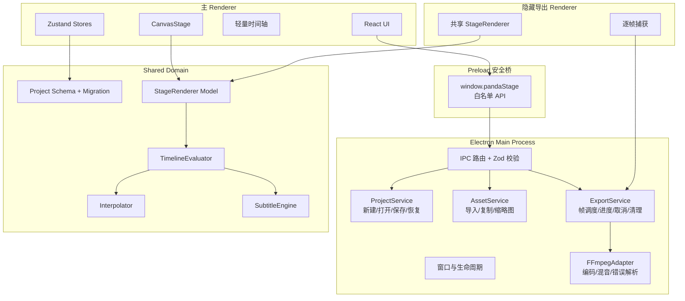
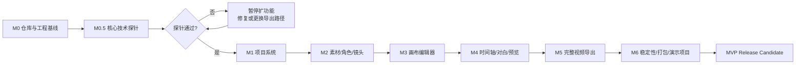

# Panda Stage 开发路线图（Roadmap）

> 仓库：`Cognitive-Architect/panda-stage`  
> 文档版本：v1.0  
> 更新日期：2026-07-19  
> 适用对象：Codex / 人类验收者 / 后续协作者  
> 当前基线：仓库只有 `README.md`、`LICENSE` 和 `.gitignore`，尚未进入代码实现。

---

## 0. 一句话结论

Panda Stage 不从“完整剪辑软件”起步，而是先用 **M0.5 核心技术探针**证明“同一套画面逻辑可以稳定预览并导出 MP4”，再按项目系统、素材与镜头、画布、时间轴、导出、打包的顺序逐层建设。

**基准计划：45 个开发工作日 / 9 个工作周。**

这里的“工作日”指一次完成验收的开发会话，不承诺必须连续日历推进。当天验收没过，就留在当天，不带病冲下一阶段——不然技术债会像没盖锅盖的粥，后面满厨房都是。

---

## 1. 产品合同：这款软件到底要完成什么

### 1.1 目标用户

- 不会专业剪辑、不会动画、不会编程的个人创作者。
- 已有或能准备透明 PNG 角色、背景、台词和音频。
- 想制作熊猫头、简笔画、纸片人式短动画。

### 1.2 MVP 核心任务

用户能够：

1. 新建一个本地项目；
2. 导入背景、透明角色图片和音频；
3. 创建 1～5 个镜头；
4. 把角色拖到 16:9 舞台上；
5. 添加对白、字幕和简单动作；
6. 预览约 30 秒动画；
7. 稳定导出 `1920×1080 / 24 FPS / H.264 + AAC / MP4`。

### 1.3 MVP 规模上限

| 项目 | MVP 约束 |
|---|---|
| 项目总时长 | 优先验证 30 秒；架构允许 5 分钟以内 |
| 镜头数 | 验收样例 5 个 |
| 常驻角色 | 验收样例 2 个 |
| 对白 | 验收样例 6～8 句 |
| 角色嘴型 | 闭嘴 + 张嘴；固定频率开合 |
| 动作预设 | 从左进入、从右进入、移动、放大强调、抖动、表情切换、淡入、淡出 |
| 画布 | 固定 1920×1080 逻辑坐标 |
| 帧率 | MVP 固定 24 FPS，不提供用户切换 |
| 平台 | Windows 优先 |

### 1.4 第一版明确不做

- AI 自动写完整剧本；
- 云端 TTS、声音克隆；
- 自然语言聊天编辑器；
- 2D 骨骼、IK、网格变形；
- Bezier 曲线编辑器；
- 多人协作、账号、云项目；
- 手机端、3D、扩散式视频；
- 插件市场；
- 完整 NLE 转场库；
- 自动横竖屏重排；
- 复杂音素级嘴型。

> **人话理解：** 第一版负责“把纸片人摆好、让它动、配上字幕和声音、导出视频”。它不负责写小说、配音、画角色，也不打算一口吞掉剪映。

---

## 2. 关键技术决策

### 2.1 固定技术栈

| 能力 | 选择 |
|---|---|
| 桌面壳 | Electron |
| UI | React + TypeScript + Vite |
| 画布 | Konva + react-konva |
| 状态管理 | Zustand |
| 数据校验 | Zod |
| 单元测试 | Vitest |
| E2E | Playwright |
| 打包 | electron-builder |
| 视频编码 | 本地 FFmpeg sidecar |
| 包管理 | pnpm |

### 2.2 不可破坏的工程原则

1. **项目数据先于 UI。** UI 只能修改版本化 JSON 数据，不把项目状态藏在组件里。
2. **预览与导出共享同一套求值器和渲染器。** 禁止写两套动画逻辑。
3. **所有时间统一使用整数毫秒。** 导出帧时间由 `frameIndex / fps * 1000` 计算。
4. **所有项目路径保存为项目内相对路径。** 移动项目文件夹后仍应能打开。
5. **所有磁盘写入走 Main Process。** Renderer 不直接访问 `fs`、`child_process`。
6. **Preload 只暴露白名单 API。** `contextIsolation=true`，`nodeIntegration=false`。
7. **保存必须原子化。** 先写临时文件，再替换正式文件。
8. **一个开发任务只解决一个验收目标。** 不顺手重构无关代码。
9. **没有证据就不算完成。** 每阶段至少提供测试输出、样例文件或截图/日志。
10. **失败信息必须可读。** 对用户显示中文原因；详细日志保留技术错误。

> **人话理解：** 画面、声音和时间都记在一本“统一账本”里。预览是在看这本账，导出也是在看这本账，不能一个按菜谱做饭、另一个凭感觉撒盐。

---

## 3. 目标架构



### 3.1 推荐目录结构

```text
panda-stage/
├── src/
│   ├── main/
│   │   ├── index.ts
│   │   ├── windows/
│   │   ├── ipc/
│   │   └── services/
│   ├── preload/
│   │   └── index.ts
│   ├── renderer/
│   │   ├── app/
│   │   ├── components/
│   │   ├── features/
│   │   └── stores/
│   ├── export-renderer/
│   │   └── index.tsx
│   └── shared/
│       ├── domain/
│       ├── schemas/
│       ├── ipc/
│       └── utils/
├── tests/
│   ├── unit/
│   ├── integration/
│   └── e2e/
├── demo-project/
├── scripts/
├── docs/
├── package.json
├── electron-builder.yml
└── pnpm-lock.yaml
```

---

## 4. 开发依赖图



---

## 5. 里程碑总览

| 里程碑 | 预计开发日 | 核心结果 | 硬性出口条件 |
|---|---:|---|---|
| M0 | Day 1～2 | 工程可启动、可检查、可测试 | Windows 开发环境可运行 Electron 空壳 |
| M0.5 | Day 3～8 | 3～5 秒技术探针 MP4 | 预览/导出差异 <1%，音画同步，中文路径、取消、打包可用 |
| M1 | Day 9～14 | 项目生命周期 | 新建→保存→重开一致，崩溃可恢复 |
| M2 | Day 15～20 | 素材、角色、镜头管理 | 4 类素材可导入，5 镜头排序可保存 |
| M3 | Day 21～27 | 可视化画布编辑 | 拖入、移动、缩放、翻转、层级、撤销、动作预设可用 |
| M4 | Day 28～35 | 时间轴、对白、字幕、完整预览 | 30 秒预览音画无明显漂移 |
| M5 | Day 36～41 | 完整项目导出 | 5 镜头/2 角色/6 对白导出 30 秒 MP4 |
| M6 | Day 42～45 | 稳定性、安装包、演示项目 | 安装→打开演示项目→预览→导出全链路通过 |

---

## 6. 详细里程碑

## M0：仓库与工程基线（Day 1～2）

### 目标

把空仓库变成一个可运行、可测试、可持续提交的 Electron + React + TypeScript 工程。

### 范围

- pnpm 工程初始化；
- Electron Main / Preload / Renderer 分层；
- React 页面显示；
- TypeScript、ESLint、Prettier、Vitest；
- 基础 GitHub Actions；
- 统一脚本：`dev`、`typecheck`、`lint`、`test:unit`、`build`；
- `src/shared/ipc/channels.ts` 作为 IPC 名称唯一来源；
- 最小错误日志目录与开发者诊断信息。

### DoD

- [ ] `pnpm install` 成功；
- [ ] `pnpm dev` 打开桌面窗口；
- [ ] `pnpm typecheck` 通过；
- [ ] `pnpm lint` 通过；
- [ ] `pnpm test:unit` 至少 1 个测试通过；
- [ ] `pnpm build` 通过；
- [ ] Renderer 无 Node.js 直接访问能力。

### 不做

- 不做项目编辑功能；
- 不先画完整 UI；
- 不接 FFmpeg 之外的大型依赖。

---

## M0.5：核心技术探针（Day 3～8）

### 目标

先证明最危险的底层链路：同一套舞台逻辑能预览，也能在隐藏窗口逐帧导出，并通过 FFmpeg 合成带音频的 MP4。

### 探针内容

- 1 张背景；
- 1 张透明 PNG 角色；
- 1 次从左到右移动；
- 1 条中文字幕；
- 1 段音频；
- 3～5 秒，24 FPS，1920×1080；
- 隐藏 BrowserWindow；
- 主进程背压控制与流式写帧；
- FFmpeg H.264 + AAC；
- 中文项目路径与中文输出文件名；
- 中途取消与临时目录清理；
- 打包后的 FFmpeg 路径验证。

### DoD

- [ ] 同一关键时间点的预览截图与导出帧像素差异 <1%；
- [ ] 音频起始与第一帧对齐，肉耳无明显错位；
- [ ] 中文和空格路径下可导出；
- [ ] 取消后隐藏窗口关闭、FFmpeg 终止、临时帧清理；
- [ ] 打包后的 Windows 应用可找到 FFmpeg 并导出；
- [ ] 导出失败有用户可读错误；
- [ ] 探针脚本可重复执行，而不是一次性手工魔法。

### 失败回退顺序

1. 首选：隐藏 BrowserWindow + 共享 React/Konva 渲染器；
2. 若捕获不稳定：改用 `webContents.capturePage()`；
3. 若性能不足：启用 offscreen 渲染并限制图层；
4. 连续两天仍无法稳定：暂停 UI 开发，先保留 CLI/探针分支并重新评审导出架构。

> **人话理解：** 这一关就是先看看“锅、灶、燃气”能不能正常做熟一盘菜。锅都漏底，就别急着装修餐厅。

---

## M1：桌面壳与项目系统（Day 9～14）

### 目标

建立可靠的本地项目生命周期，确保用户的劳动不会因为保存、路径或崩溃问题丢失。

### 范围

- `ProjectSchema v1` + Zod；
- `schemaVersion` 与迁移入口；
- 新建、打开、保存；
- 项目文件夹结构；
- 原子保存；
- 30 秒自动保存；
- `recovery/` 恢复；
- 最近项目；
- 未保存退出提醒；
- 中文/空格/Unicode 路径。

### DoD

- [ ] 新建→修改→保存→关闭→重开，数据一致；
- [ ] 项目文件夹整体移动后仍可打开；
- [ ] 模拟异常退出后能发现并恢复自动保存；
- [ ] 无效 JSON 有明确错误，不导致白屏；
- [ ] 旧 schema 有迁移测试入口；
- [ ] 保存中断不会把正式 `project.json` 写坏。

---

## M2：素材、角色与镜头管理（Day 15～20）

### 目标

让用户能把真实素材装进项目，并组织出“角色 + 表情 + 镜头”的生产结构。

### 范围

- PNG/JPG/MP3/WAV 导入；
- 素材复制到项目目录；
- 图片尺寸、音频时长等元数据；
- 缩略图；
- 角色定义与多个表情；
- 张嘴图配置；
- VoiceProfile 只保留数据模型；
- 镜头新增、复制、删除、重命名、排序、时长；
- 素材引用检查；
- 项目总时长。

### DoD

- [ ] 四类素材可导入并在素材库显示；
- [ ] 重复文件有稳定处理策略；
- [ ] 被使用的素材删除前会阻止或明确确认；
- [ ] 一个角色可配置至少 2 个表情和 1 张张嘴图；
- [ ] 5 个镜头拖拽排序后保存、重开仍一致；
- [ ] 表情尺寸差异 >30% 时给出提示。

---

## M3：画布编辑器（Day 21～27）

### 目标

让不会动画的人也能直接“拖进来、摆位置、套动作”。

### 范围

- 固定 1920×1080 逻辑舞台；
- 等比缩放适配窗口；
- 背景铺满；
- 素材拖入画布；
- 选择框与属性面板；
- 移动、缩放、旋转、水平翻转；
- 层级、锁定、删除；
- 中心参考线；
- 撤销/重做；
- 动作预设编译为 TimelineEvent。

### DoD

- [ ] 拖入角色后坐标落点正确；
- [ ] 保存、重开后变换状态不丢；
- [ ] 连续拖动 10 次只生成 1 条撤销记录；
- [ ] 至少支持 20 步撤销；
- [ ] 窗口缩放不改变逻辑坐标；
- [ ] “从左进入”和“抖动”预设可生成事件并预览。

---

## M4：时间轴、对白与预览（Day 28～35）

### 目标

把镜头中的动作、声音和字幕放到统一时间线上，并得到可拖动、可暂停的完整预览。

### 范围

- 轻量时间轴；
- 播放头与跳转；
- 对白片段、音频片段、动画事件条；
- 连续事件：move / scale / opacity；
- 离散事件：expression / flip / visibility；
- shake 作为非破坏性附加偏移；
- 事件冲突规则；
- 字幕引擎；
- Web Audio API；
- AudioContext 作为预览主时钟；
- 完整项目预览与镜头切换；
- 对白时固定 8Hz 张嘴/闭嘴切换。

### DoD

- [ ] 3 句对白预览时字幕与音频正确；
- [ ] move 平滑，shake 结束回到原位；
- [ ] 同一图层同一连续属性重叠事件被阻止；
- [ ] 30 秒预览无肉眼可见音画漂移；
- [ ] 暂停、继续、拖动播放头行为正确；
- [ ] 5 个镜头可连续播放。

---

## M5：完整视频导出（Day 36～41）

### 目标

把编辑器中的真实项目稳定导出为标准 MP4，并让失败、取消和清理都可控。

### 范围

- 导出前素材完整性校验；
- 导出任务状态机；
- 隐藏窗口加载完整项目；
- 资源预加载；
- 逐帧捕获；
- 主进程背压；
- 临时目录；
- FFmpeg H.264 / yuv420p；
- `adelay + amix` 音频延迟与混音；
- AAC 合成；
- 实时进度；
- 取消、错误、清理；
- 中文路径；
- 预览/导出关键帧自动比对。

### DoD

- [ ] 5 镜头、2 角色、6 对白的约 30 秒项目成功导出；
- [ ] 输出为 1920×1080、24 FPS、H.264 + AAC MP4；
- [ ] 相同项目连续导出 3 次，帧数、位置、字幕和音频时点一致；
- [ ] 音频末尾漂移 <100ms；
- [ ] 预览/导出关键帧视觉差异 <1%；
- [ ] 目标电脑导出速度不超过 5 倍实时，或有明确性能优化路径；
- [ ] 取消和失败不会遗留大量临时文件。

---

## M6：稳定性、打包与演示项目（Day 42～45）

### 目标

交付一个别人能安装、打开、理解、预览和导出的 Windows MVP。

### 范围

- 无版权演示项目；
- 几何/SVG 占位角色与简单背景；
- 演示音频、字幕、动作；
- Playwright 关键流程 E2E；
- electron-builder Windows 安装包；
- FFmpeg sidecar 打包；
- README、架构说明、FFmpeg 说明、已知问题；
- 第三方许可证与 NOTICE；
- Release Candidate 回归。

### DoD

- [ ] 全新 Windows 环境安装成功；
- [ ] 启动不要求手工配置开发环境；
- [ ] 打开演示项目；
- [ ] 完整预览；
- [ ] 导出 5～10 秒演示 MP4；
- [ ] 视频可正常播放；
- [ ] `pnpm typecheck / lint / test:unit / test:e2e / build / dist` 全部通过；
- [ ] 已知问题不伪装成“已完成”。

---

## 7. MVP 最终验收矩阵

| ID | 验收项 | 标准 |
|---|---|---|
| A1 | 项目生命周期 | 新建、保存、关闭、重开不丢数据 |
| A2 | 中文路径 | 项目、素材和输出路径含中文/空格可用 |
| A3 | 自动保存与恢复 | 异常退出后可恢复 |
| A4 | 素材导入 | PNG/JPG/MP3/WAV 可导入 |
| A5 | 角色表情 | 至少 2 个表情可切换 |
| A6 | 镜头管理 | 5 镜头可创建和排序 |
| A7 | 画布摆放 | 移动、缩放、翻转、层级可用 |
| A8 | 撤销重做 | 20 步，连续拖动合并为一步 |
| A9 | 对白字幕 | 6～8 句对白可显示字幕 |
| A10 | 音频同步 | 按 startMs 播放，30 秒无明显漂移 |
| A11 | 移动动画 | A 点到 B 点平滑移动 |
| A12 | 表情切换 | 时间点切换表情 |
| A13 | 抖动 | 结束后回到基础位置 |
| A14 | 嘴巴动画 | 对白时固定频率开合 |
| A15 | 动作预设 | 预设可生成时间轴事件 |
| A16 | 完整预览 | 5 镜头连续播放 |
| A17 | 视频导出 | 1080p / 24 FPS / H.264 MP4 |
| A18 | 预览导出一致 | 关键帧差异 <1% |
| A19 | 导出取消 | 可取消并清理临时文件 |
| A20 | 演示项目 | 可预览并导出 |
| A21 | 自动化测试 | schema/evaluator/interpolator/migration/conflict 通过 |
| A22 | 构建打包 | Windows 安装包可安装运行 |

---

## 8. 质量门禁

每个开发日结束前，执行当日已存在的全部脚本：

```bash
pnpm typecheck
pnpm lint
pnpm test:unit
pnpm build
```

进入 M4 后增加：

```bash
pnpm test:integration
```

进入 M6 后增加：

```bash
pnpm test:e2e
pnpm dist
```

### 8.1 Git 工作规则

- 一个任务一个分支：`codex/day-XX-short-name`；
- 一个任务一个明确 DoD；
- 不把多个里程碑混在一个 PR；
- 提交前必须附验证结果；
- 不使用“应该能跑”“理论通过”作为完成证明；
- 失败时保留最小复现和日志；
- 对同一路径的写入按顺序提交，避免覆盖。

### 8.2 推荐提交格式

```text
feat(project): add atomic project save and recovery
fix(export): clean temp frames when export is cancelled
test(timeline): cover overlapping move event rejection
docs: record M0.5 probe results
```

---

## 9. 风险与应对

| 风险 | 级别 | 早期信号 | 应对 |
|---|---|---|---|
| 预览与导出不一致 | 高 | 同一时间点位置/字体不同 | M0.5 即共享 Renderer/Evaluator；做像素对比 |
| FFmpeg 路径失效 | 高 | 开发机能导出，打包后找不到 | sidecar 固定路径；启动检测；打包烟测 |
| 音画不同步 | 高 | 30 秒后声音逐渐漂移 | 预览以 AudioContext 为时钟；导出按帧计算时间 |
| 导出内存上涨 | 高 | 帧越多内存越高 | 背压、流式写入、及时释放 buffer |
| 项目文件损坏 | 高 | 保存中断后 JSON 无法解析 | 原子保存、recovery、Zod 校验 |
| 功能膨胀 | 高 | 开始做 TTS、AI、骨骼 | 所有需求先问“是否直接服务第一条 30 秒动画” |
| 隐藏窗口性能不足 | 中 | 3 秒导出极慢或卡死 | capturePage/offscreen 回退；限制图层 <50 |
| 路径跨平台问题 | 中 | 中文/空格/移动目录失败 | 统一相对路径；Main 统一路径转换 |
| 音频兼容问题 | 中 | 特定 MP3 无法播放 | MVP 明确 MP3/WAV；导入时检测，必要时转码 |
| 动画事件冲突 | 中 | 同属性跳变、随机覆盖 | 编辑时禁止重叠；求值器覆盖冲突测试 |
| 表情切换跳位 | 低 | 切换时角色抖一下 | 中心锚点；尺寸差异提示；未来再做单表情偏移 |

---

## 10. 止损与转向规则

出现任一项，**立即暂停加功能，先修底座**；连续两个开发周无法改善，则回到现成工具制作内容，仅保留内部实验：

1. 第 6 周后，修改角色位置、字幕或动作仍必须编辑代码；
2. 预览与导出相差超过 1 帧，或关键帧差异持续超过 1%；
3. 60 秒片段音频漂移超过 100ms；
4. 项目目录重命名/移动后无法打开；
5. 崩溃后不能恢复；
6. 目标电脑导出超过 5 倍实时且没有明确优化路径；
7. 每周维护工具的时间大于它为动画制作节省的时间；
8. 90 天内仍未用 Panda Stage 完成一条真实动画。

### 10.1 阶段投资门

- M0.5 通过前：不开发完整编辑器；
- M2 前：至少准备一个真实 30 秒场景样例；
- M4 前：动作预设必须来自真实高频需求，不靠想象堆功能；
- M6 后：用真实项目与剪映/万彩基准比较，若第二次制作没有快至少 50%，先优化流程，不急着扩功能。

---

## 11. V1 → V2 演进路线

### V1：生产可用增强

- 音频 RMS 门控嘴型；
- 可选 Rhubarb 3 嘴型适配器；
- 5 分钟项目性能与代理预览；
- 时间轴吸附与更友好的批量编辑；
- 素材标签搜索；
- 导出队列与断点恢复；
- 更多动作参数，但仍保持数据化。

### V2：受约束智能化

- 自然语言只生成 schema 化命令；
- 变更预览、确认、撤销；
- 例如：“12.4 秒让主角后退 80px、切换震惊表情并抖两下”；
- 禁止模型直接重写项目文件或生成任意可执行代码；
- TTS 通过 Provider Adapter 接入，密钥只存本机安全存储。

### 不急着做

多人协作、云素材商店、插件市场、骨骼编辑器和 3D。它们看起来很“产品”，但也很容易把项目送进“功能豪华、视频没导出来”的博物馆。

---

## 12. Roadmap 完成定义

只有同时满足以下条件，才能标记 MVP 完成：

- A1～A22 全部有证据；
- Windows 安装包通过全新环境烟测；
- 无版权演示项目可完整预览和导出；
- 一个真实 30 秒项目可重复导出 3 次；
- 预览/导出关键帧差异 <1%；
- 音频漂移 <100ms；
- 取消、错误和恢复路径经过实际测试；
- README、架构、FFmpeg、第三方许可、已知问题文档齐全；
- 未完成项进入 Backlog，不用模糊语言冒充完成。

---

## 13. 下一步唯一动作

执行 `DAILY_PLAN.md` 的 **Day 1：仓库工程初始化**。在 Day 1 的 DoD 全部通过前，不进入 Day 2。
