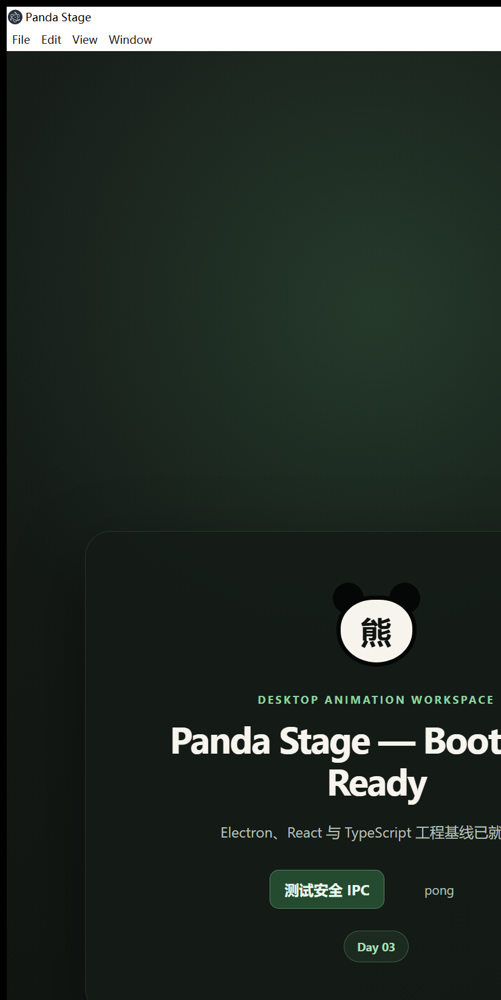

# Day 03 实施与验证记录

## 任务坐标

- 工单：B-03/45 — 安全 IPC 与隐藏窗口通信
- 基线提交：`a2441a2dd41b37e7657407856456acd457f4549a`
- 实施分支：`codex/day-03-secure-ipc`
- 日期：2026-07-19

## 已交付

- 单一 IPC 通道注册表：`app:ping`、`hidden:ready`；
- 请求和响应双向 Zod 严格校验；
- Main Process handler 的发送方窗口校验；
- 主窗口白名单 API：`window.pandaStage.app.ping()`；
- 隐藏窗口白名单 API：`window.pandaStageHidden.ready()`；
- 隐藏窗口创建、ready 超时控制与退出清理；
- `contextIsolation: true`、`nodeIntegration: false`、`sandbox: true`；
- IPC 合同单元测试和基于真实 Electron 构建的 Day 03 集成验证脚本。

## 自动化质量闸门

最终提交前执行以下命令：

```text
pnpm typecheck
pnpm lint
pnpm test:unit
pnpm build
pnpm verify:day03
```

`pnpm verify:day03` 使用生产构建启动真实 Electron 主窗口与隐藏窗口，由 Renderer 点击 IPC 测试按钮并检查清理结果。关键输出：

```json
{
  "ping": "pong",
  "hiddenReady": "true",
  "rendererGlobals": {
    "requireType": "undefined",
    "processType": "undefined",
    "apiKeys": ["app"],
    "appApiKeys": ["ping"]
  },
  "remainingWindows": 0
}
```

## 真实开发窗口验证

执行 `pnpm dev` 后完成了以下检查：

- 主窗口可见；
- 点击“测试安全 IPC”后界面返回 `pong`；
- 终端记录 `Hidden window ready (webContents=2).`；
- 关闭开发进程后，工作树对应的 Electron、Vite 和 TypeScript 进程剩余数量为 0。

界面证据：



## 范围与风险

- 未引入 FFmpeg、视频导出或编辑器逻辑；
- 白名单当前仅包含 ping/ready，新增能力必须同步增加合同、来源校验与测试；
- 本地质量闸门已验证，GitHub 远端 CI 状态需在推送后确认。
