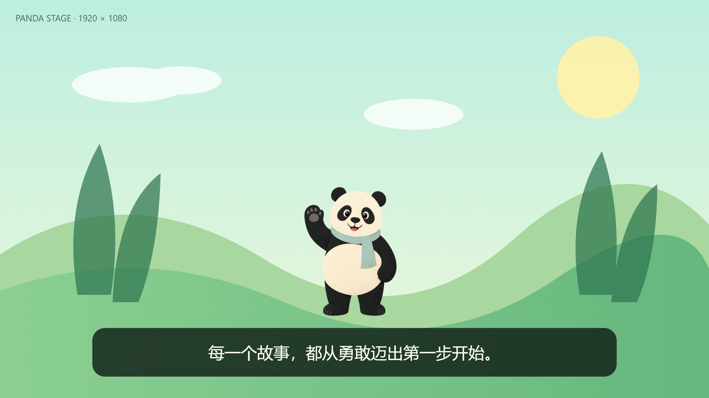
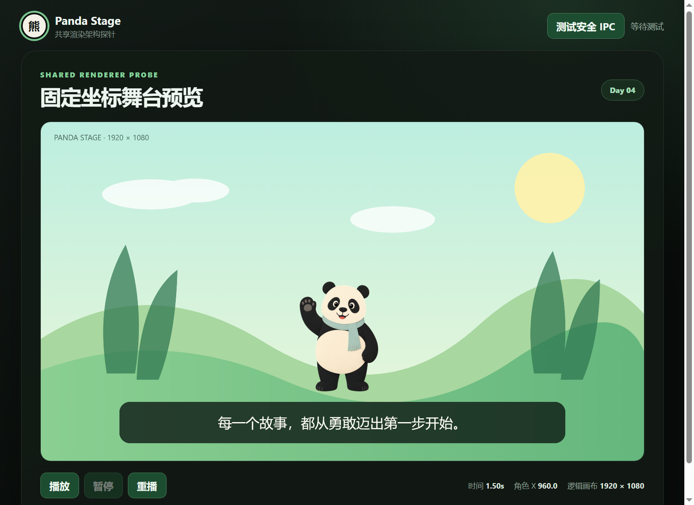
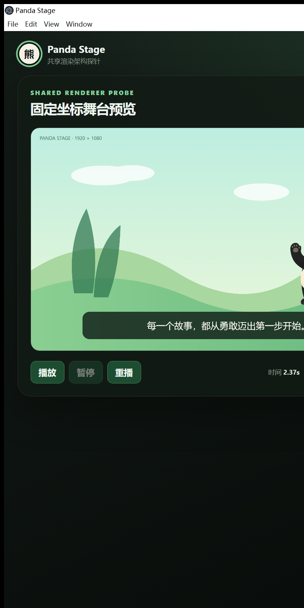
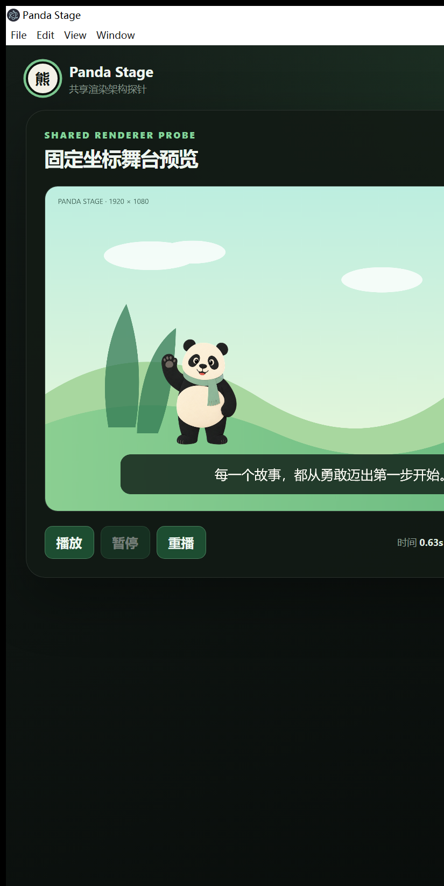

# Day 04 实施与验证记录

## 任务坐标

- 工单：B-04/45 — 共享舞台渲染探针
- 基线提交：`f5aa9b2a8dee9815af03de4fb1cdd30ec494d1e2`
- 实施分支：`codex/day-04-stage-renderer`
- 日期：2026-07-19

## 已交付

- 接入 Konva 10 与 react-konva 19；
- 经过 `ProjectSchema` 校验的 3 秒 probe project；
- 固定 1920×1080 逻辑坐标的 `CanvasStage`；
- 只消费 `evaluateShotAtTime()` 求值结果的 `StageRenderer`；
- 背景 SVG、带 alpha 的透明熊猫 PNG 和底部安全区字幕；
- `requestAnimationFrame` 驱动的播放、暂停、重播控制；
- 主窗口和隐藏窗口复用同一组件链；
- 缺素材可读错误和真实 Electron 双窗口一致性验证。

未实现时间轴编辑器、素材管理、动作系统或导出编码。

## 自动化质量闸门

最终提交前执行：

```text
pnpm typecheck
pnpm lint
pnpm test:unit
pnpm build
pnpm verify:day03
pnpm verify:day04
```

Day 04 集成验证使用生产构建创建真实主窗口和 `show:false` 隐藏窗口，并读取两边同一 Konva Layer 的 PNG 帧：

单元测试结果为 5 个测试文件、28 项测试全部通过。

```json
{
  "sharedFrameSha256": "15fb289fa0c639be5d4975085028d0edd33f7c5b0e1fce38ef5fafae18f8abff",
  "hiddenFrameMatches": true,
  "logicalSize": "1920x1080",
  "snapshotTimeMs": 1500,
  "canvasSizeStable": true,
  "responsiveScaleChanged": true,
  "transparentPngColorType": 6,
  "missingAssetError": "Stage asset \"透明熊猫角色\" has no loadable URL (probe/panda-character.png)."
}
```

其中 PNG color type `6` 表示 RGBA；本地去背校验同时确认图片角像素 alpha 为 `0`、主体中心 alpha 为 `255`。

## 双窗口一致性证据

主窗口与隐藏窗口在 1500 ms 的帧哈希完全一致：

| 主窗口 StageRenderer | 隐藏窗口 StageRenderer |
|---|---|
|  |  |

完整主窗口：



## 真实开发窗口验证

实际执行 `pnpm dev` 后，通过键盘操作完成播放、暂停、重播：

- 播放并在 2.37 秒暂停时，角色已移动到舞台右侧；
- 重播并在 0.63 秒暂停时，角色回到舞台左侧；
- 两个时刻字幕均保持在底部安全区；
- 隐藏窗口在共享舞台素材加载后完成 ready 握手；
- 退出后对应 Electron、Vite、TypeScript 进程剩余数量为 0。

缺素材手测通过：临时将角色 URL 指向 `panda-character-missing.png` 后启动 `pnpm dev`，Renderer 明确输出：

```text
Hidden stage failed. Error: 无法加载舞台素材“透明熊猫角色”：
http://localhost:5173/probe/panda-character-missing.png
```

随后已恢复正确素材路径，恢复后的全套质量闸门通过。

| 播放至 2.37 秒 | 重播至 0.63 秒 |
|---|---|
|  |  |

开发验证还发现并修复了 watcher 覆盖沙箱 Preload bundle 的问题：`dev:electron` 现使用 `tsconfig.main.json`，只监听 Main/Shared，不再覆盖两个预先打包的 Preload。

## 探针素材说明

- 文件：`public/probe/panda-character.png`
- 生成方式：内置图像生成工具生成纯绿色 chroma-key 素材，再使用 imagegen 技能附带的 `remove_chroma_key.py` 去背并缩放为 640×640 RGBA PNG；
- 最终提示词摘要：单个站立挥手的友好熊猫，扁平剪纸插画风，黑色与暖白主体、薄荷绿围巾、完整身体、纯 `#00ff00` 背景、无阴影、无文字、无水印；
- 背景为仓库内自制 SVG，不含外部素材。

## 风险与后续边界

- 当前探针只验证单镜头、背景、角色与字幕；
- Konva 进入共享 bundle 后触发 Vite 500 kB chunk 警告，不影响构建，后续可按入口拆分；
- preload 开发 watcher 当前不会热更新；修改 preload 后需重启 `pnpm dev`，启动阶段会重新打包；
- GitHub 远端 CI 状态需在推送后确认。
