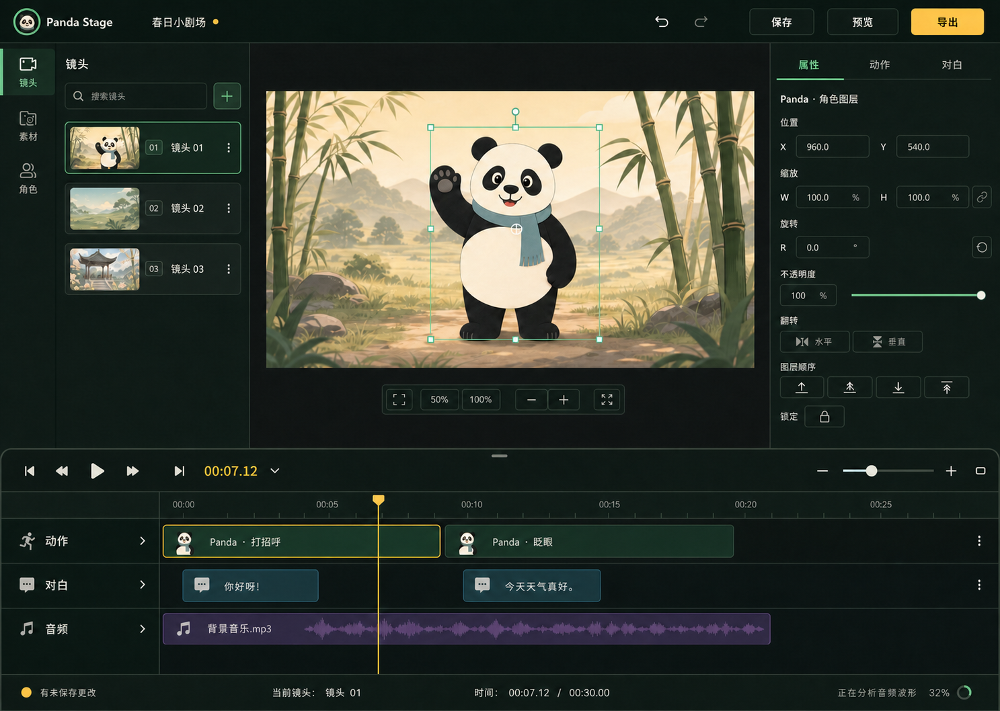

# Panda Stage 视觉设计规范

> 文档类型：产品视觉设计系统 / Desktop Editor UI Specification
>
> 版本：1.0
>
> 编写日期：2026-07-30
>
> 适用范围：Day 26～45 及后续编辑器界面
>
> 目标平台：Windows Electron 桌面应用
>
> 设计基线：`fix/m3-editor-shell` @ `50ef696`
>
> 配套技术文档：[Day 26～45 前端与交互技术实施蓝图](./day26-45-ux-implementation-blueprint.md)
>
> 状态：视觉实施合同；参考图不代表当前代码已经实现

---

## 0. 一页式设计合同

Panda Stage 的界面不是网页仪表盘，也不是把所有功能卡片堆在同一列的功能展板。它是一款需要持续使用的桌面创作工具。

从 Day 26 开始，所有 UI 必须遵守以下合同：

1. **舞台优先。** 中央唯一画布是编辑器视觉主角，任何表单、说明或状态都不能把它推离首屏。
2. **按上下文披露。** 左侧一次只显示镜头、素材、角色中的一个；右侧一次只显示当前选择所需的属性。
3. **根页面不滚动。** 只允许左 Dock、右 Inspector 和 TimelineViewport 在各自边界内滚动。
4. **专业但不冷漠。** 使用深色创作工具框架，以熊猫绿维持品牌识别，以竹金色强调时间和最终动作。
5. **反馈先于装饰。** 保存、恢复、预览、导出、失败与后台任务必须明确；渐变、阴影和动画只用于解释层级。
6. **状态不能只靠颜色。** 选中、错误、警告、成功都需要形状、图标或文字的第二信号。
7. **密度服务任务。** 控件紧凑，但正文不小于 14 px；常用操作近，低频高级字段折叠。
8. **一个能力一个生产实例。** 画布、History、Timeline、Export Dialog 和全局快捷键 owner 必须符合技术蓝图的 cardinality 合同。
9. **视觉偏好不污染项目。** Dock 宽度、折叠状态、Timeline 高度、当前 Tab、缩放和播放头都不设置 dirty。
10. **参考图是方向，不是截图测试金标。** 最终实现以本文数值、交互合同、真实数据和可访问性要求为准。

明确禁止：

- 在 `LegacyWorkspace` 末尾继续添加产品 `<section>`；
- 把每个列表项、表单区和空状态都包装成大圆角卡片；
- 使用霓虹绿、玻璃拟态、重阴影和大面积渐变制造“高级感”；
- 为了通过旧 Gate 保留隐藏的第二套组件；
- 让一条错误、长路径或按钮文案撑破 Dock；
- 用颜色差异代替焦点环、选中边框或状态文字；
- 用 Emoji、字符箭头或不一致的手绘 SVG 充当产品图标。

视觉与 DOM 双重硬合同：

```text
LegacyWorkspace          = 0
ProjectRecoveryPanel     = 0（不得继续作为业务总容器）
CanvasStage              = 1
HistoryControls          = 1
TimelineDock             = 1
ExportDialog             <= 1
完整业务 Manager 可见数  <= 1
根页面滚动容器           = 0
```

当前过渡测试仍授权双 Canvas/History，这属于必须迁移的技术债，不是设计允许的例外。

---

## 1. 推荐视觉方向

### 1.1 当前基线


现状截图尺寸为 1366×768。动作预设、编辑历史和画布沿中央区域纵向排列，画布从首屏约 400 px 以下才开始出现；继续向下还有属性、层级、素材、角色、镜头、Recovery 和第二块画布。它证明当前问题不是颜色不够精致，而是同时可见关系和滚动所有权错误。

现有样式也暴露了视觉债务：

- `src/renderer/styles.css` 已有 2,035 行；
- 72 个 px 字号声明中有 35 个不大于 11 px，最小为 8 px；
- `.shot-thumbnail-placeholder small` 的 `#65776D / #09100C` 只有 4.04:1；
- 两处 `#77847C / #161B18` 只有 4.46:1，略低于普通文字 4.5:1；
- action preset 仍缺少完整的组件状态样式；
- 大量 12～18 px 圆角和卡片边框让所有模块权重趋同。

因此视觉迁移不能只是从旧 CSS 继续拷贝数值。

### 1.2 主编辑工作区参考图



图像文件：[panda-stage-editor-workspace-reference.png](./assets/panda-stage-editor-workspace-reference.png)

生成说明与提示词：[panda-stage-editor-workspace-reference.prompt.md](./assets/panda-stage-editor-workspace-reference.prompt.md)

参考图展示的核心决定：

- 左侧只显示当前“镜头”活动，没有同时铺开素材库和角色管理；
- 中央只有一块 16:9 舞台，图层直接在舞台上选择；
- 右侧 Inspector 只显示所选角色图层的属性；
- 动作、对白和音频全部落在底部 Timeline；
- 保存、预览、导出集中在 TopBar；
- 未保存状态、当前镜头、时间和后台任务集中在 StatusBar；
- 视觉分区依靠对齐、表面色差和细分隔线，不依靠大卡片套大卡片。

对比现状：

| 现状问题 | 参考图方向 | 实施合同 |
|---|---|---|
| 所有功能向下堆叠 | 固定多区域工作区 | 根节点不承担业务滚动 |
| 画布被其他模块推离首屏 | 画布稳定居中 | 生产树只有一个 Canvas |
| 镜头、素材、角色同时占位 | Activity 互斥切换 | 非当前 Activity 不占布局高度 |
| 属性表单远离选中对象 | 上下文 Inspector | 由统一 Selection 派生 |
| 时间能力混在普通表单 | 独立 Timeline Dock | 可折叠、可调高、独立滚动 |
| 全局动作散落 | TopBar 固定入口 | 展示 disabled/busy/error |
| 状态反馈分散 | StatusBar 汇总 | 单一状态源与 aria-live owner |

### 1.3 如何使用这张图

参考图用于确定：

- 总体氛围和明暗层级；
- 舞台、Dock、Inspector、Timeline 的视觉优先级；
- 控件密度、列表密度和选中语言；
- 熊猫绿与竹金色的职责分工；
- “一个连续工作区”而不是“多个页面模块”的整体感。

参考图不能直接决定：

- 业务字段、按钮是否真的存在；
- 文字最终内容和精确换行；
- 图标库中的最终图标；
- Konva 选择框的命中区域；
- Timeline clip 的真实长度和冲突语义；
- WCAG 合规、键盘路径和小窗口降级；
- 生产素材的版权与风格。

参考图原始生成尺寸为 1487×1058；规范坐标采用 1440×1024。实现时不要把图片作为背景或逐像素描摹，而要使用本文 Token 和组件规格重建。

参考图内容分为三个规范层级：

| 层级 | 内容 | 约束 |
|---|---|---|
| 强制结构 | 固定工作区、单一画布、左右 Dock、底部 Timeline、区域独立滚动 | 实现必须遵守 |
| 视觉方向 | 深色创作氛围、绿色品牌强调、竹金时间/产出、紧凑桌面密度 | 应保持，可由 Token 校准 |
| 示例内容 | 熊猫插画、竹林、缩略图、波形、Logo、图标形状、文案与数值 | 仅作示意，不是产品资产或数据合同 |

特别注意：

- 参考图中的熊猫 Logo 是生成式示意，正式应用继续使用经过确认的品牌资产；
- 竹林背景、镜头缩略图、波形和熊猫角色不能因出现在参考图中就直接成为内置发布素材；
- 图标必须来自统一图标库，不能描摹生成图中的形状；
- 参考图没有定义原生/自定义 Windows 标题栏，不授权改变窗口 chrome；
- 图中 `00:07.12` 只用于表达 timecode 气质，正式格式必须服从整数毫秒合同；
- 静态图没有证明 hover、focus、disabled、error、loading、键盘和屏幕阅读器状态；
- 图中镜头、画布图层和动作 clip 同时被强调。正式实现只能有一个主 Inspector 上下文：选中动作 clip 时 Inspector 必须切到事件；选中图层时 Timeline 只能定位相关片段，不能伪装成第二个主选择。

### 1.4 视觉关键词

| 维度 | 目标 | 不要变成 |
|---|---|---|
| 专业度 | 安静、稳定、可长时间工作 | 冷峻复杂的专业影视软件 |
| 亲和力 | 通过熊猫品牌、清晰文案和温暖重点色体现 | 玩具化、儿童化、满屏圆角 |
| 密度 | 任务导向、紧凑但可读 | 稀疏营销页或拥挤数据表 |
| 层级 | 画布第一，时间轴第二，导航和检查器辅助 | 所有模块视觉权重相同 |
| 色彩 | 深色中性表面 + 熊猫绿 + 竹金 | 高饱和霓虹绿或彩虹轨道 |
| 动效 | 解释状态变化和空间关系 | 无意义弹跳、呼吸光、持续动画 |
| 文案 | 直接说明当前状态与下一步 | 技术日志、内部错误码、空泛鼓励 |

---

## 2. 品牌与体验原则

### 2.1 品牌人格

Panda Stage 的品牌人格是“耐心的创作搭档”：

- **可靠**：保存、恢复和导出状态永远可理解；
- **温和**：不以报错惩罚新手，告诉用户如何修复；
- **克制**：不为了显得强大而同时展示所有能力；
- **清晰**：编辑对象、时间位置和当前任务始终明确；
- **有趣**：熊猫和竹色提供记忆点，但不侵入工作区。

### 2.2 层级原则

视觉层级固定为：

1. 当前作品：舞台内容；
2. 当前时间：播放头与选中片段；
3. 当前对象：所选镜头、图层、事件或对白；
4. 当前动作：保存、预览、导出或正在编辑的字段；
5. 辅助信息：路径、提示、统计、低频设置。

任何新增组件若试图高于前四层，必须证明它是阻塞性错误或模态任务。

### 2.3 颜色职责

- **熊猫绿**：品牌、焦点、普通选择、可继续的正向动作；
- **竹金色**：时间轴播放头、选中时间片段、未保存提示、最终导出动作；
- **红色**：不可逆删除、失败和阻塞；
- **蓝色**：外部信息、后台检查或链接；
- **紫色**：仅用于音频内容类别，不用于全局状态；
- **灰绿色**：结构、禁用和次级信息。

熊猫绿和竹金色不得在同一个控件上争夺主状态。普通选择用绿；时间与最终产出用金。

---

## 3. 颜色系统

### 3.1 基础表面

| Token | 值 | 用途 |
|---|---|---|
| `--color-canvas-black` | `#070A09` | CanvasViewport 外部最深 pasteboard |
| `--color-app-bg` | `#0B100E` | 应用根背景 |
| `--color-surface-1` | `#111815` | TopBar、Timeline、主要 Dock |
| `--color-surface-2` | `#17211C` | Inspector section、输入框邻接表面 |
| `--color-surface-3` | `#1D2922` | Hover、选中前景的抬升表面 |
| `--color-surface-overlay` | `#233129` | Popover、Menu、Tooltip 深色基底 |
| `--color-stage-matte` | `#0D1210` | 舞台外工作区 |
| `--color-scrim` | `rgb(3 7 5 / 68%)` | Modal 背景遮罩 |

表面使用规则：

- 相邻层级优先依靠 6～10% 的亮度差和 1 px 分隔线；
- 不为普通列表项增加阴影；
- 不在每个 section 上同时使用背景、边框和阴影；
- Canvas 舞台本身可使用一层细边框和轻微阴影，帮助图片区分于 pasteboard。

### 3.2 边框与分隔

| Token | 值 | 用途 |
|---|---|---|
| `--color-border-subtle` | `#25322C` | 大区域分隔、非交互边界 |
| `--color-border-default` | `#35463E` | 装饰分隔、非关键列表边界 |
| `--color-border-strong` | `#4B6257` | 非交互结构的增强边界 |
| `--color-border-control` | `#527C65` | 输入、按钮、ResizeHandle 等功能边界 |
| `--color-divider` | `rgb(168 180 173 / 14%)` | Timeline 行、Inspector 轻分隔 |
| `--color-focus-ring` | `#8AD7FF` | 键盘焦点外环；与绿色选择态区分 |

`border-default` 和 `border-strong` 只负责视觉分组，不单独承担控件可辨识性。所有交互控件至少使用 `border-control`；它在最亮常用表面 `#1D2922` 上仍达到 3.18:1。

### 3.3 文字

| Token | 值 | 用途 |
|---|---|---|
| `--color-text-primary` | `#F3F1E8` | 标题、主要值、主要按钮文字 |
| `--color-text-secondary` | `#A8B4AD` | 正文、字段标签、次级状态 |
| `--color-text-muted` | `#85938C` | 时间刻度、占位符、辅助元数据 |
| `--color-text-disabled` | `#69776F` | 禁用控件；仍须保持可辨识 |
| `--color-text-on-accent` | `#0B100E` | 绿色、金色实心按钮上的文字 |
| `--color-text-link` | `#7AC3F0` | 真正可点击的链接 |

不得使用纯白 `#FFFFFF` 作为大面积正文。温暖的 `#F3F1E8` 可以降低深色界面的刺眼感。

### 3.4 品牌与语义色

| Token | Default | Hover | Pressed | Soft background |
|---|---|---|---|---|
| Green / primary | `#5FDC9A` | `#79E7AD` | `#3FBF7D` | `#1D4A35` |
| Gold / timeline-output | `#F2C45E` | `#FFD575` | `#D9A93E` | `#3A311C` |
| Red / danger | `#EF716B` | `#F48680` | `#D85A55` | `#3B1E1D` |
| Blue / info | `#6DB6E8` | `#87C8F2` | `#4C9CCC` | `#182F3D` |
| Purple / audio | `#B792E6` | `#C7A8ED` | `#936CC7` | `#2E2440` |

语义映射：

```text
brand / focus / normal selection    Green
playhead / unsaved / export         Gold
destructive / failed / blocked      Red
informational / external / scan     Blue
audio clips only                    Purple
```

### 3.5 对比度基线

关键组合的计算值：

| 前景 / 背景 | 对比度 | 结论 |
|---|---:|---|
| `#F3F1E8` / `#0B100E` | 16.95:1 | AAA 正文 |
| `#A8B4AD` / `#0B100E` | 8.95:1 | AAA 正文 |
| `#85938C` / `#1D2922` | 4.70:1 | AA 正文下限 |
| `#5FDC9A` / `#0B100E` | 11.14:1 | 品牌文字/图标可用 |
| `#0B100E` / `#5FDC9A` | 11.14:1 | 绿色实心按钮可用 |
| `#0B100E` / `#F2C45E` | 11.72:1 | 金色实心按钮可用 |
| `#F3F1E8` / `#1D4A35` | 8.91:1 | 绿色选中表面可用 |
| `#8AD7FF` / `#1D2922` | 9.51:1 | 蓝色焦点环清晰可见 |
| `#527C65` / `#1D2922` | 3.18:1 | 功能控件边界达到非文本 AA |
| `#EF716B` / `#0B100E` | 6.62:1 | 错误文字可用 |
| `#6DB6E8` / `#1D2922` | 6.83:1 | 信息/对白标签可用 |
| `#B792E6` / `#1D2922` | 5.94:1 | 音频标签可用 |
| `#F3F1E8` / `#3B1E1D` | 13.36:1 | 错误 Banner 可用 |

实施要求：

- 常规文字至少达到 WCAG AA 4.5:1；
- 大字和非文字关键图形至少达到 3:1；
- `--color-text-muted` 已是可用下限，不得再叠加透明度；更弱信息应通过内容、位置和字号降级；
- Disabled 虽不受 WCAG 对比度强制约束，仍不能低到无法辨认；
- Windows 150% DPI、灰阶模式和常见色觉缺陷模拟都要检查。

---

## 4. 字体与排版

### 4.1 字体栈

```css
--font-ui:
  "Segoe UI Variable Text",
  "Segoe UI",
  "Microsoft YaHei UI",
  "Microsoft YaHei",
  system-ui,
  sans-serif;

--font-brand:
  "Segoe UI Variable Display",
  "Segoe UI",
  sans-serif;

--font-mono:
  "Cascadia Mono",
  "Cascadia Code",
  Consolas,
  monospace;
```

规则：

- 产品 UI 以 Windows 系统字体为确定基线；
- `--font-brand` 只用于品牌名，且仅在 Inter 随安装包合法内置时启用；
- 不得依赖联网字体，也不得假设用户系统已经安装 Inter；
- 中文和拉丁文字必须在同一行保持相近 x-height；
- 文件路径、时间码、坐标和技术值使用等宽字体；
- 不使用衬线字体作为产品标题；
- 不用全大写英文承担主要导航。短 eyebrow 仅限内部 Gate/开发界面，生产 UI 不显示 `DAY 24 HISTORY` 之类标签。

### 4.2 字号阶梯

| Token | Font size / line height | Weight | 用途 |
|---|---|---:|---|
| `--type-display` | 24 / 32 px | 700 | StartScreen 主标题，编辑器内极少使用 |
| `--type-title-lg` | 20 / 28 px | 600 | Dialog、空状态标题 |
| `--type-title` | 16 / 24 px | 600 | Dock 标题、Inspector 对象标题 |
| `--type-body` | 14 / 20 px | 400 | 正文、列表主标签、表单值 |
| `--type-body-strong` | 14 / 20 px | 600 | 按钮、当前对象、重要状态 |
| `--type-label` | 13 / 18 px | 600 | 字段标签、Tab、次级操作 |
| `--type-caption` | 12 / 18 px | 400 | 时间刻度、辅助元数据 |
| `--type-timecode` | 15 / 20 px | 600 | 当前时间，等宽数字 |

最低要求：

- 重要操作和正文不小于 14 px；
- 12 px 只用于短辅助信息，不用于错误恢复步骤；
- 不使用 10 px 文字模拟“专业软件密度”；
- 标题与正文的层级优先通过字号、字重和间距，不靠全大写或高饱和颜色。

### 4.3 数字与时间

- Timeline 与 Inspector 时间统一显示为 `mm:ss.mmm`；超过一小时扩展为 `hh:mm:ss.mmm`，底层始终使用整数毫秒；
- 输入字段保留业务需要的单位，例如 `ms`、`%`、`°`；
- 时间码、坐标、尺寸启用 `font-variant-numeric: tabular-nums`；
- 不在同一区域混用 `00:07.120`、`7.12s` 和 `7120 ms`；
- Inspector 可使用业务单位，StatusBar 和 TimelineToolbar 使用统一时间码。

---

## 5. 空间、尺寸与形状

### 5.1 4 px 基础网格

| Token | 值 | 常见用途 |
|---|---:|---|
| `--space-0-5` | 2 px | 图标微调，慎用 |
| `--space-1` | 4 px | 同组内紧邻元素 |
| `--space-1-5` | 6 px | 图标与文字 |
| `--space-2` | 8 px | 控件组、列表内部 |
| `--space-3` | 12 px | 表单行、Dock padding |
| `--space-4` | 16 px | Section、Dialog 内容 |
| `--space-5` | 20 px | 大组间距 |
| `--space-6` | 24 px | 空状态、Dialog 边距 |
| `--space-8` | 32 px | StartScreen 大区块 |
| `--space-10` | 40 px | 仅用于营销式空白或欢迎页 |

组件内 padding 不得随意出现 7、11、13、18、22 px。视觉微调若偏离网格，需要在 CSS 注释中说明原因。

### 5.2 控件尺寸

| Token | 高度 | 用途 |
|---|---:|---|
| `--control-xs` | 24 px | Timeline 刻度按钮、只含图标的局部开关 |
| `--control-sm` | 28 px | 紧凑 Inspector 辅助按钮 |
| `--control-md` | 32 px | 默认输入、Tab、普通按钮 |
| `--control-lg` | 36 px | TopBar 主要按钮、Dialog 主按钮 |
| `--control-xl` | 40 px | StartScreen 主操作 |

24/28 px 可以是图标或视觉框，但所有交互命中区域不得小于 32×32 px。可通过透明 padding 或外层按钮扩大命中，不用 `transform: scale()` 缩小控件。

### 5.3 圆角

| Token | 值 | 用途 |
|---|---:|---|
| `--radius-xs` | 4 px | Timeline clip、进度条 |
| `--radius-sm` | 6 px | 输入、Tooltip、小按钮 |
| `--radius-md` | 8 px | 普通按钮、列表选中表面 |
| `--radius-lg` | 10 px | Popover、Inspector group |
| `--radius-xl` | 12 px | Dialog、StartScreen 大容器 |
| `--radius-pill` | 999 px | 状态点、真正的 Chip；禁止滥用 |

生产工作区不使用 16～30 px 的大圆角。圆角越大，越容易让编辑器退化成卡片式网页。

### 5.4 阴影

| Token | 值 | 用途 |
|---|---|---|
| `--shadow-stage` | `0 8px 24px rgb(0 0 0 / 28%)` | 舞台与 pasteboard 分离 |
| `--shadow-popover` | `0 12px 32px rgb(0 0 0 / 38%)` | Popover、Menu |
| `--shadow-dialog` | `0 20px 64px rgb(0 0 0 / 46%)` | Modal Dialog |

Dock、列表、普通 Section、按钮和输入框不使用阴影。

### 5.5 图标

- 推荐采用同一套 1.75 px stroke 的线性图标，例如 Lucide；
- 默认尺寸 16 px，ActivityRail 20 px，空状态 28～32 px；
- 选中状态优先改变背景、边框和文字，不把线性图标突然换成复杂实心图标；
- 图标按钮必须有可访问名称和 Tooltip；
- 常用 Windows 语义保持一致：保存、撤销、重做、播放、暂停、停止、文件夹、更多；
- “上移/下移/置顶/置底”不得仅靠四个难区分的箭头，Tooltip 和 accessible name 必须完整；
- 不用垃圾桶红色填满整个按钮，危险色只在 hover/确认层强调。

---

## 6. 工作区布局规范

### 6.1 1440×1024 标准画板

规范基准：

```text
┌──────────────────────── TopBar 52 ────────────────────────────┐
├──────┬──────────────────┬──────────────────────┬─────────────┤
│ Rail │ Navigation Dock  │   Canvas Workspace   │  Inspector  │
│  48  │       248        │      minmax(0,1fr)   │     300     │
├──────┴──────────────────┴──────────────────────┴─────────────┤
│ Timeline Dock 232（折叠后 42；全宽）                          │
├──────────────────────── StatusBar 24 ─────────────────────────┤
└───────────────────────────────────────────────────────────────┘
```

| 区域 | 标准值 | 最小/最大 | 说明 |
|---|---:|---:|---|
| TopBar | 52 px | 固定 | 不允许两行 |
| ActivityRail | 48 px | 固定 | 3 个主活动 + 底部帮助入口 |
| NavigationDock | 248 px | 216～340 px | 用户可调宽 |
| InspectorDock | 300 px | 264～400 px | 用户可调宽 |
| TimelineDock | 232 px | 160～窗口高 45% | 可折叠、可调高 |
| Collapsed Timeline | 42 px | 固定 | 保留 Transport 与时间码 |
| StatusBar | 24 px | 固定 | 单行，长内容截断 |
| Canvas minimum | 360×203 px | 硬下限 | 16:9 可操作区 |

`TimelineDock` 在标准视觉方案中横跨全宽，因为：

- 时间是整个项目的统一维度，不属于某个侧栏；
- 轨道标题可获得稳定宽度；
- 左右 Dock 不会制造 Timeline 的嵌套边界；
- 折叠后只占一条全局 Transport。

若实施选择 Timeline 只跨中央区，也必须保持同样的交互合同和根无滚动要求，并在视觉评审中证明轨道可读性没有下降。

### 6.2 CSS Grid 建议

```css
.editor-workspace {
  display: grid;
  width: 100%;
  height: 100%;
  min-width: 0;
  min-height: 0;
  overflow: hidden;
  grid-template:
    "top top top top" var(--topbar-height)
    "rail navigation canvas inspector" minmax(0, 1fr)
    "timeline timeline timeline timeline" var(--timeline-height)
    "status status status status" var(--statusbar-height)
    / var(--activity-rail-width)
      var(--navigation-dock-width)
      minmax(0, 1fr)
      var(--inspector-dock-width);
}
```

所有 Grid 子项都必须设置：

```css
min-width: 0;
min-height: 0;
```

否则长路径、表单或 Timeline clip 会撑破主布局。

### 6.3 滚动所有权

| 区域 | X | Y | 规则 |
|---|---|---|---|
| `html/body/#root` | 禁止 | 禁止 | 尺寸必须等于窗口 |
| TopBar | 禁止 | 禁止 | 次要动作进入 overflow menu |
| ActivityRail | 禁止 | 禁止 | 活动数固定 |
| NavigationDock content | 禁止 | 允许 | Header 固定，内容单层滚动 |
| CanvasViewport | 用户放大后允许 pan | 用户放大后允许 pan | 不是产品页面滚动 |
| Inspector content | 禁止 | 允许 | Header/Tab 固定 |
| TimelineViewport | 允许 | 轨道多时允许 | 不把 wheel 传给根 |
| StatusBar | 禁止 | 禁止 | 单行截断 |
| Dialog body | 禁止 | 必要时允许 | Footer 固定 |

禁止同一方向出现两层常驻滚动条。滚轮进入 Dock 后，滚到边界不得继续推动根页面。

### 6.4 层级与 z-index

| Token | 值 | Owner |
|---|---:|---|
| `--z-base` | 0 | 普通工作区 |
| `--z-sticky` | 10 | Dock header、Timeline ruler |
| `--z-canvas-overlay` | 20 | Selection、guides、drop ghost |
| `--z-popover` | 40 | Menu、Tooltip、Popover |
| `--z-banner` | 50 | Recovery/全局错误 Banner |
| `--z-modal-scrim` | 80 | Modal scrim |
| `--z-modal` | 90 | Dialog |
| `--z-toast` | 100 | Toast/Task center |
| `--z-gate` | 200 | 仅 debug/gate 覆盖层 |

业务组件不使用 `9999`。若需要更高层级，应先检查 Portal owner 是否错误。

---

## 7. 响应式与窗口行为

Panda Stage 不支持手机布局；正常支持范围是 800×560 到 1920×1080 的 Windows 桌面窗口。Electron `BrowserWindow` 使用 DIP（device-independent pixels），不是物理像素；系统缩放、任务栏和 work area 可能让实际可用高度低于 560 DIP，因此还必须提供 Emergency 降级。

### 7.1 宽度模式

| 可用宽度 | 模式 | 行为 |
|---:|---|---|
| `>= 1440` | Comfortable | 48 / 248 / Canvas / 300；TopBar 完整文字 |
| `1280～1439` | Standard | Navigation 232；Inspector 288；按钮保持文字 |
| `1000～1279` | Compact | Navigation 216；Inspector 264；次要 TopBar 动作转图标 |
| `800～999` | Focus | Rail 常驻；Navigation 与 Inspector 为互斥 overlay dock |

Focus 模式规则：

- 默认关闭两侧 overlay，中央 Canvas 占满剩余空间；
- 点击“镜头/素材/角色”打开左 overlay；
- 选中对象可自动打开右 Inspector，但不得同时遮住左右两侧；
- Escape 关闭最上层 overlay 并把焦点还给触发器；
- overlay 宽度 `min(320px, calc(100vw - 96px))`；
- 不把 Dock 内容追加到 Canvas 下方；
- 不恢复根页面滚动。

### 7.2 高度模式

| 可用高度 | Timeline 默认 | 其他变化 |
|---:|---:|---|
| `>= 900` | 232 px | 完整三轨及更多行 |
| `720～899` | 192 px | 压缩轨道行，舞台仍完整 |
| `600～719` | 160 px | Inspector section 更紧凑 |
| `560～599` | 42 px collapsed | 展开时 overlay Canvas 下部 |
| `< 560` | 42 px collapsed | Emergency：两侧互斥 overlay，TopBar 次要动作溢出，Dialog 内滚 |

任何高度下，TopBar、StatusBar、Canvas 主操作和 Timeline Transport 都不能离开视口。

Emergency 模式不承诺舒适编辑，但必须保证打开/关闭项目、保存、退出、选择镜头、查看舞台和控制 Timeline Transport 可达。Dialog 最大高度为 `calc(100vh - 16px)`，Header/Footer 固定，Body 内部滚动。

### 7.3 DPI

- 100%、125%、150% Windows 缩放均须截图验收；
- 记录物理分辨率、work area、`scaleFactor` 与最终 DIP，不能只写“1366×768”；
- 避免依赖物理像素判断命中；
- 1 px 边框允许由浏览器映射到设备像素，不手动做 DPI 补偿；
- Konva Canvas 单独处理 devicePixelRatio，但逻辑坐标保持 1920×1080；
- 图标和文字不得通过 transform scale 缩小；
- 125% 下检查 32 px 控件是否发生半像素模糊；
- 多显示器移动后，Dialog 和 Popover 要重新限制到当前 work area。

---

## 8. 交互状态语言

### 8.1 通用状态矩阵

| 状态 | 背景 | 边框 | 文字/图标 | 其他 |
|---|---|---|---|---|
| Default | 当前表面 | 交互控件用 `border-control` | secondary/primary | 无阴影 |
| Hover | `surface-3` | `border-control` 或 accent | primary | 120 ms |
| Focus-visible | 状态本身 | 状态本身 | 状态本身 | 2 px focus ring + 2 px offset |
| Pressed | 更深/更实 | strong | primary | 80 ms，无缩放弹跳 |
| Selected | `accent-soft` | green | primary + green icon | 可加左侧 2 px indicator |
| Time-selected | gold soft | gold | primary | Timeline 专用 |
| Disabled | `surface-1` | subtle | disabled | 不响应 hover |
| Busy | 保持原状态 | 原边框 | secondary | 局部 spinner，防重复提交 |
| Error | danger soft | danger | primary + danger icon | 字段下方说明 |

Hover、Focus、Selected 是三个独立状态：

- 鼠标移到已选中项上，仍保持选中语义；
- 键盘焦点不能被选中背景吞掉；
- Focus ring 不得修改布局尺寸；
- 不把 hover 当作唯一可发现入口。
- Disabled 使用明确的文字、背景和边框 Token，不给整个控件设置 `opacity`，避免对比度再次下降。

### 8.2 选择层级

同时可能存在：

1. 当前 Activity；
2. 当前镜头；
3. 当前图层；
4. 当前 Timeline clip；
5. 当前 Inspector Tab；
6. 键盘焦点。

区分方法：

- Activity：绿色窄边 + soft background；
- 镜头/列表：绿色边框 + soft background；
- Canvas 图层：绿色 transform outline 和 handles；
- Timeline clip：金色 2 px outline；
- Inspector Tab：绿色下划线；
- Focus：亮蓝色外环；
- 不把所有选择都涂成同一种实心绿色。

### 8.3 保存状态

| 状态 | TopBar | StatusBar | 行为 |
|---|---|---|---|
| Clean | 项目名无圆点 | 绿色 check + `已保存` | 保存按钮可用但非强调 |
| Dirty | 项目名金色圆点 | 金色 dot + `有未保存更改` | 保存按钮提升为明显次主操作 |
| Saving | 项目名圆点脉冲一次 | spinner + `正在保存…` | 防重复保存 |
| Save failed | 红色状态点 | 红色 icon + `保存失败：原因` | 保持 dirty，提供重试 |
| Recovery restored | 金色圆点 | `已恢复未保存内容，请保存` | 必须保持 dirty |

禁止同时显示“有未保存更改”和“已保存 2 分钟前”。时间信息可作为 Tooltip 或次级详情，不能与当前状态矛盾。

### 8.4 任务与进度

- 0～500 ms 的操作不显示 spinner；
- 500 ms～3 s 显示局部 spinner 或状态文字；
- 超过 3 s 显示阶段、可取消性和预计影响；
- 进度更新最多约 10 次/秒；
- 不用全屏 Modal 阻塞可后台执行的缩略图、波形分析；
- Export 属于明确任务 Dialog，关闭 Dialog 不等于取消任务；
- 任务完成 Toast 提供结果入口，但不覆盖 StatusBar 的真实状态。

---

## 9. 基础组件

### 9.1 Button

变体：

| Variant | 用途 | 视觉 |
|---|---|---|
| Primary | 当前 Dialog 的确认、保存等正向动作 | 绿色实心，深色文字 |
| Output | 导出、生成最终作品 | 金色实心，深色文字 |
| Secondary | 预览、打开、普通确认 | 透明/Surface，default border |
| Ghost | 工具栏低频动作 | 无边框，Hover 才出现表面 |
| Danger | 删除确认 | 红色实心或 danger outline |

规格：

- 默认高度 32 px，TopBar/Dialog 36 px；
- 水平 padding 12 px，图标 + 文案 gap 6 px；
- 字号 14 px / 600；
- 同一区域最多一个实心主按钮；
- 输出动作不与普通 Primary 并列为两个同权重实心按钮；
- loading 时保持按钮宽度，图标位置替换为 spinner；
- Disabled 必须有原因，优先通过 Tooltip 或邻接说明解释。

### 9.2 IconButton

- 32×32 px 默认，Timeline 可用 28×28 px；
- 图标 16 px，ActivityRail 20 px；
- 圆角 6 px；
- Tooltip 延迟 500 ms，键盘 focus 时立即显示；
- Toggle 按钮使用 `aria-pressed`；
- 不通过图标颜色单独表示锁定、静音或吸附；
- 危险 IconButton 默认保持中性，hover/focus 才使用危险语义。

### 9.3 TextField / NumberField

- 高度 32 px；
- 左右 padding 8 px；
- 背景 `color-app-bg` 或比所在 surface 深一级；
- 字段 label 位于输入上方或稳定左列，不使用 placeholder 代替 label；
- NumberField 的单位放在尾部 slot，不写进值；
- 坐标字段使用等宽数字和 tabular nums；
- 输入中的非法草稿保留，不在每个键击后强制跳回旧值；
- blur/Enter 提交，Escape 恢复上次合法值；
- 错误边框 + icon + 一行修复说明；
- 不在一列中堆叠九个全宽字段，优先使用两列紧凑 form grid。

### 9.4 Select / Combobox

- 高度 32 px；
- 单选短列表用 Select，超过约 12 项或需要搜索时用 Combobox；
- 选项名称左对齐，当前值不截断关键识别部分；
- Popover 最大高度 280 px，内部滚动；
- Escape 关闭并返回触发器；
- 不在 Dropdown 内再开第二层 Dropdown。

### 9.5 Tabs

- 高度 36 px；
- 文字 13 px / 600；
- 默认无卡片边框，用底部 2 px indicator；
- 仅展示当前上下文支持的 Tab；
- 切换 Tab 不设置 dirty；
- 未提交非法草稿按实体 ID 保留或明确提示；
- Tab 数量超过 4 时重新审视信息架构，不直接压缩字号。

### 9.6 ListRow

- 默认高度 52 px；含缩略图的镜头行 68 px；
- 左右 padding 8～12 px；
- 普通行以分隔线分组，不逐项使用阴影；
- 主标签 14 px，元数据 12 px；
- 选中使用 soft green + 1 px green border 或 2 px 左 indicator；
- Hover 才显示更多菜单，但键盘 focus 时也必须显示；
- 拖拽排序有插入线和键盘“上移/下移”替代；
- 行内不得嵌套另一个 `role=button` 容器。

### 9.7 InspectorSection

- Header 高度 32 px；
- 标题 13 px / 600；
- 内容上下 padding 8～12 px；
- Section 间使用 divider，不使用独立大卡片；
- 当前任务关键 Section 默认展开；
- 高级参数可折叠，折叠状态属于 UI 偏好；
- 折叠按钮使用 `aria-expanded`；
- 单个上下文若仍超过约两个 Inspector 高度，必须再次分组或转为专用 Dialog。

### 9.8 Tooltip

- 仅用于补充，不用于承载完成任务所需的唯一信息；
- 12 px / 18 px，最大宽度 260 px；
- 6 px 圆角，8×6 px padding；
- 默认延迟 500 ms；错误与禁用原因可立即显示；
- 不覆盖触发器和正在拖动的目标；
- 不在 Tooltip 内放按钮。

### 9.9 Toast

- 右下角、StatusBar 上方；
- 宽度 320～420 px；
- 默认持续 4 s；错误不自动消失或至少持续 8 s；
- 同时最多显示 3 条，其余进入 Task/Status Center；
- 成功 Toast 简短，例如 `项目已保存`；
- 错误 Toast 包含原因和一个下一步；
- 不用 Toast 替代字段错误、Recovery Banner 或 Export Dialog。

### 9.10 Banner

用于 Recovery、阻塞性项目错误和全局兼容性问题：

- 位于 TopBar 下方，不进入任何内容滚动；
- 最小高度 40 px，可按内容增高但不超过 96 px；
- icon + 标题/摘要 + 主/次操作；
- 错误详情可展开，不默认显示堆栈；
- Recovery 的“恢复/忽略”必须有明确后果；
- Banner 消失后布局稳定，Canvas 重新 fit，但不修改项目坐标。

### 9.11 Dialog

| Size | 宽度 | 场景 |
|---|---:|---|
| Small | 400 px | 简单确认、重命名 |
| Medium | 560 px | 新建项目、导入配置 |
| Large | 720 px | Export、复杂错误详情 |
| Max | `min(960px, 92vw)` | 日志、引用列表 |

通用合同：

- 标题与关闭按钮固定；
- Body 必要时滚动，Footer 固定；
- 打开后焦点到标题或首字段；
- Tab 焦点圈定；
- Escape 的行为与取消按钮一致；
- 关闭后焦点返回触发器；
- 破坏性确认默认焦点在取消/继续编辑；
- 不把六个 Export 阶段同时纵向展开。

### 9.12 Checkbox、Switch 与 Segmented Control

Checkbox：

- 用于多选或独立布尔设置；
- 视觉框 16×16 px，整行命中高度至少 32 px；
- 支持 unchecked/checked/indeterminate；
- label 位于右侧，点击 label 也切换；
- checked 不只变色，显示明确 check；
- 项目字段进入 History，UI 偏好不进入 History。

Switch：

- 仅用于切换后立即生效的设置，例如 guide、snap；
- 不用于需要“保存/应用”确认的字段；
- 轨道约 28×16 px，整行命中至少 32 px；
- 使用 `role=switch` 与 `aria-checked`；
- On 状态包含 thumb 位置变化，不只靠绿色。

Segmented Control：

- 用于 Fit/50%/100% 等少量互斥选项；
- 2～4 项，单项高度 28～32 px；
- 选中使用抬升表面 + 边框，不使用多个实心主按钮；
- 支持方向键切换；
- 选项超过 4 个时改用 Select 或独立 Toolbar。

### 9.13 Progress、Spinner 与 Skeleton

ProgressBar：

- 高度 4～6 px；
- determinate 使用真实 `aria-valuenow/min/max`；
- indeterminate 使用独立运动样式，不能伪造百分比；
- 颜色表示任务类型，失败后变为 error 并提供文字；
- 不在每个素材行同时运行无限动画。

Spinner：

- 14/18/24 px 三档；
- 线宽与图标一致；
- 与动作文字并列，例如 `正在保存…`；
- 不单独作为错误或长期状态。

Skeleton：

- 只用于结构可预测的首次加载；
- 与最终内容尺寸一致，避免 layout shift；
- 已有内容刷新时保留旧内容，不退回整页 skeleton；
- forced-colors/reduced-motion 下使用静态占位。

---

## 10. 工作区组件

### 10.1 TopBar

结构：

```text
Brand | ProjectName + Dirty | History | FlexibleSpace | Save | Preview | Export
```

规格：

- 高度 52 px，padding 8 px 12 px；
- 品牌标记 28 px，名称可在窄窗口隐藏；
- 项目名最大宽度 280 px，单行 ellipsis；
- 完整路径只在 Tooltip/Project Popover 中出现；
- Undo/Redo 使用单一 shortcut owner；
- Save 是绿色语义；Preview 是 Secondary；Export 是金色 Output；
- 顶栏不放最近项目完整列表、路径输入框、大段状态和开发 Gate 标签；
- Recovery Banner 出现在 TopBar 下方，不挤进按钮行。

### 10.2 ActivityRail

规格：

- 宽度 48 px；
- 每项 44×44 px，图标 20 px；
- 生产 MVP 只有镜头、素材、角色三个主入口；
- 选中项使用绿色 2 px 左 indicator + soft surface；
- 支持 `Ctrl+1 / Ctrl+2 / Ctrl+3` 可选快捷键；
- 活动切换只改变 NavigationDock，不滚动、不 dirty；
- 底部可放帮助/设置，但不能在中部继续堆入口。

### 10.3 NavigationDock

结构：

```text
DockHeader
├─ Title
├─ Search / Filter
└─ Primary local action
DockContent [single vertical scroll owner]
DockFooter [optional summary]
```

镜头模式：

- 标题 `镜头`；
- 新建按钮作为紧凑图标或带文案按钮；
- 1～10 个镜头不强制显示搜索；
- 行含缩略图、序号、名称、时长和更多菜单；
- 当前镜头用绿色选择态；
- 拖拽时显示插入线，不让整列左右抖动；
- 5 个镜头在 720 px 高度内至少能看到 4 个完整行。

素材模式：

- 分类 Tab + 搜索 + 导入；
- 96～120 px 紧凑网格或单列切换；
- 缩略图失败使用明确图标和“重建”操作；
- 选中素材的详情进入 Inspector；
- 删除引用阻塞在 Inspector/Dialog 呈现，不在每张卡下展开长警告。

角色模式：

- 角色行含小头像、名称和表达式数量；
- 表情缩略图不在左栏全部铺开；
- 新建角色使用短 Dialog；
- 角色与表达式详情进入 Inspector。

### 10.4 CanvasWorkspace

视觉结构：

```text
CanvasToolbar [floating/edge aligned]
CanvasViewport
├─ Stage matte
├─ 16:9 Stage
├─ Selection overlay
├─ Guides / snap feedback
└─ Drop feedback / empty state
```

规格：

- 中央背景使用最深中性色，不使用纹理干扰素材；
- 舞台最大化占据可用矩形，默认 16:9 fit；
- Stage 使用 1 px 边框和 `shadow-stage`；
- 工具栏靠近舞台下缘或上缘，不能覆盖关键内容；
- Fit / 50% / 100% / Zoom− / Zoom+ 使用紧凑按钮；
- 当前 zoom 与坐标使用辅助文字，不抢主视觉；
- 选中框使用 1.5～2 px 熊猫绿，handle 8 px，命中区域至少 14 px；
- 旋转 handle 与缩放 handle 形状不同；
- 锁定图层仍可选中和查看，但不能拖动，选择框显示锁 icon；
- Drop ghost 使用半透明内容 + 绿边，非法 drop 使用红边和文字；
- 无图层时只显示一个中心空状态和一个明确下一步；
- Preview 复用同一 Stage，隐藏编辑 handles，不挂第二个 Canvas。

### 10.5 InspectorDock

结构：

```text
ContextHeader
├─ Object type / name
└─ quick actions
ContextTabs
InspectorContent [single vertical scroll owner]
```

上下文标题示例：

```text
Panda · 角色图层
镜头 03 · 5.2 秒
对白 · Panda
背景音乐.mp3 · 音频
```

表单布局：

- X/Y、W/H、ScaleX/ScaleY 使用两列；
- 单位尾缀占固定宽度；
- 锁定比例按钮与 W/H 同行；
- 高频字段默认展开；
- 翻转、层级、锁定使用清晰图标 + Tooltip；
- Delete 位于 Section 底部或更多菜单，不与移动按钮同权重；
- 字段提交进入 History；折叠、Tab、滚动不进入 History；
- 无选择时显示当前镜头摘要和“选择舞台上的图层进行编辑”，不显示禁用字段海洋。

### 10.6 TimelineDock

Timeline 是第二视觉焦点，不能成为表格，也不能成为另一个长页面。

#### TimelineToolbar

- 高度 42 px；
- 左侧 Transport：跳到开头、上一帧、播放/暂停、下一帧、跳到结尾；
- 当前时间使用金色 timecode；
- 右侧为 snap、zoom−、zoom slider、zoom+、collapse；
- 播放按钮 32×32 px，其他 28×28 px；
- 播放中图标切换为 Pause，不改变按钮位置。

#### Ruler

- 高度 24 px；
- 主刻度文字 12 px muted；
- 次刻度不显示文字；
- 刻度密度随 `pixelsPerSecond` 改变；
- 当前播放头为 2 px 金线 + 10 px 顶部 handle；
- 播放头不能遮住 clip label 的全部文字。

#### Track header

- 标准宽度 220～236 px；
- 行高：动作 44 px、对白 44 px、音频 56 px；
- icon + 名称 + mute/lock/expand；
- Header 固定，内容横向滚动；
- 垂直滚动时 Header 与轨道严格对齐；
- Track 不使用独立大卡片。

#### Clip

| 类型 | 基础色 | 高度 | 内容 |
|---|---|---:|---|
| Move/scale/action | Green soft | 32 px | 对象 + 动作名 |
| Dialogue | Blue soft | 32 px | 角色/对白摘要 |
| Audio | Purple soft | 44 px | 文件名 + waveform |
| Conflict | Danger soft | 32 px | warning icon + 冲突说明 |

状态：

- Default：1 px 类别边框；
- Hover：表面增亮；
- Selected：2 px 竹金色 outline；
- Focus：额外亮蓝色 focus ring；
- Dragging：85% opacity + 原位置 ghost；
- Invalid candidate：红色 outline，pointer up 回到最后合法值；
- Trim handle：两侧 6 px 可见区，实际命中 10～12 px；
- 文案不足时 ellipsis，Tooltip 显示完整内容；
- clip 颜色只表示类别，选中和错误另有边框/图标。

### 10.7 StatusBar

- 高度 24 px；
- padding 0 12 px；
- 字号 12 px / 18 px；
- 左：保存/恢复；
- 中：当前镜头、当前时间/总时长；
- 右：后台任务阶段与进度；
- 单行，区域间最少 24 px；
- 重要错误可点击打开详情，但不能在 StatusBar 展开日志；
- 没有任务时右侧保持安静，不显示 `等待测试` 一类开发文案；
- Dirty、Saving、Failed 语义必须与 TopBar 一致。

### 10.8 ResizeHandle 与 Scrollbar

ResizeHandle：

- 视觉线 1 px，实际命中区至少 8 px；
- Hover 使用 `border-control`，Focus 使用独立蓝色 focus ring；
- 拖动时光标使用 `col-resize` / `row-resize`；
- 使用 `role="separator"`、`aria-orientation`、`aria-valuemin/max/now`；
- 方向键每次调整 8 px，Shift 调整 32 px，Home/End 到 min/max；
- 到达边界时保持明确状态，不通过抖动提示；
- 双击可恢复默认尺寸，但必须在 Tooltip 中说明。

Scrollbar：

- Windows 默认优先，不为“漂亮”隐藏可滚动性；
- 自定义时轨道约 10～12 px，thumb 至少 24 px；
- Track 使用 `app-bg`，thumb 使用 `border-control`；
- Hover 时增亮，active 时使用 text-muted；
- forced-colors 模式交还系统；
- Timeline 横向 scrollbar 不与 clip trim handle 重叠；
- 不让 Dock、Section 和 Form 同时出现三层滚动条。

### 10.9 StartScreen

StartScreen 是项目入口，不沿用 Editor Grid，也不复刻编辑长页面。

结构：

```text
Brand / Welcome
PrimaryActions
├─ 新建项目
├─ 打开项目
└─ 打开演示项目
RecentProjects
GettingStarted [optional]
```

规格：

- 最大内容宽度 1040 px，窗口内居中；
- PrimaryActions 使用三个清晰入口，不放十几张功能卡；
- 最近项目是完整 Recent owner，编辑器内只保留 Project Popover；
- 最近项目行显示名称、路径摘要、最后打开时间和状态；
- Missing/Mismatched 只影响单行，不升级整页 fatal；
- 空列表说明如何开始，不渲染空白大面板；
- 首次引导是可跳过 Checklist，不使用阻塞全屏漫游；
- 长中文路径中间省略，并提供复制/完整 Tooltip；
- Loading 保持版式稳定，不闪烁整屏。

### 10.10 Asset Import 与后台任务

导入不是常驻大卡片：

- NavigationDock 顶部提供 `导入素材`；
- Canvas/Asset Dock 提供统一 drag-over 反馈；
- 文件选择、验证和拷贝期间用 Task Center/Toast；
- partial success 显示成功数、失败数和具体失败项；
- duplicate/rejected/unsupported 有可读原因；
- 缩略图或波形属于后台任务，不锁死整个应用；
- 每个任务有稳定 ID，UI 更新节流；
- 重试只重试失败项；
- 结果详情使用 Popover/Dialog，不向 Dock 底部追加长日志。

导入状态：

```text
idle
→ drag-valid / drag-invalid
→ validating
→ importing
→ success / partial-success / failed
```

### 10.11 ExportDialog

Export 使用一个大型 Dialog 在状态间切换，不把阶段做成六个纵向 Section：

```text
settings
→ validating
→ blocked | ready
→ rendering
→ encoding
→ cancelling
→ cancelled | failed | completed
```

视觉合同：

- 宽度 720 px，800×560 下 `min(92vw, 720px)`；
- Header 显示 `导出视频` 和当前阶段；
- Body 只显示当前任务所需内容；
- Footer 固定，主按钮随状态变化；
- validating 使用轻量 spinner 和检查项；
- blocked 列出可跳转到镜头/素材/事件的问题；
- rendering/encoding 使用阶段名、总进度、当前/总帧和耗时；
- determinate 与 indeterminate 进度视觉不同；
- cancelling 明确显示正在清理，按钮防重复；
- failed 显示原因、影响、下一步、日志入口和 `重新导出`；
- completed 显示输出文件、打开文件夹、播放和关闭；
- 正式 MP4 只在 completed 后存在；
- 关闭 Dialog 不等于取消；
- 取消失败后仍要恢复到可操作状态；
- 同时最多一个 ExportDialog 和一个 export controller。

### 10.12 Menu、Popover 与 Portal

- Menu/Popover/Dialog/Toast 统一通过 Portal，避免被 Dock `overflow` 裁切；
- Menu item 高度 32 px，左右 padding 10 px；
- Separator 只分语义组，不每两项使用一次；
- 当前状态用 check/icon + 文字；
- 危险操作位于最后一组；
- 右键菜单必须有按钮/键盘等价入口；
- Popover 点击外部关闭，Escape 关闭并恢复焦点；
- 禁用按钮的原因不能依赖 disabled 元素自身 hover；使用旁边说明或可聚焦 wrapper；
- 不使用三层嵌套菜单；
- 所有 overlay 在 800×560 和多显示器 work area 内重新定位。

---

## 11. 空状态、错误与恢复

### 11.1 空状态模板

```text
[simple icon]
标题：发生了什么
说明：为什么这里为空
Primary：最合理的下一步
Secondary：可选帮助
```

规则：

- 空状态不超过 320 px 文案宽度；
- 一次最多一个 Primary；
- 不显示插画大于工作区的 25%；
- 不用“暂无数据”结束对话；
- 空状态必须跟随当前上下文。

推荐文案：

| 场景 | 标题 | 下一步 |
|---|---|---|
| 无镜头 | `还没有镜头` | `新建镜头` |
| 镜头无图层 | `这个镜头还是空的` | `从左侧素材拖到舞台` |
| 无图层选择 | `选择一个图层进行编辑` | 无强制按钮 |
| 无 Timeline 事件 | `还没有动作` | `从右侧“动作”添加预设` |
| 无对白 | `还没有对白` | `添加对白` |
| 搜索无结果 | `没有匹配项` | `清除筛选` |

### 11.2 错误结构

每条用户可见错误都回答：

1. 原因是什么；
2. 影响了什么；
3. 用户下一步做什么。

示例：

```text
无法保存项目
项目文件已被其他进程修改，你的当前更改仍保留在编辑器中。
[重新读取] [另存副本] [查看详情]
```

不要直接显示：

```text
EACCES
ZodError
stale revision
FFmpeg exited with code 1
```

技术详情进入可复制的 Details，默认折叠并脱敏。

### 11.3 破坏性操作

- 第一次删除普通未引用图层可直接进入 History，不弹 Modal；
- 删除被引用素材、角色或不可恢复数据时使用确认 Dialog；
- 按钮写具体对象，例如 `删除角色`，不写笼统 `确定`；
- 默认焦点为 `取消`；
- 红色只用于最终破坏动作；
- 能 Undo 的操作在完成后用 Toast 提供 `撤销`；
- 不能 Undo 的操作在确认文案中明确说明。

### 11.4 Recovery

- 有候选时显示紧凑 Banner；
- 标题说明恢复时间与项目；
- 主操作 `恢复未保存内容`，次操作 `忽略这次恢复`；
- 恢复后立即显示 Dirty；
- Ignore 只清当前候选状态，不伪装成已删除磁盘恢复文件；
- 完整详情通过展开或 Dialog 查看；
- Recovery 不与最近项目、素材库和画布共享一个长 Panel。

---

## 12. 动效

### 12.1 时长与缓动

| Token | 值 | 用途 |
|---|---|---|
| `--motion-instant` | 80 ms | Pressed、颜色反馈 |
| `--motion-fast` | 120 ms | Hover、Tab indicator |
| `--motion-base` | 160 ms | Dock 内容切换、Popover |
| `--motion-slow` | 220 ms | Overlay Dock、Dialog |
| `--ease-standard` | `cubic-bezier(.2, 0, 0, 1)` | 常规位移/尺寸 |
| `--ease-emphasized` | `cubic-bezier(.2, .8, .2, 1)` | Dialog/Overlay 进入 |

### 12.2 使用原则

- Activity 切换使用 120 ms fade，不横向滑过整个工作区；
- Inspector 内容切换可 80～120 ms fade；
- Overlay Dock 使用 220 ms translate；
- Timeline 折叠使用 160 ms height/transform，但 Canvas fit 在结束时稳定；
- Tooltip 只 fade，不缩放；
- Toast 进入 160 ms，退出 120 ms；
- 不给按钮使用 `transform: scale()` 弹跳；
- 禁止 `transition: all`，每个组件只声明需要变化的属性；
- 播放头跟随真实时间，不使用 CSS transition 追帧；
- 拖动 Canvas/Timeline 时关闭无关过渡，保证输入跟手；
- `prefers-reduced-motion: reduce` 下取消非必要位移，只保留即时状态切换。

### 12.3 Loading

- Spinner 尺寸 14/18/24 px，线宽与图标一致；
- 不让整个界面长期出现多个 spinner；
- 列表初次加载可用 3～5 行 skeleton；
- Skeleton 不模拟真实图片闪烁，不超过 1.2 s 循环；
- 已有内容刷新时保留内容并显示轻量状态，不清空为 skeleton；
- Preview/Export 的每帧更新不触发布局动画。

---

## 13. 文案与术语

### 13.1 统一术语

| 使用 | 不使用 |
|---|---|
| 镜头 | 场景、片段（除非 domain 明确） |
| 图层 | 元素、对象（上下文标题可说对象类型） |
| 素材 | 资源文件、Asset |
| 角色 | Character |
| 表情 | Expression |
| 对白 | 台词（用户输入内容可称台词文本） |
| 时间轴 | Timeline |
| 预览 | 播放测试、Probe |
| 导出 | 渲染输出（技术日志可用渲染） |
| 保存并退出 | Save & Exit |
| 不保存退出 | Discard |

### 13.2 按钮文案

- 使用动词 + 对象：`新建镜头`、`导入素材`、`删除图层`；
- 当前对象已知时可缩短：Inspector 中可用 `删除`，但 accessible name 仍完整；
- 不使用 `OK`、`Submit`、`Go`；
- 对话框内的主按钮反映结果：`创建项目`、`开始导出`；
- “关闭”不等于“取消导出”，必须区分。

### 13.3 状态文案

结构：

```text
已完成：过去式 + 结果
进行中：正在 + 动作…
失败：无法 + 动作：可理解原因
空状态：当前情况 + 下一步
```

示例：

- `项目已保存`
- `正在生成音频波形…`
- `无法导入素材：文件格式不受支持`
- `这个镜头还是空的，从左侧素材拖到舞台`

---

## 14. 可访问性

### 14.1 键盘

所有主流程必须在不拖拽的情况下完成：

- Activity：Tab/快捷键进入；
- 列表：方向键移动，Enter 选择；
- 镜头排序：提供“上移/下移”菜单；
- 图层变换：Inspector 数字输入；
- Timeline clip：方向键微移，Shift 加速；trim 有键盘命令；
- Dialog：焦点圈定，Escape 可预测；
- Menu：上下键、Enter、Escape；
- Tooltip：focus 时可见；
- Canvas 图层：必须有可聚焦的图层列表替代路径。

### 14.2 焦点

- Focus ring：2 px `#8AD7FF`，offset 2 px；
- 深浅背景下都必须可见；
- 打开 Dialog 后焦点不留在背景；
- 关闭 Overlay/Dock/Dialog 后返回触发器；
- 删除选中项后焦点移到下一个合理对象；
- Activity 切换后焦点进入新 Dock 标题或保留在 Activity 按钮，行为需一致；
- 不使用 `outline: none`；
- Canvas 点击产生图层选择，但不吞掉全局快捷键的可预测焦点规则。

### 14.3 屏幕阅读器

- 全局状态只有一个主要 `aria-live=polite` owner；
- 字段错误通过 `aria-describedby` 关联；
- Export 阶段变化播报阶段，不逐帧播报百分比；
- Timeline clip 有可读名称：对象、类型、开始、结束；
- IconButton 都有 accessible name；
- Tab、Disclosure、Toggle 使用原生语义或完整 ARIA；
- Konva Canvas 提供同步 DOM 图层/事件列表作为替代。

### 14.4 非颜色信号

| 状态 | 颜色外第二信号 |
|---|---|
| Selected | 边框/indicator/check |
| Focus | 独立 focus ring |
| Error | icon + 文案 |
| Warning | icon + 文案 |
| Dirty | dot + `有未保存更改` |
| Locked | lock icon + disabled drag |
| Muted | speaker-off icon + accessible state |
| Conflict clip | warning icon + pattern/label |

### 14.5 Windows 高对比与系统偏好

- `@media (forced-colors: active)` 下使用系统色恢复边框、文字、焦点和选中；
- 不强制关闭 `forced-color-adjust`，Canvas selection 等必要例外需单独说明；
- 高对比模式下 Timeline 类别依靠 icon/label，不依靠绿蓝紫；
- `prefers-reduced-motion` 关闭位移、呼吸和 skeleton shimmer；
- 200% 文本缩放下重要字段、错误和 Dialog Footer 仍可访问；
- 系统字体增大后允许 Dock 内容滚动，但根布局保持固定；
- 32 px 常用目标及合理间距满足 WCAG 2.2 Target Size Minimum；
- 在真实 Windows Narrator、键盘和高对比主题上做人工抽查，静态 PNG 不能证明合规。

---

## 15. CSS 与工程落地

### 15.1 建议 Token 文件

```css
:root {
  color-scheme: dark;

  --color-canvas-black: #070a09;
  --color-app-bg: #0b100e;
  --color-surface-1: #111815;
  --color-surface-2: #17211c;
  --color-surface-3: #1d2922;
  --color-surface-overlay: #233129;
  --color-stage-matte: #0d1210;

  --color-border-subtle: #25322c;
  --color-border-default: #35463e;
  --color-border-strong: #4b6257;
  --color-border-control: #527c65;
  --color-divider: rgb(168 180 173 / 14%);

  --color-text-primary: #f3f1e8;
  --color-text-secondary: #a8b4ad;
  --color-text-muted: #85938c;
  --color-text-disabled: #69776f;

  --color-accent: #5fdc9a;
  --color-accent-hover: #79e7ad;
  --color-accent-pressed: #3fbf7d;
  --color-accent-soft: #1d4a35;
  --color-focus-ring: #8ad7ff;

  --color-gold: #f2c45e;
  --color-gold-hover: #ffd575;
  --color-gold-pressed: #d9a93e;
  --color-gold-soft: #3a311c;

  --color-danger: #ef716b;
  --color-danger-soft: #3b1e1d;
  --color-info: #6db6e8;
  --color-info-soft: #182f3d;
  --color-audio: #b792e6;
  --color-audio-soft: #2e2440;

  --font-ui: "Segoe UI Variable Text", "Segoe UI",
    "Microsoft YaHei UI", "Microsoft YaHei", system-ui, sans-serif;
  --font-brand: "Segoe UI Variable Display", "Segoe UI", sans-serif;
  --font-mono: "Cascadia Mono", "Cascadia Code", Consolas, monospace;

  --space-1: 4px;
  --space-1-5: 6px;
  --space-2: 8px;
  --space-3: 12px;
  --space-4: 16px;
  --space-5: 20px;
  --space-6: 24px;
  --space-8: 32px;

  --radius-xs: 4px;
  --radius-sm: 6px;
  --radius-md: 8px;
  --radius-lg: 10px;
  --radius-xl: 12px;

  --topbar-height: 52px;
  --activity-rail-width: 48px;
  --navigation-dock-width: 248px;
  --inspector-dock-width: 300px;
  --timeline-height: 232px;
  --timeline-collapsed-height: 42px;
  --statusbar-height: 24px;

  --motion-instant: 80ms;
  --motion-fast: 120ms;
  --motion-base: 160ms;
  --motion-slow: 220ms;
  --ease-standard: cubic-bezier(.2, 0, 0, 1);
  --ease-emphasized: cubic-bezier(.2, .8, .2, 1);
}
```

### 15.2 文件拆分

```text
src/renderer/styles/
├─ tokens.css
├─ reset.css
├─ typography.css
├─ primitives.css
├─ feedback.css
├─ shell.css
└─ features/
   ├─ navigation.css
   ├─ canvas.css
   ├─ inspector.css
   ├─ timeline.css
   ├─ dialogue.css
   ├─ preview.css
   └─ export.css
```

迁移规则：

1. 先引入 Token，不一次性格式化 2,000 行旧 CSS；
2. 新 Workspace 只使用 Token；
3. 每迁出一个模块，同时迁移其样式；
4. 旧 `styles.css` 只保留尚未迁移的 legacy/gate 样式；
5. 删除 `LegacyWorkspace` 时删除其布局和滚动规则；
6. 不保留两套同名 Token；
7. 不使用 `!important` 解决组件 owner 错误。

### 15.3 命名

推荐：

```css
.workspace
.workspace__topbar
.navigation-dock
.navigation-dock__header
.shot-row
.shot-row[data-selected="true"]
.inspector-section
.timeline-clip
.timeline-clip[data-kind="dialogue"]
.timeline-clip[data-selected="true"]
```

状态优先使用 `data-*` 或 ARIA：

```css
[data-selected="true"]
[data-dirty="true"]
[data-status="failed"]
[aria-expanded="true"]
[aria-pressed="true"]
```

避免：

```css
.green-card
.big-panel
.active2
.new-style
.day26-fix
```

---

## 16. 视觉验收

### 16.1 固定截图矩阵

| Viewport | DPI | 必测状态 |
|---|---:|---|
| 约 911×480 DIP | 150% | Emergency、Timeline collapsed、Dialog 内滚 |
| 800×560 | 100% / 150% | Focus 模式、Timeline collapsed、左右 overlay |
| 1024×640 | 100% | Compact、Inspector、Dialog |
| 1200×760 | 100% / 125% | 当前默认启动尺寸 |
| 1366×768 | 100% / 150% | 主验收尺寸 |
| 1440×900 | 100% | 标准工作区 |
| 1920×1080 | 100% / 150% | 大屏与空白利用 |

每档至少覆盖：

- StartScreen；
- 空项目；
- 选中镜头和图层；
- 素材 Activity；
- 角色 Activity；
- 选中动作 clip；
- 对白 Inspector；
- Timeline collapsed/expanded；
- Dirty/Saving/Save failed；
- Recovery Banner；
- Export validating/rendering/failed/completed；
- 长中文项目名、中文路径和 200% 字体放大抽查。

### 16.2 结构验收

- [ ] 根页面无纵向或横向滚动；
- [ ] CanvasStage、HistoryControls、TimelineDock 各只有一个；
- [ ] 左侧完整 Manager 同时可见不超过一个；
- [ ] 右侧只显示当前上下文；
- [ ] 画布在所有支持尺寸下可见且可操作；
- [ ] Timeline 与 StatusBar 不被 Dock 覆盖；
- [ ] Popover/Dialog 不离开 work area；
- [ ] 长路径和错误不撑宽布局；
- [ ] 关闭 Dock 后焦点和选择不丢失；
- [ ] 无隐藏旧组件参与 Gate。

### 16.3 视觉验收

- [ ] 画布是首要视觉焦点；
- [ ] 普通列表没有卡片套卡片；
- [ ] 绿色只承担品牌、焦点和普通选择；
- [ ] 金色只承担时间、Dirty 和导出；
- [ ] 错误不只靠红色；
- [ ] 文字层级不依赖全大写；
- [ ] 正文、标签和辅助文字符合字号下限；
- [ ] 所有关键颜色组合达到目标对比度；
- [ ] Focus ring 在每种表面可见；
- [ ] Hover、Focus、Selected 可同时区分；
- [ ] Selected+Hover、Selected+Focus、Error+Focus、Busy+Disabled 等组合态仍有唯一语义；
- [ ] 窗口失焦后选择仍保留，但键盘焦点不伪装为活跃；
- [ ] 100%/125%/150% DPI 无模糊图标和裁切；
- [ ] 动效遵守 reduced motion；
- [ ] 截图未用大面积 mask 掩盖布局差异。

### 16.4 交互验收

- [ ] 镜头→图层→Inspector→动作→Timeline 的路径无需滚整页；
- [ ] Activity 切换不卸载 Canvas；
- [ ] Timeline seek、zoom、resize 不 dirty；
- [ ] 字段非法草稿切 Tab 后不静默丢失；
- [ ] 连续拖动只产生一条 History；
- [ ] 保存失败保留 dirty；
- [ ] Recovery restore 后显示 dirty；
- [ ] Preview stop/seek 无残影和叠音；
- [ ] Export 取消后可立即再次开始；
- [ ] 所有拖拽有键盘替代；
- [ ] Dialog 焦点进入、圈定、Escape、恢复正确；
- [ ] 错误都包含原因、影响和下一步。

### 16.5 参考图对照方法

参考图不是像素基线。每次视觉 QA 使用三份证据：

1. 本文 Token 和数值；
2. 参考图的层级与氛围；
3. 相同 viewport 的真实产品截图。

评审顺序：

```text
结构与 owner
→ 可见任务路径
→ 尺寸和滚动
→ 字体与颜色
→ 组件状态
→ 动效与细节
```

若实现与参考图不同，但更符合真实内容、可访问性和本文合同，应保留实现，并在 PR 中记录设计决定。不得为了“像图”而伪造功能、写死内容或破坏小窗口。

---

## 17. Day 26 实施顺序

视觉改造必须与组件 owner 迁移同步，不做覆盖在旧长页面上的“换肤”。

建议切片：

1. 增加 `tokens.css`、字体和 focus contract；
2. 建立固定 Workspace Grid；
3. 将唯一 Canvas 迁入中央并应用 stage matte；
4. 建立 ActivityRail 和 NavigationDock；
5. 将图层属性、层级和动作迁入 Inspector；
6. 建立全宽 TimelineDock 与 StatusBar；
7. 迁移 History 到 TopBar；
8. 迁移最近项目到 StartScreen/Project Popover；
9. 删除第二个 Canvas、旧 Panel wrapper 和 `LegacyWorkspace`；
10. 重写旧 Gate 导航与视觉截图；
11. 完成 800×560～1920×1080 与 DPI 验收；
12. 最后做颜色、动效和微间距 polish。

禁止的实施顺序：

```text
先重写全部 CSS
→ 旧组件仍然纵向堆叠
→ 用 display:none 隐藏一半
→ 旧 Gate 继续 querySelector 第一实例
```

---

## 18. 组件交付模板

每个新增/迁移 UI 在 PR 中填写：

```text
Component:
Host region:
Primary user task:
Invocation:
Exit / focus return:
Visible with:
Mutually exclusive with:
Scroll owner:
State owner:
Persistence:
Dirty / History effect:
Default / hover / focus / selected / disabled / busy / error:
Empty state:
800×560 behavior:
Keyboard path:
Screen reader name/status:
Cardinality:
Evidence:
```

未填写 Host region、State owner、Small-window behavior 或 Cardinality 的组件，不应进入产品树。

---

## 19. 完成定义

这份视觉规范真正落地，需要同时满足：

- 工作区与参考图一样形成连续桌面编辑器，而不是纵向模块展板；
- 生产树中不存在 `LegacyWorkspace`；
- Canvas、History、Timeline 和全局快捷键 owner 均为单实例；
- 左侧导航、中央舞台、右侧检查器、底部时间轴职责明确；
- 根页面不滚动，局部滚动所有权可测试；
- Token 成为新工作区唯一视觉值来源；
- 关键组件具备完整状态，而不只实现 default/hover；
- 颜色、字体、焦点、键盘和屏幕阅读器达到本文要求；
- 800×560～1920×1080 与 100%～150% DPI 有真实证据；
- 保存、Recovery、Preview、Export 的视觉状态与真实业务状态一致；
- Gate B 可以在不改 JSON、不滚长页面的情况下完成 30 秒项目；
- 最终样片制作效率来自工作流改善，而不是只换了颜色。

达到这些条件后，Panda Stage 才拥有可持续扩展的视觉系统，而不是一张好看的参考图。
