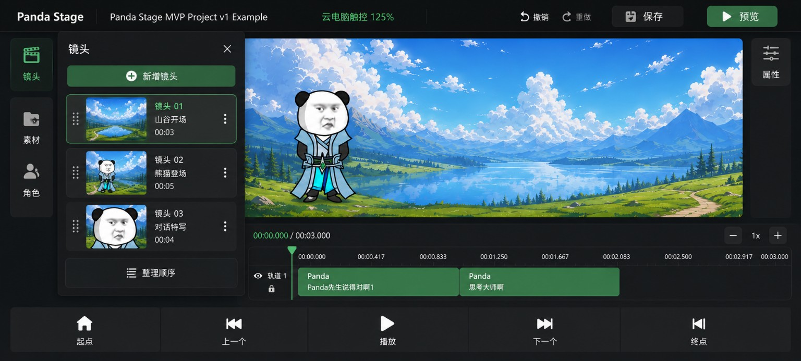
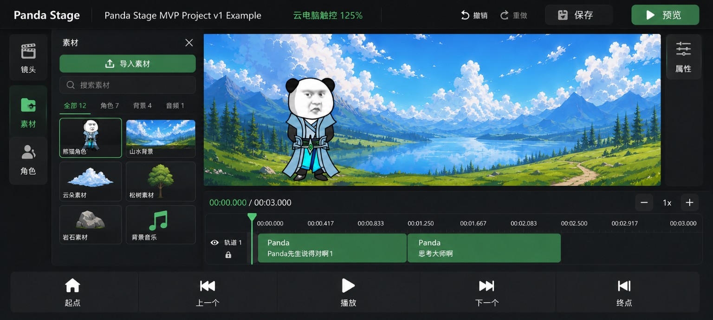
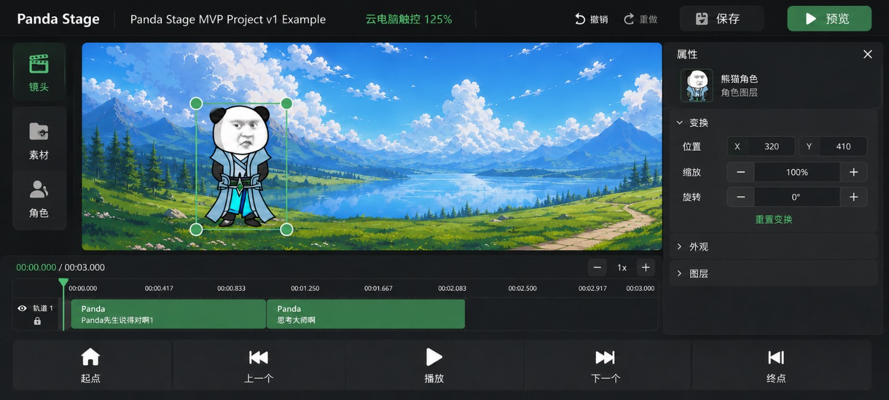
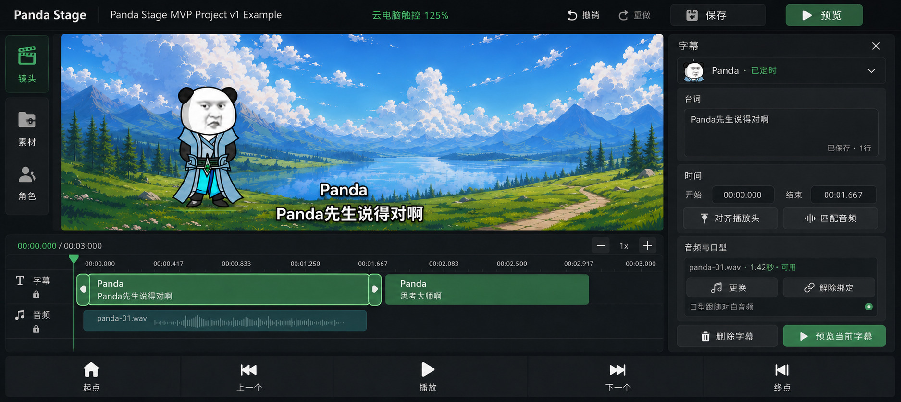
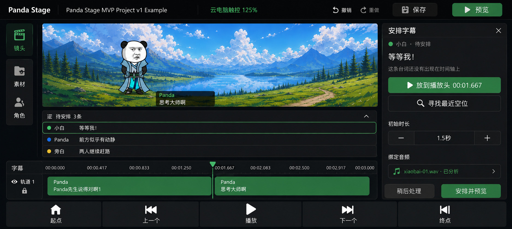
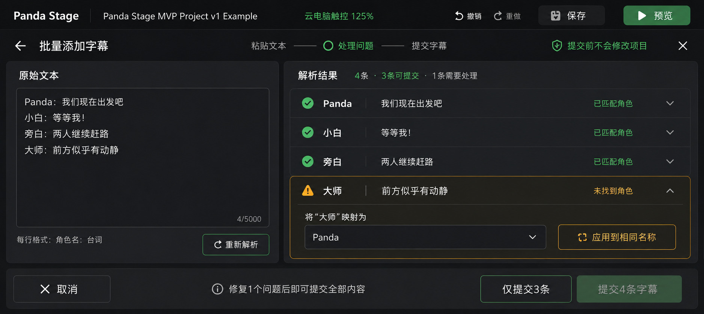
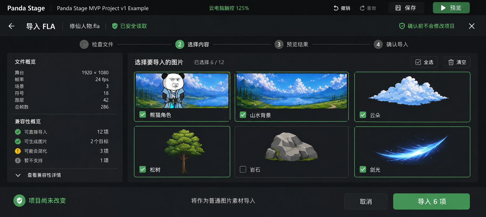
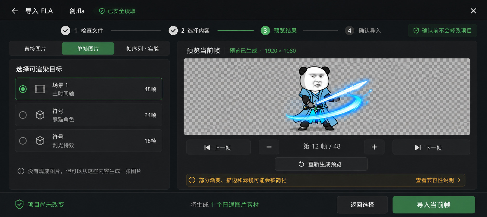
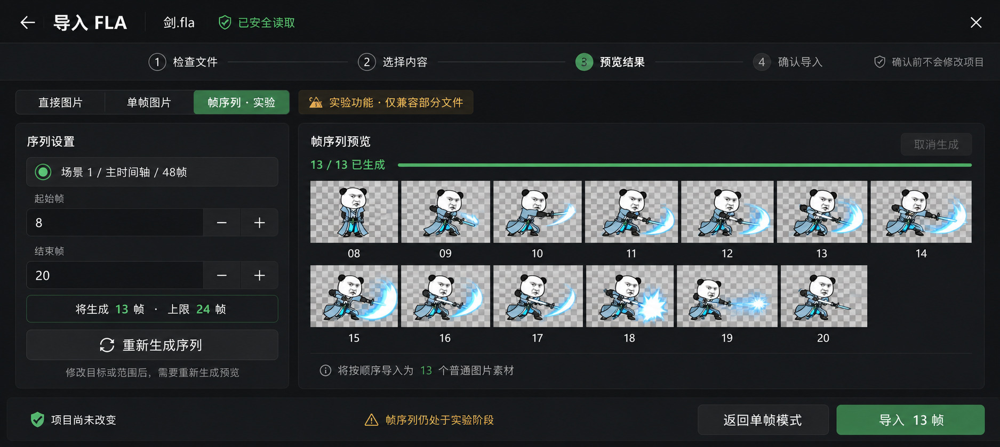
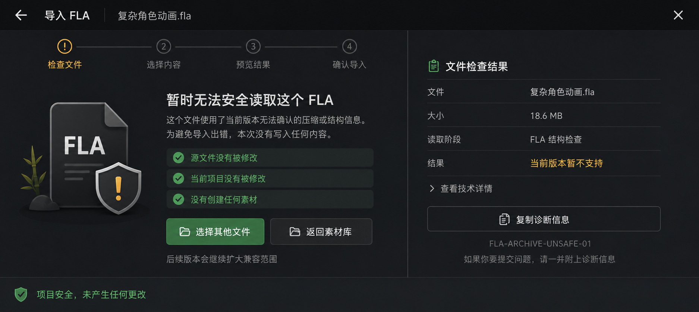

# Panda Stage 云电脑手机编辑器交互蓝图 v0.2

> 状态：`DESIGN ARCHIVE / REFERENCE ONLY`
>
> 上位方案：[`cloud-mobile-editor-layout-v0.1.md`](./cloud-mobile-editor-layout-v0.1.md)
>
> 日期：2026-08-24
>
> 目标环境：Windows / Electron 通过阿里无影云电脑串流到 Redmi K60 Ultra 手机，优先横屏触控。
>
> 权限边界：本文只补充布局、状态、交互和验收规格；不授权生产实现，不代表相关功能或真机验收已经通过。

## 1. 本次补充解决什么

v0.1 已冻结“云电脑手机优先”的编辑器壳层方向。本次 v0.2 不重新发明视觉系统，而是在同一基线下补齐三类此前缺少的产品状态：

1. 左右抽屉展开后的稳定母版；
2. Day29 字幕 / 对白的高频编辑工作流；
3. FLA 检查、选择、单帧预览、实验帧序列和安全阻断工作流。

核心判断：

- **字幕是高频、连续、可撤销的编辑行为**，应留在编辑器内部，由时间轴与右侧检查器协作完成；
- **FLA 导入是低频、多阶段、高风险的事务行为**，只在素材抽屉提供入口，实际过程进入全屏导入工作间；
- 两类流程共享视觉语言和触控规则，但不共享同一种空间结构；
- 参考图表达信息层级与交互意图，不是生产截图或最终像素验收基准。

## 2. 相关能力的当前事实边界

| 来源 | 2026-08-24 状态 | 本文如何处理 |
| --- | --- | --- |
| PR #233 Day29 Dialogue / Audio / Mouth / Preview | `Open / Draft / Unmerged / mergeable=false`；Windows Electron 人工验收仍待完成 | 字幕蓝图以该分支已有语义为依据，但不把蓝图写成已交付能力 |
| PR #274 FLA V1.5 | 已合并至 `main@3c47a4ee…` | 复用已合并的检查、诊断、结构信息和显式确认边界；不宣称 V1.5-C 已实现 |
| PR #285 FLA V2-R | `Open / Draft / Unmerged / mergeable`；R1 单帧以限制条件通过；R2 实现与自动化通过 | 单帧蓝图可作为已验收方向；帧序列必须标记“实验 / 条件可用” |
| Issue #294 最新人工凭据 | `R2_FRAME_SEQUENCE_BLOCKED`；缺少通过严格入口且 `frameCount >= 2` 的真实样本 | 不把帧序列画成默认稳定能力，不允许 UI 绕过 V1.5-C 安全门 |

说明：PR #285 正文仍可能保留“R2 human acceptance pending”的旧摘要；Issue #294 的最新人工验收评论是当前更具体的阶段凭据。

## 3. 共用视觉与触控规范

### 3.1 布局层级

| 层级 | 责任 | 规则 |
| --- | --- | --- |
| 顶部全局栏 | 项目身份、模式、撤销 / 重做、保存、预览 | 只保留全局高频动作；项目名允许截断 |
| 左侧工具轨 | 镜头、素材、角色入口 | 图标加文字；当前入口同时使用颜色与表面变化表达 |
| 左侧任务抽屉 | 镜头 / 素材等集合操作 | 一次只打开一个；覆盖或临时压缩画布，不长期常驻成桌面三栏 |
| 中央画布 | 场景预览与对象操作 | 始终是编辑态最大连续区域 |
| 右侧检查器 | 当前选择对象的局部属性 | 由选择触发；分组清楚；底部动作固定可达 |
| 时间轴 | 时间位置、轨道、片段与音频关系 | 标签常驻可读；精细拖拽必须有离散按钮替代 |
| 底部传输栏 | 起点、上一个、播放、下一个、终点 | 大触控目标常驻；播放为最强动作 |
| 全屏任务工作间 | FLA、批量粘贴等高专注流程 | 单一主任务、单一主滚动面、固定页脚；完成或退出后回到编辑器 |

### 3.2 尺寸建议

- 正文：14–16 px 等效视觉尺寸；
- 次级说明：不低于 13 px 等效视觉尺寸；
- 关键触控目标：48–56 px；
- 图标按钮实际命中区域：不低于 44 × 44 px；
- 字幕片段建议高度：48–52 px；
- 字幕拖拽把手可见宽度可小于命中区域，但真实热区不得小于约 44 px；
- 禁止将关键能力隐藏在 hover、右键、双击或精确到数像素的拖拽中。

这些数值是设计起点，不是真机已通过的最终值。最终需结合 Windows 缩放、无影客户端缩放和触控映射校准。

### 3.3 颜色与表面

- 石墨黑 / 炭灰承担应用底色和工作面；
- 暖白承担正文；次级灰仍需满足长时间阅读；
- 竹绿色只用于当前选择、主按钮、播放头和安全成功状态；
- 琥珀色只用于可处理警告、实验能力与兼容性限制；
- 红色只留给确实危险且需要用户立即响应的状态；
- 优先用间距、对齐和明度分组，不把每行都塞进独立卡片。

## 4. 横屏编辑母版

三张母版冻结左抽屉与右检查器展开后的空间关系。后续字幕与 FLA 入口应沿用该壳层，不另起一套视觉系统。

### 4.1 镜头抽屉



- 左工具轨常驻，镜头抽屉展开；
- 镜头列表使用缩略图、名称和时长构成可拖拽对象；
- 画布、时间轴和传输栏仍保持可用；
- 关闭按钮固定在抽屉标题栏；
- 抽屉不与右属性检查器同时占用大面积。

### 4.2 素材抽屉



- 素材搜索、分类与导入集中在左抽屉；
- 卡片只承担真正独立的素材对象，不再把说明文案拆成多层卡片；
- FLA 只从“导入素材”进入，文件选择后切换到全屏 FLA 工作间；
- 素材抽屉本身不承载完整 FLA 检查和渲染流程。

### 4.3 属性检查器



- 右侧检查器由当前选择驱动；
- 顶部固定显示对象身份；
- 中部使用可折叠分组；
- 高风险或提交型动作固定在底部；
- 字幕检查器沿用这一结构，但字段由字幕 / 时间 / 音频三个所有权分组组成。

## 5. 字幕区设计

### 5.1 信息所有权

| 数据 / 状态 | 所有者 | UI 表达 |
| --- | --- | --- |
| 字幕文本、角色、显示起止时间 | Dialogue | 字幕片段、画布字幕、右侧“台词 / 时间” |
| 音频素材与实际播放起止时间 | AudioClip | 独立音频条、音频状态、右侧“音频与口型” |
| 当前预览时间 | 现有 Product Preview 主时钟 | 播放头、预览传输控件；不得新增第二只时钟 |
| 未定时对白 | Dialogue 的 Untimed 状态 | “待安排”任务队列，不使用难以命中的小圆点 |
| 批量粘贴临时解析结果 | 临时 UI 状态 | 全屏工作间；最终一次提交进入 History |

关键不变量：绑定音频不能偷偷覆盖字幕结束时间。字幕显示区间与音频播放区间必须独立可见、独立修改、独立持久化。

### 5.2 正常编辑态



#### 时间轴

- 使用明确的“字幕”轨道；片段内常驻显示角色与台词摘要；
- 已选片段使用竹绿色描边与更亮表面，不只依赖颜色；
- 片段两端提供 44 px 级触控热区；
- 选中字幕下方显示较细的音频条，让用户看到音频可能早于字幕结束；
- 轨道标签、锁定状态与时间刻度保持可读，不依赖 hover 才出现。

#### 右侧字幕检查器

| 分组 | 字段 / 动作 | 行为 |
| --- | --- | --- |
| 身份 | 角色、`已定时 / 待安排` | 固定在检查器顶部 |
| 台词 | 多行文本、行数、安全区提示、保存状态 | 失焦保存时必须立即显示结果；实现也可提供显式保存 |
| 时间 | 开始、结束、对齐播放头、匹配音频 | 默认显示可读时间码；原始毫秒值放入高级项 |
| 音频与口型 | 绑定素材、时长、分析状态、更换、解除绑定、口型状态 | `待分析 / 可用 / 失败`必须可区分；不显示尚未实现的口型模式 |
| 固定页脚 | 删除字幕、预览当前字幕 | 预览复用现有 Product Preview 并跳转到字幕起点 |

建议状态文案：

- `已保存 · 1 行`；
- `音频可用 · 1.42 秒`；
- `音频分析中`；
- `分析失败，点此重试`；
- `字幕持续 1.67 秒 / 音频持续 1.42 秒`。

### 5.3 待安排字幕态



- 时间轴上方提供可折叠的“待安排 N 条”队列；
- 每条显示角色、完整短台词和状态点，并提供整行触控目标；
- 选择后打开“安排字幕”检查器；
- 主动作一：`放到播放头`；
- 主动作二：`寻找最近空位`，使用 Day29 已有的确定性首个合法间隙语义；
- 初始时长使用减号、数值、加号离散调整；
- 安排成功后作为一个 History 命令进入时间轴；失败时项目、dirty/revision 与 History 均不得改变。

建议失败文案：

> 当前镜头没有足够空位。你可以缩短初始时长、移动播放头，或稍后处理。

不要只抛出 `DIALOGUE_NO_AVAILABLE_SLOT` 等内部错误码。

### 5.4 批量粘贴与纠错态



流程：

```text
粘贴文本
→ 解析每行“角色名：台词”
→ 标出合法 / 未知 / 歧义 / 格式错误
→ 人工映射或选择跳过
→ 明确提交 N 条
→ 一次 History 命令
```

#### 左侧原始文本

- 一个大文本区承载原始输入；
- 显示行数 / 字符数和格式帮助；
- 重新解析为显式动作，不在每次击键时进行高噪声重排。

#### 右侧解析结果

- 正常行使用绿色状态；
- 未知或歧义角色使用琥珀色，直接在当前行展开映射控件；
- 支持“应用到相同名称”；
- 错误处理完成前，全部提交按钮保持禁用并说明原因；
- 允许“仅提交合法项”，但必须明确将跳过多少条。

#### 提交边界

- 解析、映射、预览期间项目不改变；
- 最终一次提交创建全部 Dialogue；
- 撤销一次即可撤销该批次；
- 不允许一半成功、一半静默失败。

### 5.5 字幕最小验收

| 场景 | 操作 | 通过信号 |
| --- | --- | --- |
| 可读性 | 在目标手机横屏查看两条字幕片段 | 角色、台词和时间关系无需系统放大镜 |
| 触控调整 | 选择并改变字幕起止时间 | 不需要命中 7 px 把手；误触可撤销 |
| 独立时间 | 字幕 1500 ms、音频 1330 ms | 两条时间在 UI 中可见且保存 / 重开后不互相覆盖 |
| 未定时 | 从播放头安排、寻找最近空位 | 成功进入合法区间；失败不产生项目变更 |
| 批量粘贴 | 输入正常、未知和错误行 | 问题可逐条修复；一次提交、一次撤销 |
| 预览 | 从当前字幕启动预览并反复停止 / 重放 | 复用单一预览时钟，无幽灵音频或 dirty / History 泄漏 |

## 6. FLA 导入区设计

### 6.1 总体流程

FLA 从素材抽屉进入，但后续使用全屏导入工作间：

```text
选择 .fla
→ 检查文件
→ 选择内容 / 选择生成方式
→ 预览结果
→ 显式确认导入
→ 返回普通素材库
```

全程固定显示：`确认前不会修改项目`。检查、选择和预览都是临时状态；只有最终确认才能写入 Project。

### 6.2 直接位图路径



#### 左侧文件概览

- 舞台尺寸、帧率、场景、符号、图层、总帧数；
- 兼容性汇总使用用户语言：`可直接导入`、`可生成图片`、`可能会简化`、`暂不支持`；
- 详细诊断默认折叠，避免小字号技术卡片霸占主屏。

#### 右侧素材选择

- 只展示当前可直接导入的图片；
- 缩略图、名称、选择状态和大号复选热区；
- 全选、清空与已选数量常驻；
- 页脚明确说明输出为普通图片素材，并提供 `导入 N 项`。

#### 事务规则

- 关闭、返回、清空都不改变项目；
- 提交时应复用既有去重和事务策略；
- 成功结果需报告新增、复用和跳过数量；
- 不执行 ActionScript，不重写源 FLA。

### 6.3 单帧生成路径



适用条件：没有可直接导入的位图，但严格检查后发现受支持的可渲染目标。

| 区域 | 内容 | 规则 |
| --- | --- | --- |
| 左侧目标列表 | 场景 / 符号、名称、帧数 | 一次选择一个受支持目标 |
| 中央预览 | 透明棋盘与生成结果 | 预览成功前不得启用导入 |
| 帧控制 | 上一帧、减号、帧号、加号、下一帧 | 使用离散大按钮；输入必须限制在真实 `frameCount` 内 |
| 兼容性提示 | 渐变、描边、滤镜等可能简化 | 警告可展开，但不得承诺像素级还原 |
| 固定页脚 | 项目未改变、返回选择、导入当前帧 | 选择或帧号改变后，旧预览立即失效 |

最终输出必须是恰好一个普通 `ImageAsset`；保存、关闭、重开后仍可在普通素材库中使用。

### 6.4 帧序列实验路径



这张图表达未来 / 条件满足时的 R2 界面，不代表当前主线或 PR #285 已完成人工验收。

#### 显示门槛

只有同时满足以下条件时才可进入：

1. 对应能力在当前构建中显式启用；
2. FLA 通过严格入口检查；
3. 选择的可渲染目标 `frameCount >= 2`；
4. 范围合法、连续、步长固定为 1；
5. 总数不超过当前 R2 上限 24 帧。

不满足时，入口禁用并显示具体原因；不能提供“强制开启”或绕过检查。

#### 交互规则

- 用户选择目标、开始帧和结束帧；范围为闭区间；
- 渲染前显示将生成的帧数与上限；
- 生成过程中显示真实 `N / total` 进度和取消动作；
- 结果按请求帧顺序展示，不按异步完成顺序排序；
- 修改目标或范围后，旧结果立即失去提交资格，并提示重新生成；
- 最终显式导入为有界的一组普通 `ImageAsset`；
- 取消、关闭、替换请求、预算失败和提交结束都必须清理临时输出。

#### 当前严重限制

截至 2026-08-24，R2 实现与自动化证据通过，但真实多帧人工验收为 `BLOCKED`：批准的 `剑.fla` 只暴露 `0..0`，其他候选又被 V1.5-C 严格入口拒绝。因此 UI 必须保留“实验 / 条件可用”，不能写成稳定正式能力。

### 6.5 无法安全读取路径



目标不是庆祝安全门挡住了用户，而是让用户明确知道发生了什么、哪些内容没有被破坏、下一步能做什么。

#### 主信息

- `暂时无法安全读取这个 FLA`；
- 使用人话解释“压缩或结构信息当前无法确认”；
- 明确列出：源文件未修改、项目未修改、未创建素材。

#### 可用动作

- `选择其他文件`；
- `返回素材库`；
- `查看技术详情`；
- `复制诊断信息`。

#### 禁止动作

- 不提供“忽略并继续”；
- 不提供“强制导入”；
- 不绕过 V1.5-C；
- 不把原始堆栈、上游解析器对象或大段内部错误直接甩给普通用户。

### 6.6 FLA 状态与主按钮

| 状态 | 主按钮 | 是否可写项目 |
| --- | --- | --- |
| 检查中 | 无；仅允许安全取消 | 否 |
| 检查失败 | 选择其他文件 | 否 |
| 可直接导入位图 | 导入 N 项 | 仅确认后 |
| 可生成单帧、尚未预览 | 生成预览 | 否 |
| 单帧预览有效 | 导入当前帧 | 仅确认后 |
| 帧序列生成中 | 取消生成 | 否 |
| 帧序列预览有效 | 导入 N 帧 | 仅确认后 |
| 意图变化导致预览过期 | 重新生成 | 否 |
| 正在提交 | 无；锁定关闭或给出受控取消策略 | 事务中 |
| 提交成功 | 返回素材库 | 已完成 |

### 6.7 FLA 最小验收

| 场景 | 操作 | 通过信号 |
| --- | --- | --- |
| 直接图片 | 选择部分位图并确认 | 只导入所选普通素材；关闭前项目不变 |
| 单帧 | 选目标、帧号、预览、改变帧号 | 旧预览失效；重新预览后只导入一个 ImageAsset |
| 兼容性 | 查看受限特性 | 使用用户语言提示，不承诺完整 Animate 兼容 |
| 帧序列条件 | 目标 `frameCount < 2` | 实验入口禁用并解释原因 |
| 帧序列范围 | 超过 24 帧或改变已预览范围 | 渲染前拒绝；旧结果不可提交 |
| 取消与关闭 | 在生成中取消或退出 | 无残留临时输出、无项目变更、无卡死 |
| 安全阻断 | 导入被严格入口拒绝的 FLA | 无绕过按钮；源文件和项目保持不变；诊断可复制 |
| 持久化 | 导入后保存、关闭、重开 | 新素材仍可在普通素材库使用 |

## 7. 横屏与竖屏适配规则

本批蓝图以横屏为主。未来竖屏实现遵循 v0.1 的单工作区原则：

- 字幕正常编辑：主工作区切换为“时间轴”，点选字幕后用全高详情页代替窄右抽屉；
- 待安排字幕：队列占据主工作区，安排动作固定在底部；
- 批量粘贴：拆为“粘贴 → 处理问题 → 提交”逐屏流程；
- FLA：始终使用逐步全屏工作间，不在竖屏素材列表内展开多列检查器；
- 单帧预览：目标选择、预览和帧控制分步显示；
- 帧序列：范围设置与胶片预览分屏，页脚持续显示项目未改变；
- 阻断结果：保持单一主说明与两个恢复动作，不压缩成桌面双栏。

## 8. 可访问性与远程串流细节

- 所有图标按钮必须有中文可访问名称与 title；
- 选中、警告、禁用和成功不得只靠颜色；
- 远程点击后先给即时按下 / 处理中反馈，并对重复提交做幂等保护；
- 长任务需显示真实进度或明确的不确定状态，禁止假进度条；
- 抽屉和工作间关闭时应把焦点归还到触发入口；
- 键盘可用时保留 Tab / Enter / Escape 路径，但不能让触控用户必须依赖键盘；
- 图片预览与字幕应保持足够对比；透明棋盘不能干扰对象边界；
- 连续使用 20–30 分钟仍应无需系统放大镜完成主流程。

## 9. 建议的实现拆分（仅建议，不构成授权）

1. **UI-1：设计令牌与触控模式壳层**——颜色、字号、间距、触控尺寸、模式入口；
2. **UI-2：横屏抽屉与右侧检查器**——按三张母版建立壳层，不改编辑语义；
3. **UI-3：字幕轨与字幕检查器**——保持 Dialogue / AudioClip 独立时间所有权；
4. **UI-4：待安排队列与批量粘贴工作间**——复用既有确定性安排与单 History 提交；
5. **UI-5：FLA 全屏导入壳层与直接位图路径**——复用 PR #274 已合并边界；
6. **UI-6：FLA 单帧路径**——仅在 PR #285 R1 能力进入目标分支后实施；
7. **UI-7：FLA 帧序列实验路径**——只有 #294 人工证据门解除后才允许升级为稳定能力；
8. **UI-8：云电脑手机真机验收**——记录逻辑分辨率、缩放、网络、触控映射和人类证据。

每一项都应拥有独立 Issue / PR、范围、自动化验证与真机验收。PR #306 继续保持 docs-only 设计存档，不吸收生产代码。

## 10. 风险与待决策

### 严重风险

- PR #233 仍是陈旧基线上的 Draft / non-mergeable 分支；字幕 UI 实施前必须先确定集成路线，不能直接把设计稿当成可合并代码任务；
- R2 帧序列人工验收被真实样本与 V1.5-C 严格入口阻断；不能以蓝图或自动化 PASS 代替真实多帧验收；
- 若左右抽屉、画布、时间轴与底部传输栏同时常驻，手机横屏仍会退化成拥挤桌面三栏；
- 若远程点击没有本地即时反馈与重复提交保护，10 Mbps 串流抖动会放大重复导入、重复保存和误触。

### 待决策

- 云电脑触控模式是用户手动开启，还是在自动模式中提示切换；
- 125% 是否为目标手机默认缩放，需要真机实测；
- 字幕台词采用失焦自动保存还是显式保存；
- FLA 提交阶段是否允许取消，以及取消的事务边界；
- 帧序列在未来稳定后是否仍输出松散 ImageAssets，或由 R3 引入更高层的动作包 / 分组产品语义。

## 11. 资产清单

### 本次新增母版

| 文件 | 尺寸 | 目的 |
| --- | --- | --- |
| `cloud-mobile-editor-master-shot-drawer-v0.2.jpg` | 1536 × 693 | 镜头抽屉母版 |
| `cloud-mobile-editor-master-assets-drawer-v0.2.jpg` | 1536 × 692 | 素材抽屉母版 |
| `cloud-mobile-editor-master-properties-drawer-v0.2.jpg` | 1536 × 693 | 属性检查器母版 |

### 本次新增字幕蓝图

| 文件 | 尺寸 | 目的 |
| --- | --- | --- |
| `cloud-mobile-editor-subtitle-edit-v0.2.jpg` | 1875 × 839 | 正常编辑与独立音频时间 |
| `cloud-mobile-editor-subtitle-unscheduled-v0.2.jpg` | 1875 × 839 | 待安排队列与确定性安排 |
| `cloud-mobile-editor-subtitle-batch-paste-v0.2.jpg` | 1875 × 839 | 批量粘贴、角色映射与原子提交 |

### 本次新增 FLA 蓝图

| 文件 | 尺寸 | 目的 |
| --- | --- | --- |
| `cloud-mobile-editor-fla-direct-bitmaps-v0.2.jpg` | 1876 × 838 | 检查通过后的直接位图选择 |
| `cloud-mobile-editor-fla-single-frame-v0.2.jpg` | 1875 × 839 | 受限单帧生成、预览与导入 |
| `cloud-mobile-editor-fla-frame-sequence-experimental-v0.2.jpg` | 1875 × 839 | 条件可用的实验帧序列 |
| `cloud-mobile-editor-fla-safe-blocked-v0.2.jpg` | 1875 × 839 | 无绕过的安全阻断结果 |

图片包含 AI 生成的示意文案、素材与视觉细节。实现时以真实产品数据结构、能力状态和真机证据为准。

## 12. 当前决策

本版本冻结以下方向：

- 三张横屏抽屉 / 检查器图作为后续交互蓝图的视觉母版；
- 字幕采用“时间轴主编辑 + 右侧字幕检查器”，批量处理进入独立工作间；
- FLA 采用“素材入口 + 全屏导入工作间”，确认前项目始终不变；
- 单帧和帧序列不同时堆叠，用户先选择一种生成模式；
- R2 帧序列保持实验和条件可用，直到真实多帧人工验收解除阻断；
- 安全失败页必须提供恢复路径与诊断信息，但绝不提供绕过按钮。

下一步唯一动作：仓库所有者审阅 v0.2 蓝图和能力边界；确认后再分别为字幕、FLA 壳层和真机验收建立实施 Issue。
