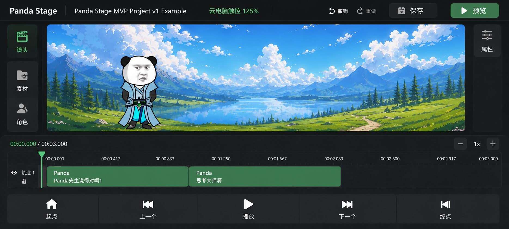
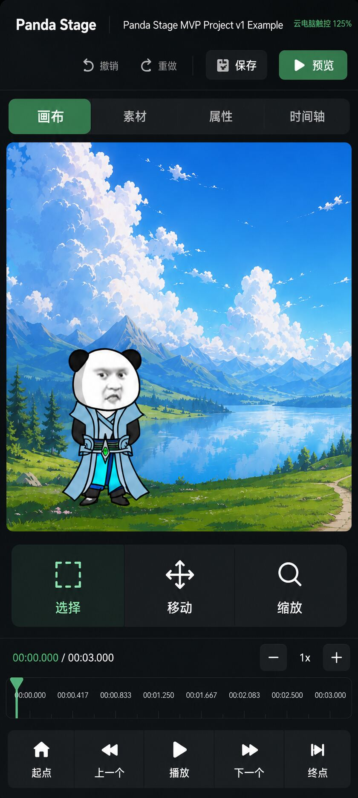

# Panda Stage 云电脑手机编辑器布局方案 v0.1

> 状态：`DESIGN ARCHIVE / REFERENCE ONLY`
>
> 基线：`main@3c47a4ee8af07e834338b223fcb3260a4c6dddbc`
>
> 日期：2026-08-23
>
> 权限边界：本文仅存档设计方向与后续验收口径，不授权修改生产代码，不代表真机验收通过。

## 1. 为什么单独做这份方案

当前 Panda Stage 的使用画面并非普通桌面显示器，而是 Windows / Electron 界面通过阿里无影云电脑串流到手机。目标设备为 Redmi K60 Ultra（6.67 英寸，设备分辨率 2712 × 1220），云电脑配置约为 8 核 CPU、16 GiB 内存和 10 Mbps 网络。

因此，高像素分辨率不能等同于可用的物理显示面积。若继续按传统桌面三栏布局缩小显示，会同时出现以下问题：

- 画布、素材、属性和时间轴争夺同一块窄小空间；
- 字体看得见但读不清，按钮看得到但点不中；
- 依赖 hover、右键或精细拖拽的操作在手机串流环境中不可靠；
- 远程延迟会放大误触、重复点击与拖拽失败；
- 过多面板、描边和装饰会增加视觉噪声，并降低长期使用舒适度。

本方案把“云电脑投到手机上长期编辑”视为独立工作模式，而不是把桌面版等比缩小。

## 2. 本次设计目标

1. **云电脑手机优先**：本阶段优先保证手机横屏与竖屏可用，暂不以真实桌面显示器比例为主目标。
2. **画布优先**：画布始终是最强视觉中心，面板只在当前任务需要时出现。
3. **横屏完整编辑**：横屏保留画布、轻量素材入口、可读时间轴和大号播放控制。
4. **竖屏单工作区**：竖屏一次只展示画布、素材、属性或时间轴中的一个主工作区，避免四块区域同时被压扁。
5. **触控可读可点**：关键按钮使用图标加文字；目标触控高度建议为 48–56 px 等效视觉尺寸，正文建议为 14–16 px 等效视觉尺寸，最终数值必须由真机校准。
6. **克制的成熟感**：使用石墨黑 / 炭灰表面、暖白文字和有限的竹绿色强调，减少卡片套卡片、厚描边、霓虹和无意义渐变。
7. **适应串流**：减少依赖细微动效、模糊和高频视觉变化的设计，优先保证状态清楚与操作反馈明确。

## 3. 权限与非目标

### 本文记录什么

- 手机横屏与竖屏的信息架构；
- 面板显隐和工作区切换原则；
- 触控尺寸、视觉层级与串流环境约束；
- 未来真机验收清单；
- 两张经当前讨论确认的布局参考图。

### 本文不授权什么

- 不修改 `src/`、测试、构建配置或运行时行为；
- 不授权启动响应式重构或组件重写；
- 不改变 V1.5-C、V2-R 或其他当前路线的范围与验收状态；
- 不把参考图中的文字、素材、按钮数量或像素值认定为最终产品事实；
- 不宣称阿里无影云电脑 / Redmi K60 Ultra 真机已经通过验收；
- 暂不定义普通桌面显示器布局。

本方案与现有的 [M3 编辑器壳层设计](./m3-editor-shell-design.md)并列：前者聚焦手机串流场景，后者仍是已有编辑器壳层与验收背景，不互相覆盖。

## 4. 横屏布局：画布主场 + 常驻轻导航

### 区域与行为

| 区域 | 设计职责 | 触控 / 串流规则 |
| --- | --- | --- |
| 顶部栏 | 产品名、项目名、模式 / 缩放、撤销重做、保存、预览 | 只保留高频全局动作；保存和预览使用大按钮；项目名允许截断 |
| 左侧工具轨 | 镜头、素材、角色入口 | 图标加文字；同一时间最多展开一个抽屉；展开层覆盖画布边缘，不永久挤压画布 |
| 中央画布 | 场景预览与对象编辑 | 占据最大连续区域；选择框与变换把手必须适合触控，不依赖像素级命中 |
| 右侧属性入口 | 当前对象属性 | 默认折叠成单入口；需要时以抽屉覆盖打开；不与左侧抽屉同时占用大面积 |
| 时间轴 | 时间读数、轨道、片段、缩放 | 保证片段文字可读；放大 / 缩小为显式按钮；拖拽外必须有可替代的离散操作 |
| 底部控制 | 起点、上一个、播放、下一个、终点 | 作为大号触控区常驻；主播放动作具有最强层级 |

### 横屏核心判断

- 横屏是手机云电脑模式的主编辑姿态。
- 画布、时间轴与播放控制可以同时存在，但素材和属性面板按需覆盖。
- 左右侧入口不能恢复为传统桌面的长期展开三栏，否则会重新挤压画布。
- 时间轴需保留可读标签和明确播放头，不能只剩一条难以命中的细线。

## 5. 竖屏布局：一次只做一件事

### 区域与行为

| 区域 | 设计职责 | 触控 / 串流规则 |
| --- | --- | --- |
| 顶部栏 | 产品 / 项目状态、撤销重做、保存、预览 | 允许分成两行；动作尺寸优先于把所有信息硬塞进一行 |
| 工作区标签 | 画布、素材、属性、时间轴 | 四个等权大标签；当前工作区高亮；切换后保留选择对象、播放头和面板状态 |
| 主工作区 | 当前被选择的单一工作面 | 一次仅显示一个完整工作区；禁止把桌面三栏纵向堆成长页面 |
| 画布工具 | 选择、移动、缩放等当前高频工具 | 使用大号图标加文字；选中状态必须同时依靠颜色和形态 / 边框表达 |
| 紧凑时间条 | 当前时间、总时长、播放头和缩放 | 画布页只保留定位与播放所需信息；完整多轨编辑进入“时间轴”工作区 |
| 底部控制 | 起点、上一个、播放、下一个、终点 | 拇指可达的大触控区；不依赖双击或长按才能完成关键动作 |

### 竖屏核心判断

- 竖屏不是缩窄后的横屏，而是“工作区切换器”。
- “画布”页可保留紧凑时间条和播放控制，但不能同时展开完整素材库、属性面板和多轨时间轴。
- 进入“素材”“属性”或“时间轴”后，主区域整体换页；上下文状态不丢失。
- 若某个功能无法在大触控目标内安全呈现，应延后或进入二级页面，不用更小按钮硬塞。

## 6. 模式与缩放建议

后续实现时建议保留显式模式，而不是仅根据窗口宽度自动猜测：

| 模式 | 目的 | 建议行为 |
| --- | --- | --- |
| 自动 | 降低普通用户配置成本 | 综合可用视口、指针能力和最近一次选择推断，但允许随时覆盖 |
| 桌面 | 未来真实电脑场景 | 本方案暂不定义其最终布局 |
| 云电脑触控 | 手机串流场景 | 启用大触控目标、面板覆盖和横 / 竖屏信息架构 |

云电脑触控模式可提供 100% / 125% / 150% 三档界面缩放。参考图使用“125%”作为方向示意，并不等同于已经验证的最终默认值。切换方向或缩放时，项目内容、当前对象、时间位置、撤销栈和未保存状态不得丢失。

## 7. 视觉语言

- **背景层级**：以 2–3 个炭灰层级区分应用背景、工作面和临时浮层，避免每个区块都变成独立卡片。
- **强调色**：竹绿色只用于当前选择、主按钮、播放头或成功状态；普通信息不大面积铺绿。
- **文字**：暖白为主，次级灰仍需保持可读；禁用态必须明显但不能低对比到看不见。
- **分隔**：优先使用间距和表面明度，必要时才使用 1 px 低对比分隔线。
- **状态**：选中、按下、禁用、保存中、保存失败等状态不能只靠颜色区别。
- **远程反馈**：关键操作先给即时本地视觉反馈；防止延迟期间连续重复触发。

## 8. 参考图说明

两张图片为基于当前讨论和已确认合并布局方向整理的 AI 概念稿，用于表达空间关系、视觉层级与触控尺度。

- 图中背景、角色、项目名、片段文案与图标只作示意，不构成产品文案或素材定稿；
- 图中“125%”是模式表达，不是已通过真机验证的默认值；
- 图片不是当前生产版本截图，也不是实现完成证明；
- 实现时应服从真实数据结构、既有功能边界和无影云电脑真机验收结果。

资产文件：

- `cloud-mobile-editor-landscape-v0.1.jpg`：1869 × 842；
- `cloud-mobile-editor-portrait-v0.1.jpg`：840 × 1871。

## 9. 后续真机验收门槛

任何实现均需在阿里无影云电脑实际串流到目标手机后，由人类完成以下任务；自动截图或无头测试不能代替验收。

| 场景 | 最小任务 | 通过信号 |
| --- | --- | --- |
| 启动与恢复 | 打开现有项目并切换横 / 竖屏 | 无状态丢失、无主要区域被系统栏遮挡 |
| 导航 | 在镜头、素材、角色、属性间切换 | 单次点击可达；无左右面板叠成不可关闭状态 |
| 画布 | 选择角色、移动、缩放并撤销 / 重做 | 主要操作无需像素级点击；误触可恢复 |
| 时间轴 | 定位播放头、选择片段、缩放、上一 / 下一 | 标签可读，播放头可命中，远程延迟下不重复触发 |
| 保存 | 修改后保存并验证状态 | 保存中、成功、失败均有清楚反馈 |
| 竖屏工作区 | 依次进入画布、素材、属性、时间轴 | 切换保持上下文；没有三栏被压缩并存 |
| 可读性 | 连续使用 20–30 分钟 | 无需系统放大镜；关键文字和按钮不造成持续视觉疲劳 |

还需记录：无影云电脑实际逻辑分辨率、Windows 缩放、云客户端缩放、触控到鼠标映射、是否连接蓝牙键鼠、网络抖动和系统任务栏占用。这些数据决定最终断点和尺寸，当前不能凭设备像素值推断。

## 10. 建议的后续拆分（仅建议，不构成授权）

1. **UI-1：设计令牌与云电脑触控模式壳层**——只建立颜色、间距、字号、触控尺寸和手动模式入口。
2. **UI-2：横屏编辑壳层**——只处理顶部栏、左右抽屉、画布、时间轴和大号播放控制的布局，不改编辑语义。
3. **UI-3：竖屏单工作区**——只处理四工作区切换、状态保持与紧凑播放条。
4. **UI-4：目标手机真机验收与修正**——在无影云电脑环境执行第 9 节任务并记录证据。

每一步都应拥有独立 Issue / PR、明确范围与止损条件；本存档 PR 本身不启动上述工作。

## 11. 当前决策

本版本冻结的是“云电脑手机优先”的布局方向，不是最终像素稿：

- 横屏采用画布主场、轻量常驻导航、按需覆盖面板和完整可读时间轴；
- 竖屏采用单工作区切换，画布页只保留紧凑时间信息与播放控制；
- 视觉采用克制的深色创作工具风格与有限竹绿色强调；
- 普通桌面比例、最终断点、最终缩放档位和完整交互规格留待独立授权与真机证据。

下一步唯一动作：由仓库所有者审阅本方向；如确认进入实现，再单独建立 UI-1 Issue，不能直接从本 PR 扩 scope 写生产代码。
