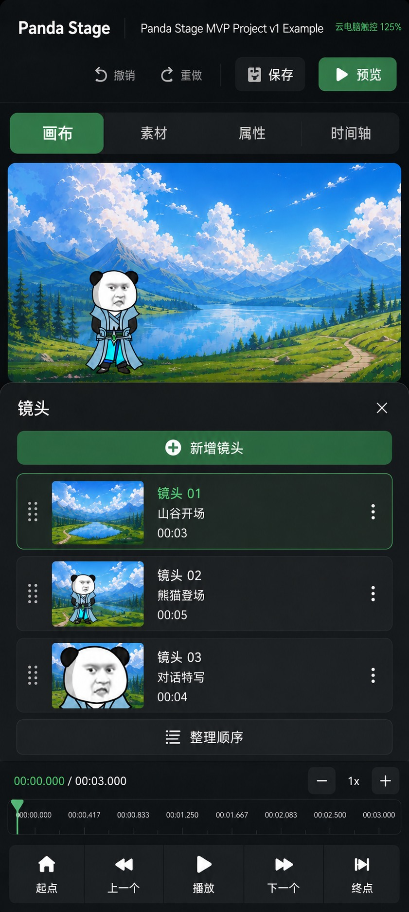
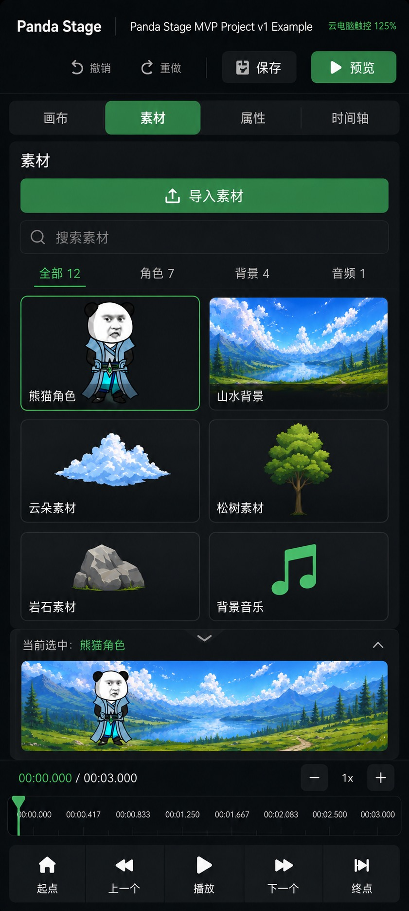
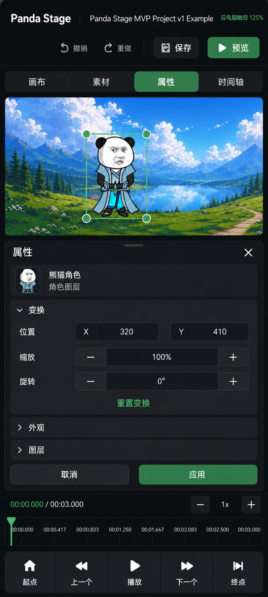
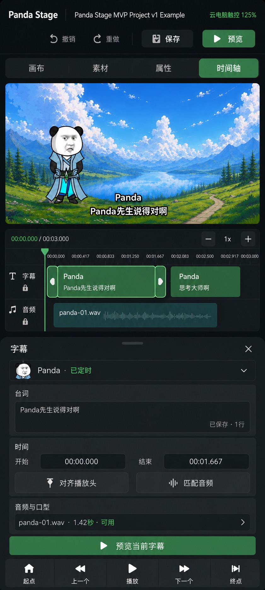
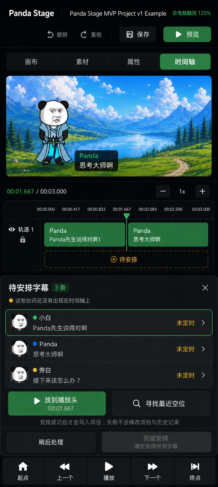
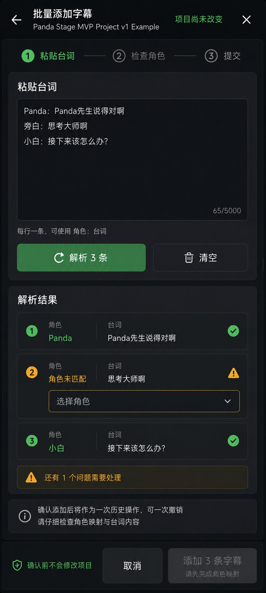
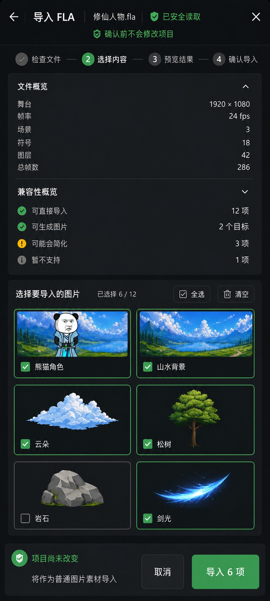
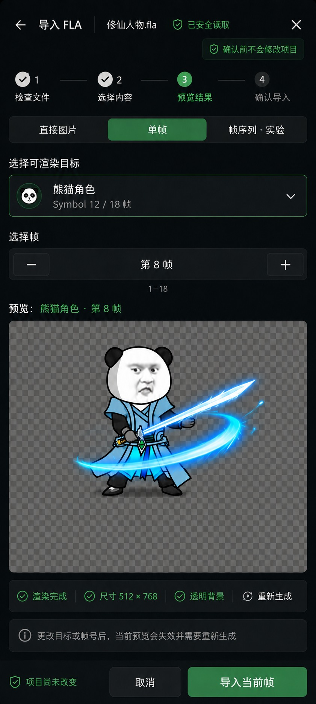
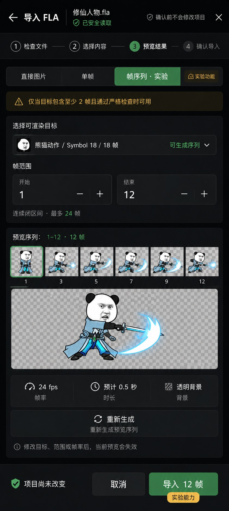
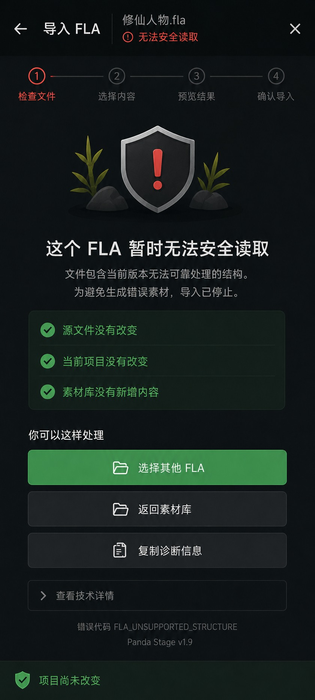

# Panda Stage 云电脑手机竖屏工作区与流程蓝图 v0.3

> 状态：设计存档 / 非生产实现  
> 日期：2026-08-24  
> 目标环境：阿里无影云电脑串流至 Redmi K60 Ultra，竖屏触控使用  
> 关联设计：`cloud-mobile-editor-layout-v0.1.md`、`cloud-mobile-editor-interaction-blueprints-v0.2.md`

## 1. 背景与目标

v0.1 已确定手机竖屏不能照搬桌面三栏布局，而应采用“画布 / 素材 / 属性 / 时间轴”单工作区切换。v0.2 又补齐了横屏镜头、素材、属性、字幕与 FLA 导入状态。

本 v0.3 的目标是把同一套产品信息架构完整映射到竖屏，并回答四个实现问题：

1. 横屏左侧抽屉在竖屏如何展开；
2. 横屏右侧检查器在竖屏如何编辑；
3. 字幕画布、时间轴与检查器如何同时保持上下文；
4. FLA 复杂导入如何在窄屏中维持明确步骤、显式确认和安全边界。

本设计优先解决“在手机竖屏里能不能长期用”，不追求与桌面像素级同构。

## 2. 核心结论

### 2.1 不把左右栏压窄，而是改变空间模型

- 横屏左侧镜头 / 素材抽屉，在竖屏变为全宽工作区或下半屏抽屉；
- 横屏右侧属性 / 字幕检查器，在竖屏变为可拖动的底部检查器；
- FLA 导入不嵌入编辑器主体，始终使用全屏事务工作间；
- 同一时间只允许一个主工作区承担滚动，避免多层嵌套滚动争夺手势。

### 2.2 保留稳定的产品骨架

普通编辑状态保持以下固定顺序：

1. 项目栏；
2. 撤销 / 重做 / 保存 / 预览；
3. 工作区切换；
4. 当前工作区；
5. 时间摘要或时间轴；
6. 五键传输控制。

全屏事务状态（批量字幕、FLA 导入）则暂时退出普通编辑骨架，只保留任务标题、进度、内容和显式提交区。

## 3. 竖屏壳层规则

### 3.1 固定区、粘性区与滚动区

| 区域 | 默认行为 | 说明 |
| --- | --- | --- |
| 项目栏 | 顶部固定 | 项目名可省略号截断，状态信息不得挤掉保存 / 预览 |
| 工作区切换 | 顶部粘性 | 画布 / 素材 / 属性 / 时间轴只允许单选 |
| 主内容 | 独立滚动 | 当前页面唯一纵向滚动容器 |
| 底部检查器 | 可拖动 / 可折叠 | 至少提供收起、半屏、接近全屏三档 |
| 时间摘要 | 底部粘性 | 抽屉展开时允许降级为单行摘要 |
| 传输控制 | 底部固定 | 起点 / 上一个 / 播放 / 下一个 / 终点始终可达 |

### 3.2 高度竞争处理顺序

竖屏高度不足时，按以下顺序让出空间：

1. 缩短画布预览高度；
2. 将完整时间轴降级为单行时间摘要；
3. 折叠非当前检查器分组；
4. 隐藏辅助说明但保留状态和禁用原因；
5. 最后才允许主内容滚动。

不得压缩以下目标：

- 主操作按钮命中区；
- 文本输入字号；
- 错误与安全状态；
- 底部五键传输控制。

### 3.3 建议触控规格

- 关键按钮高度：48–56 px；
- 图标按钮最小命中区：44 × 44 px；
- 输入框 / 步进器高度：48 px 起；
- 正文：14–16 px；
- 状态辅助文字：不低于 12 px；
- 相邻危险与确认操作之间至少保留 12 px 间隔。

图中 `125%` 为云电脑触控方向标记，最终 CSS / Electron 缩放值必须由真机校准，不能把概念图数值直接当实现常量。

## 4. 三张工作区母版

### 4.1 镜头工作区

用途：浏览、选择、新建和排序镜头。

布局：

- 上半部保留紧凑画布预览，帮助用户确认当前镜头；
- 下半部打开全宽“镜头”抽屉；
- 每行包含拖动柄、缩略图、镜头名称、说明、时长和更多操作；
- 当前镜头使用绿色描边与绿色标题；
- “新增镜头”是抽屉内唯一主操作；
- “整理顺序”作为次级操作固定在列表尾部。

交互约束：

- 拖动排序时锁定页面纵向滚动，结束拖动后恢复；
- 点击缩略图只切换选中镜头，不自动播放；
- 抽屉收起后仍保留当前镜头名称与数量摘要；
- 镜头列表为空时显示单一空状态与“新增镜头”，不堆教程卡片。

### 4.2 素材工作区

用途：搜索、分类、选择和导入素材。

布局：

- “素材”标签激活后，素材工作区替代大画布；
- 顶部依次为标题、导入按钮、搜索、分类标签；
- 主区使用两列触控网格；
- 当前素材以细绿色描边表示；
- 底部可展开当前素材的场景预览条；
- 时间摘要和传输控制仍保持可达。

交互约束：

- 分类与搜索共同过滤同一数据源；
- 选择素材不等于把素材写入场景；
- 长按进入多选前必须给出明显模式反馈；
- 大图预览不得盖住导入入口与返回路径；
- 素材缩略图加载失败时保留名称、类型与重试操作。

### 4.3 属性工作区

用途：在保持画布上下文的同时编辑选中对象。

布局：

- 上半部显示选中对象及变换框；
- 下半部打开全宽属性检查器；
- 对象摘要固定在检查器顶部；
- “变换”默认展开，“外观”“图层”默认折叠；
- 位置、缩放、旋转使用大字段与大步进器；
- 检查器底部提供“取消 / 应用”。

交互约束：

- 字段编辑期间画布手势暂停，避免拖动画布与输入冲突；
- “取消”恢复本次检查器会话的起始值；
- “应用”形成一次历史操作；
- 切换选中对象前，如有未应用更改，应要求应用、放弃或留在当前对象；
- 底部检查器收起时，画布恢复完整选择 / 移动 / 缩放工具。

## 5. 字幕工作流

### 5.1 正常编辑

目标：在一个竖屏视图中同时保留“画面结果、字幕时间、音频上下文、当前字段”。

结构：

1. 紧凑画布预览与字幕叠加；
2. 字幕 / 音频双轨时间轴；
3. 字幕底部检查器；
4. 当前字幕预览与传输控制。

字段：

- 角色；
- 台词；
- 开始时间；
- 结束时间；
- 绑定音频；
- 口型跟随状态。

规则：

- Dialogue 的字幕区间与 AudioClip 播放区间保持独立；
- 拖动字幕片段仅改变字幕时间，不隐式裁切音频；
- “匹配音频”必须是显式操作；
- 选中片段提供足够大的左右修剪柄；
- 修改文字允许自动保存草稿，但时间与绑定变更应形成可撤销历史操作。

### 5.2 待安排字幕

用途：处理已经存在台词、但尚未分配时间区间的字幕。

状态与操作：

- 顶部显示“待安排字幕 N 条”；
- 行内展示角色、台词预览与“未定时”；
- “放到播放头”以当前播放头作为开始位置；
- “寻找最近空位”寻找满足最小时长的最近可用区间；
- 全部完成前，“完成安排”保持禁用并说明原因；
- “稍后处理”允许返回，但保留待安排队列。

事务约束：

- 只有安排成功后才修改项目；
- 碰撞、越界、无空位或数据校验失败时不得增加 dirty / revision；
- 失败不得写入 History；
- 成功安排一条字幕形成一次可撤销操作。

### 5.3 批量粘贴与纠错

此流程使用全屏任务工作间，步骤为：

1. 粘贴台词；
2. 解析并检查角色；
3. 显式提交。

规则：

- 支持每行一条及“角色：台词”格式；
- 解析结果必须逐行保留原始文本和行号；
- 未匹配角色必须由用户选择或明确跳过；
- 存在阻断问题时，提交按钮显示禁用原因；
- 确认前项目不改变；
- 最终成功提交是一次历史操作，可一次撤销全部新增字幕；
- 中途关闭时可询问是否保留临时草稿，但不得悄悄写入 Project。

### 5.4 软键盘行为

字幕文字输入获得焦点时：

- 系统键盘可以覆盖传输控制，但不能覆盖当前输入行；
- 检查器自动提升至键盘上方；
- 画布可缩为最小预览或暂时隐藏；
- 时间轴至少保留当前片段、播放头和时间范围摘要；
- 键盘关闭后恢复用户此前的检查器高度档位。

## 6. FLA 导入工作流

FLA 导入是全屏事务工作间，不复用普通编辑器底部传输控制。所有模式共享：

- 文件名与读取状态；
- 四步进度；
- “确认前不会修改项目”；
- 明确取消 / 返回路径；
- 只有通过当前模式校验后才启用确认按钮。

### 6.1 直接图片

用途：导入 FLA 中可以安全提取的普通图片素材。

布局与规则：

- 文件与兼容性概览在竖屏中纵向排列；
- 图片候选使用两列网格；
- 全选 / 清空与已选数量同区展示；
- 每个候选必须显示选择状态、名称和缩略图；
- 最终按钮同时显示将导入的数量；
- 不支持内容不能通过“全选”被意外加入。

### 6.2 单帧生成

用途：从一个可渲染目标生成单张图片。

状态机：

1. 选择目标；
2. 选择帧；
3. 生成预览；
4. 校验预览；
5. 导入当前帧。

约束：

- 一次只选择一个目标和一个帧；
- 改变目标或帧号后，旧预览立即失效；
- 只有存在与当前选择匹配的有效预览时才可导入；
- 预览区展示尺寸、透明背景和生成状态；
- 导入结果作为普通图片素材进入素材库。

### 6.3 帧序列（实验 / 条件可用）

能力边界：

- 仅当目标 `frameCount >= 2` 且通过严格入口校验时显示；
- 仅支持连续闭区间；
- 当前设计上限为 24 帧；
- 修改目标、范围或帧率后，旧预览立即失效；
- 生成完成前不得导入；
- 页面必须持续标注“实验能力”。

该蓝图不改变 #294 的 `R2_FRAME_SEQUENCE_BLOCKED` 事实，也不把帧序列声明为稳定正式能力。

### 6.4 无法安全读取

目标：把“为什么停下、什么没有改变、下一步能做什么”讲清楚。

必须包含：

- 人话错误标题与简短原因；
- 源文件未改变；
- 当前项目未改变；
- 素材库未新增内容；
- 选择其他 FLA；
- 返回素材库；
- 复制诊断信息；
- 可折叠技术详情。

严禁提供：

- 忽略并继续；
- 强制导入；
- 绕过安全检查；
- 将内部堆栈直接暴露为主错误信息。

## 7. 滚动、抽屉与手势契约

### 7.1 单滚动所有权

任一时刻只能有一个纵向滚动所有者：

- 素材页：素材网格；
- 镜头页：镜头列表；
- 属性页：底部检查器内容；
- 字幕页：检查器或待安排列表；
- FLA 页：任务主内容。

横向时间轴、帧序列缩略图和分类标签可以拥有横向滚动，但必须通过方向锁避免误触纵向页面滚动。

### 7.2 底部抽屉档位

建议三档：

- 收起：仅显示标题、对象 / 状态摘要；
- 半屏：默认编辑档；
- 接近全屏：长表单、批量队列或无障碍大字模式。

抽屉档位切换应支持拖动柄和显式点击；不得只依赖精细拖拽。

### 7.3 返回行为

返回优先级：

1. 关闭弹出菜单 / 下拉框；
2. 收起键盘；
3. 将抽屉从全屏降至半屏；
4. 关闭当前抽屉；
5. 离开工作区；
6. 如存在未提交事务，再询问应用、放弃或留在当前页。

## 8. 可访问性与云电脑串流

- 状态不能只依赖颜色，需同时使用图标和文字；
- 绿色选中态与背景需满足可读对比；
- 焦点样式必须在键盘 / 鼠标模式下可见；
- 拖动操作必须提供按钮或字段替代；
- 串流卡顿时，按钮按下应先提供本地视觉反馈，再等待远端结果；
- 防止重复提交：主事务进行中锁定确认按钮，并显示进行中状态；
- 缩略图与画布允许渐进加载，但文字状态与返回路径必须先出现；
- 真实验收需覆盖无影云电脑的触摸模拟、长按、双击、滚轮与软键盘。

## 9. 验收建议

### 9.1 视觉验收

- 顶部项目名截断后不挤压保存 / 预览；
- 四个工作区标签均有完整命中区；
- 主内容不被底部传输控制遮挡；
- 抽屉三档切换后没有跳动和内容丢失；
- 关键状态、禁用原因和安全信息无需放大即可阅读；
- 横竖屏使用同一颜色、组件和状态语言。

### 9.2 行为验收

- 切换工作区不会丢失当前选择；
- 检查器取消 / 应用语义稳定；
- 字幕失败操作不改变 Project、dirty、revision 或 History；
- 批量字幕最终提交可一次撤销；
- FLA 任一确认前退出都不改变项目；
- 修改 FLA 预览意图会使旧预览失效；
- 安全阻断页不存在任何绕过入口。

### 9.3 真机验收矩阵

至少覆盖：

- Redmi K60 Ultra 竖屏；
- 无影客户端常用缩放值与 125% 方向值；
- 软键盘打开 / 关闭；
- 网络正常与明显延迟；
- 单指滚动、长按、拖动、双击；
- 字体缩放默认与放大档；
- 触控与鼠标临时切换。

## 10. 建议实现拆分

1. 竖屏壳层与工作区切换；
2. 通用底部抽屉与高度档位；
3. 镜头 / 素材 / 属性竖屏适配；
4. 字幕时间轴与检查器适配；
5. 待安排与批量字幕事务；
6. FLA 全屏工作间壳层；
7. FLA 三种可用模式与安全阻断；
8. 无影云电脑真机触控与性能验收。

每一步单独提交和验收，避免把视觉重构、字幕语义和 FLA 安全边界混成一个超大实现 PR。

## 11. 风险与 TODO

### 高风险

- 顶栏、工作区切换、底部抽屉、时间轴和传输控制可能同时争夺高度；
- 多层滚动会让云电脑触摸模拟出现误操作；
- 软键盘可能覆盖输入、时间字段或提交按钮；
- FLA 帧序列仍缺满足严格入口的人验证据，不能因设计稿存在而宣称能力已交付。

### 待验证

- 125% 是否为目标设备的最佳缩放；
- 半屏抽屉的默认高度；
- 时间轴在 690 px 设计宽度下的最小可用缩放；
- 长按多选与右键菜单在无影触控映射中的冲突；
- 图像生成稿中的示例文案与最终领域对象字段映射。

## 12. 文件清单

- `cloud-mobile-editor-portrait-master-shot-workspace-v0.3.jpg`
- `cloud-mobile-editor-portrait-master-assets-workspace-v0.3.jpg`
- `cloud-mobile-editor-portrait-master-properties-workspace-v0.3.jpg`
- `cloud-mobile-editor-portrait-subtitle-edit-v0.3.jpg`
- `cloud-mobile-editor-portrait-subtitle-unscheduled-v0.3.jpg`
- `cloud-mobile-editor-portrait-subtitle-batch-paste-v0.3.jpg`
- `cloud-mobile-editor-portrait-fla-direct-bitmaps-v0.3.jpg`
- `cloud-mobile-editor-portrait-fla-single-frame-v0.3.jpg`
- `cloud-mobile-editor-portrait-fla-frame-sequence-experimental-v0.3.jpg`
- `cloud-mobile-editor-portrait-fla-safe-blocked-v0.3.jpg`

这些图片是高保真概念蓝图，不是当前生产截图，不构成无影云电脑真机通过证明，也不授权放宽现有字幕或 FLA 能力边界。
