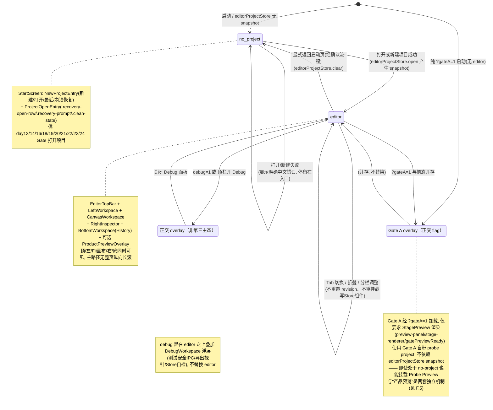

# M3 编辑器外壳（Editor Shell）设计包 — Issue #55

> 分支：`fix/m3-editor-shell`（基于 `feat/day-25-action-presets` @ `a907269`）
> 工作树：`D:\panda-stage\.worktrees\day25`
> 性质：**仅设计，不写生产代码、不 git commit/push**
> 语言：简体中文（与需求一致）
> 版本：**v1.1a**（v1.0/v1.1 方向已获认可；本次为**纯设计增补**，仅补充「v1.1a Implementation Clarifications」6 项澄清，并修正阶段 0→0A 与 A 树入口关系；**不修改任何生产代码、不 git commit/push**）

## 本次修订变更说明（v1.0 → v1.1）

在 v1.0 已核实事实基础上补齐 7 项，并落到指定章节：

1. **StartScreen 新增明确 NewProjectEntry**：含「新建项目 / 打开项目 / 最近项目 / 崩溃恢复」四项，基于真实 IPC/Service 调用链与成功/失败态（见 A 组件树、D 表 #17、第 3 节补充读码）。
2. **产品 UI「预览当前镜头」**：位于 `EditorTopBar`，复用正式 `Project`/`Shot`/`evaluateShotAtTime`/`StageRenderer`，仅「播放 / 暂停 / 重播 / 关闭」，不实现播放头/轨道/关键帧/时间轴编辑；与 Gate-A Probe 明确分离（见 A、`ProductPreviewOverlay`、F.5）。
3. **保存与关闭项目合同**：顶栏保存按钮 + `Ctrl+S`；dirty 下返回启动页或关闭窗口弹「保存并退出 / 不保存退出 / 取消」；**禁止直接 `editorProjectStore.clear` 丢弃修改**（必须走确认流程，见 A、D 表 #19、H.9）。
4. **Gate Navigation Matrix**：列出 `verify-day18~24` 各自需激活的 Tab/区域；新增稳定选择器 `[data-workspace-tab="shots|assets|characters"]`；Tab 采用**条件卸载**；Gate 可增加导航动作但不得放宽断言、不得操作隐藏 DOM（见 F.4）。
5. **修正页面状态模型**：基础态仅 `no-project | editor`；`debug` 与 `gateA` 是正交 flag/overlay，不是替换 editor 的第三主态；`gateA` 在没有 Project snapshot 时仍能挂载 Probe Preview（见 B）。
6. **删除"模块级 Set"强制单挂载**：改为**组件树保证唯一** + **集成测试断言数量=1**；`History` 快捷键提升至 `EditorShell` 单点注册（见 A、D 表 #1/#2 缓解、H.1）。
7. **新增阶段 0：合同锁定**：Gate 全绿基线（成功 CI SHA = `a907269`，已两次连续 PR SUCCESS）+ 选择器合同 + 唯一挂载失败测试 + 1366×768 基线截图（见 G 阶段 0，v1.1a 改列为阶段 0A）。

## 本次 v1.1 → v1.1a 变更说明（纯设计增补，不碰生产代码）

在 v1.1 已核准架构基础上，本次仅追加 6 项**实施澄清**并修正 2 处矛盾点，未新增架构方向：

1. **修正阶段 0 矛盾**（见 G 阶段 0A）：原"阶段 0 合同锁定"被表述为"新增选择器存在性测试 + 唯一挂载失败测试"，若提前断言尚未实现的组件会制造必然失败的 CI。改为 **阶段 0A（基线 + 护栏，不改生产代码）**：仅记录现有 Gate 全绿、DOM 层级、双挂载数量（CanvasStage 2 / HistoryControls 2）、1366×768 基线截图；新组件选择器测试随实现阶段提交；数量===1 测试随双挂载修复一并落地；禁止阶段 0 制造"必然失败的 CI"。
2. **统一 StartScreen 打开入口**（见 A 树修正 + 附录 2）：`NewProjectEntry` 是唯一入口容器；`ProjectOpenEntry` 降为其内部"打开项目"表单子节点；全应用仅一个 `.recovery-open-row`，不再与 `NewProjectEntry` 平行挂在 `StartScreen` 下。
3. **明确新建项目 UX**（见附录 3）：项目名输入 + 目录选择器（不手输系统路径）；`projectRoot` 由 名称+位置 拼接（`<位置>/<名称>.pandastage`）；PROJECT_ALREADY_EXISTS / 用户取消 / INVALID_PROJECT_ROOT / OPEN_FAILED 等中文反馈与 `ProjectServiceError.code` 映射。
4. **明确 Windows 窗口关闭 IPC**（见附录 4）：主进程 `window.on('close')` + `UnsavedCloseGuard.handleWindowClose` 已存在（`preventDefault` 已确认）；现状用**原生 Electron `dialog.showMessageBox`** 弹 save/discard/cancel，**未用**临时 `beforeunload`；v1.1a 明确正式 Electron close 合同，禁止以 `beforeunload` 替代。
5. **明确 ProductPreviewOverlay 资源与生命周期**（见附录 5）：无当前镜头时禁用预览；复用 `evaluateShotAtTime` / `buildEditorStageRenderModel`；加载中/失败态；播到 `shot.durationMs` 自动暂停；close/切换项目清理 timer/raf；**不写 editor Store**。
6. **明确旧 Gate 保存选择器兼容**（见附录 6 + 白名单）：`EditorTopBar` 保存区**保留** `.recovery-status-row`；正式保存按钮同时挂 `.editor-save-button`；day22/23/24 旧 Gate 仍可点 `.recovery-status-row button`，不降低断言。

---

## 0. 读码依据（已实际读取，非臆测）

| 类别 | 已读文件 |
|---|---|
| 入口/外壳 | `src/renderer/App.tsx`、`src/renderer/main.tsx`（index.html 引用） |
| 状态层（铁律依据） | `src/renderer/stores/EditorProjectStore.ts`、`shotStore.ts`、`selectionStore.ts`、`layerStore.ts`、`canvasViewportStore.ts`、`characterStore.ts`、`assetLibrarySelectors.ts`、`features/actions/actionPresetStore.ts` |
| 功能组件 | `features/canvas/CanvasStage.tsx`、`CanvasViewport.tsx`、`features/actions/ActionPresetPanel.tsx`、`features/editor/HistoryControls.tsx`、`features/recovery/ProjectRecoveryPanel.tsx`、`features/shots/ShotManager.tsx`、`features/assets/AssetLibrary.tsx`、`features/characters/CharacterManager.tsx`、`features/welcome/RecentProjectsPanel.tsx`、`features/properties/Layer{Transform,Order,Position}Panel.tsx` |
| 调试探针 | `src/renderer/stage/StagePreview.tsx`、`stage/CanvasStage.tsx`、`src/main/gate-a-runner.ts`、`src/main/windows/main-window.ts` |
| 样式/构建 | `src/renderer/styles.css`、`package.json`（scripts）、`.github/workflows/ci.yml`、`index.html` |
| Gate 选择器 | `scripts/verify-day{13,14,16,17,18,19,20,21,22,23,24}.cjs`、`verify-gate-a.cjs` |
| 领域（规避 Day23） | `src/domain/evaluate-shot-at-time.ts`（正确）、`src/shared/domain/evaluate-shot-at-time.ts`（**@deprecated**）、`src/domain/selectors/stageRenderModel.ts`、`src/renderer/stage/StageRenderer.tsx`、`src/domain/actions/createPresetEvents.ts`、`applyPresetEvents.ts`、`validators/timelineEventValidator.ts` |
| **v1.1 增补：IPC/恢复/预览** | `src/preload/index.ts`（contextBridge 暴露 `window.pandaStage`）、`src/main/services/ProjectService.ts`、`src/renderer/features/recovery/ProjectSessionController.ts`、`src/renderer/features/recovery/saveCurrentProject.ts`、`src/renderer/features/editor/useHistoryShortcuts.ts`、`src/shared/project-api.ts`、`scripts/verify-day{18,19,20,21,22,23,24}.cjs` |

### 读码得到的 5 个关键事实（v1.0 继承）
1. **项目未使用 Tailwind**：无 `tailwind.config.*`，全部样式在 `src/renderer/styles.css` 用原生 CSS。M3 布局沿用原生 CSS Grid/Flex，不引入新框架（与代码库一致，避免新增构建依赖）。
2. **存在两套 `CanvasStage`**：编辑画布 `features/canvas/CanvasStage.tsx`（带 `data-testid="project-canvas-stage"`）与 Gate-A 探针画布 `stage/CanvasStage.tsx`（带 `data-testid="stage-renderer"`，仅供 `StagePreview` 使用）。二者不可混用。
3. **当前已有"双挂载"隐患（Day 20 类）**：`features/canvas/CanvasStage.tsx` 被 `App.tsx`（第 170–172 行 `day25-editor-shell`）**和** `ProjectRecoveryPanel.tsx`（第 204–206 行）同时渲染；`HistoryControls` 被 `App.tsx`（第 167 行）**和** `CanvasStage.tsx`（第 420 行）同时渲染。二者都订阅同一 Store。
4. **Gate 通过"恢复入口"打开项目**：`verify-day{13,14,16,18,19,20,21,22,23,24}` 均依赖 `.recovery-open-row`、`.clean-state`/`.dirty-state`、`.recovery-prompt`、`.recovery-panel` 等选择器打开项目并校验保存态。这些选择器**必须保留在默认 UI**，不能整体迁到 `?debug=1`。
5. **Gate A（`verify-gate-a`）不在 CI**：它经 `?gateA=1` 加载并由 `gate-a-runner.ts` 读取 `[data-testid="preview-panel"]`、`[data-testid="stage-renderer"]`。CI 的 day13–24/m1/17/14/16 均**不**查询 `preview-panel`，故 `StagePreview` 可安全门控到 `?gateA=1 || ?debug=1`，不破坏 CI。

### v1.1 增补读码事实（夯实 7 项）
6. **IPC 表面（`window.pandaStage`，由 `src/preload/index.ts` 经 `contextBridge.exposeInMainWorld` 暴露）**：`project.{create, open, save}`、`recentProjects.{list, open, remove, relocate}`、`autosave.{track, update, stop, onError}`、`recovery.{detect, restore, ignore}`、`assets.*`、`export.*`。其中 `project.create`（→ `IPC_CHANNELS.PROJECT_CREATE` → `ProjectService.create`）是本次「新建项目」的真实通道；`project.open`/`recentProjects.open` 分别由 `ProjectSessionController.switchProject`/`switchRecentProject` 封装。
7. **`ProjectSessionController` 仅封装 `open/openRecent/track/stop/detect`（无 create 方法）**；新建项目先 `project.create` 建树写盘，再复用同一 `switchProject` 打开路径（`switchProject` 内部调用 `window.pandaStage.project.open` → `ProjectService.open` 读盘 → `editorProjectStore.open`）。失败态由 `ProjectServiceError.code` 承载（`PROJECT_ALREADY_EXISTS` / `INVALID_PROJECT_ROOT` / `PROJECT_NOT_FOUND` / `UNSUPPORTED_VERSION` / `INVALID_PROJECT` / `PROJECT_NOT_WRITABLE` / `OPEN_FAILED` / `CURRENT_PROJECT_DIRTY`）。
8. **`useHistoryShortcuts` 在 `HistoryControls` 内以 `useEffect` 注册 `window.addEventListener('keydown', …)`**（`HistoryControls.tsx:42`）。这正是双挂载导致 Ctrl+Z 可能触发两次的根因 —— 修复方式是把该注册**上提到 `EditorShell` 单点**（见 H.1、第 6 项）。
9. **`StageRenderer`（`src/renderer/stage/StageRenderer.tsx`）是编辑画布与 Gate-A Probe 共用的非交互 Konva 渲染器**（消费 `buildStageRenderModel` 的 `shared/stage` 契约）；产品预览应复用它 + 正确的 `evaluateShotAtTime`，与 Day23 动作管线共用同一求值器，规避 `@deprecated` 误用（见 F.5、H.8）。
10. **Gate 打开入口统一为 `.recovery-open-row`**：`verify-day{18,19,20,21,22,23,24}` 全部先 `setInput('.recovery-open-row input', root)` + `click('.recovery-open-row button')` 打开项目，再断言各自区域。各 gate 关注的面板/标签：day18→`.asset-library`（Assets）；day19→`.character-manager`（Characters）+ 资源导入 `.asset-import-heading`（Assets 标签内）；day20→`.shot-manager`（Shots）；day21→`.project-canvas`（中央常驻）+ `.shot-manager-heading span`(revision 0)；day22→`.project-canvas` + 右栏 `[data-testid="layer-transform-panel"]` + `.asset-category-tabs`（Assets 拖拽源）；day23→`.project-canvas` + 右栏 `layer-transform-panel`/`layer-order-controls` + `.asset-category-tabs`（Assets）；day24→`.project-canvas` + 右栏 `layer-transform-panel`/`layer-order-controls` + 底栏 `[data-testid="history-controls"]`。

---

## A. Editor Shell 组件树

> 约定：标注 **[复用]** = 直接复用现有组件；**[包装]** = 复用但加 Tab/容器外壳；**[新建]** = 本设计新增；**[门控]** = 仅 `?debug=1` 或 `?gateA=1` 渲染；**写Store** 指会触发 `editorProjectStore.updateProject` 或 `selectionStore.select` 等。
> 状态源全部来自第 C 节现有 Store，**禁止新建第二套 Project/Selection 状态**。
> **单挂载契约（v1.1）**：`CanvasStage`(editing) / `HistoryControls` / `ActionPresetPanel` 各自仅在下方标注的**唯一节点**渲染一次，由组件树结构本身保证（不再依赖模块级 `Set`）；集成测试断言其 DOM 数量 === 1（见阶段 0A、H.1）。

```mermaid
graph TD
  App["App.tsx<br/>(挂载 EditorShell + 保留 ?demo=1/?gateA=1 逻辑)"]
  Shell["EditorShell [新建]<br/>状态机 + 路由 + History 快捷键单点注册"]

  App --> Shell

  Shell -->|no-project| Start["StartScreen [新建]<br/>入口层·写Store:无(仅调用 open)"]
  Shell -->|editor| Top["EditorTopBar [新建]<br/>项目名/保存态/保存按钮/Ctrl+S/Debug开关/预览按钮"]
  Shell -->|editor| Left["LeftWorkspace [新建·Tabs·条件卸载]"]
  Shell -->|editor| Center["CanvasWorkspace [新建]"]
  Shell -->|editor| Right["RightInspector [新建]"]
  Shell -->|editor| Bottom["BottomWorkspace [新建·仅 History]"]
  Shell -->|debug| Debug["DebugWorkspace [新建·门控]"]
  Shell -->|gateA(正交 overlay)| GateA["StagePreview [门控·?gateA=1||?debug=1]<br/>(Gate A 证据用, 独立于 editor snapshot)"]

  Start --> NPE["NewProjectEntry [新建]<br/>四项: 新建项目/打开项目/最近项目/崩溃恢复"]
  NPE --> NPB["NewProjectButton [新建项目]<br/>window.pandaStage.project.create → switchProject"]
  NPE --> OPB["OpenProjectButton [打开项目]<br/>ProjectSessionController.switchProject"]
  NPE --> RP["RecentProjectsPanel [复用]"]
  NPE --> RC["RecoveryCandidateBanner [新建]<br/>(有崩溃恢复候选时显示)"]
  NPE --> POE["ProjectOpenEntry [包装自 ProjectRecoveryPanel·NPE 内"打开项目"表单]<br/>.recovery-open-row / .recovery-prompt / .clean-state<br/>(全应用唯一 .recovery-open-row)"]

  Top --> SaveBtn["保存按钮 + Ctrl+S [新建]<br/>saveCurrentProject(window.pandaStage.project, store)"]
  Top --> PreviewBtn["预览按钮 [新建]<br/>打开 ProductPreviewOverlay"]
  Top --> POverlay["ProductPreviewOverlay [新建·只读]<br/>复用 StageRenderer + evaluateShotAtTime<br/>播放/暂停/重播/关闭 · 不写 editor Store"]
  Top --> CloseConfirm["关闭/返回确认 [新建]<br/>dirty 时弹 保存并退出/不保存退出/取消"]
  Top --> DebugSwitch["Debug 开关 [新建]"]

  Left --> ShotsTab["ShotsTab [包装·data-workspace-tab=shots]"]
  Left --> AssetsTab["AssetsTab [包装·data-workspace-tab=assets]"]
  Left --> CharsTab["CharactersTab [包装·data-workspace-tab=characters]"]
  ShotsTab --> ShotManager["ShotManager [复用] 写Store:shotStore"]
  AssetsTab --> AssetLibrary["AssetLibrary [复用] 写Store:editorProjectStore(删/元数据)"]
  CharsTab --> CharacterManager["CharacterManager [复用] 写Store:characterStore"]

  Center --> CanvasStage["CanvasStage(editing) [复用·唯一挂载] 写Store:selection/layer/canvasViewport"]
  CanvasStage --> CanvasToolbar["CanvasToolbar [复用]"]
  CanvasStage --> CanvasViewport["CanvasViewport [复用·ResizeObserver+Fit]"]
  CanvasStage --> SelectableLayer["SelectableLayer/LayerTransformer [复用]"]

  Right --> LayerProps["LayerPropertiesSection [新建]"]
  Right --> ActionPresetSec["ActionPresetSection [新建]"]
  LayerProps --> LTP["LayerTransformPanel [复用→从CanvasStage迁出] 写Store:layerStore"]
  LayerProps --> LOC["LayerOrderControls [复用→从CanvasStage迁出] 写Store:layerStore"]
  LayerProps --> LPP["LayerPositionPanel [复用] 写Store:layerStore"]
  ActionPresetSec --> APP["ActionPresetPanel [复用→从App.tsx迁入·唯一挂载] 写Store:actionPresetStore→editorProjectStore"]

  Bottom --> HC["HistoryControls [复用·唯一挂载] 写Store:editorProjectStore.undo/redo"]

  Debug --> Ping["测试安全 IPC(ping) [门控·从App.tsx迁出]"]
  Debug --> ExportProbe["完整导出探针 [门控·从App.tsx迁出]"]
  Debug --> StoreInspect["Store 自检面板 [新建·门控]<br/>显示 revision/selectedShotId/selectedLayerId"]
```

**A 树入口关系修正（v1.1a）**：`ProjectOpenEntry` **不再是** `StartScreen` 的平行节点；它是 `NewProjectEntry` 内部「打开项目」项的具体表单子节点（包装自 `ProjectRecoveryPanel`，承载 `.recovery-open-row`/`.recovery-prompt`/`.clean-state`）。全应用**仅一个** `.recovery-open-row`（位于 `NewProjectEntry` 内），day18–24 Gate 仍经此唯一入口打开项目（见附录 2）。

**关键复用决策**
- `CanvasStage`(editing) 仅挂在 `CanvasWorkspace` **一处**；同时**移出**其内嵌的 `HistoryControls`、`LayerTransformPanel`、`LayerOrderControls`（这些迁到右栏/底栏），消除双挂载。
- `ActionPresetPanel` 从 `App.tsx` 的 `day25-action-shell` 迁入 `RightInspector`，紧邻画布，满足"应用动作不跨长页滚动"。
- `ProjectRecoveryPanel.tsx` 被**拆分**：入口/恢复候选部分 → `StartScreen`（`NewProjectEntry` + `ProjectOpenEntry`）；保存态指示 `.clean-state/.dirty-state` → `EditorTopBar`；恢复诊断细节 → `DebugWorkspace`（门控）。其 `ProjectSessionController`（autosave/recovery 跟踪）提升至 `EditorShell` 顶层 effect，与视图无关，避免重复挂载。
- **NewProjectEntry（第 1 项）**：四项均位于 `StartScreen`。`新建项目` 调 `window.pandaStage.project.create({projectRoot, metadata})`，成功后复用 `ProjectSessionController.switchProject` 打开；`打开项目` 直接调 `switchProject`；`最近项目` 复用 `RecentProjectsPanel`（回调 `switchRecentProject`）；`崩溃恢复` 在有 `recoveryCandidate` 时显示横幅（restore/ignore）。
- **产品预览（第 2 项）**：`EditorTopBar` 的「预览」按钮打开 `ProductPreviewOverlay`（只读 overlay），复用正式 `Project`/`Shot` + 正确 `evaluateShotAtTime` + 共用 `StageRenderer`，仅提供「播放/暂停/重播/关闭」，**不写 editor Store**（不改 selection/layer/revision，预览时间由本地 timer 驱动）。与 Gate-A Probe（`StagePreview`，`?gateA=1||?debug=1`，使用 probe project/音频，CI 证据用途）是两套独立机制（见 F.5）。
- **保存/关闭（第 3 项）**：`EditorTopBar` 保存按钮与 `Ctrl+S`（在 `EditorShell` 单点注册）均调 `saveCurrentProject(window.pandaStage.project, editorProjectStore)`；dirty 下返回启动页或关闭窗口触发 `CloseConfirm` 对话框（保存并退出/不保存退出/取消），**任何路径都不得在未确认时直接 `editorProjectStore.clear`**（见 H.9）。
- **History 快捷键（第 6 项）**：`useHistoryShortcuts` 从 `HistoryControls` 内迁出，由 `EditorShell` 注册一次；`HistoryControls` 仅渲染按钮，不再注册 `window.keydown`，彻底消除双注册。

---

## B. 页面状态机



**进入/退出条件（实测代码支撑）**
- `no-project`：当前 `editorProjectStore.getSnapshot() === null`。`App.tsx` 中 `?demo=1` 会在 snapshot 为空时调用一次 `editorProjectStore.open`（见 `App.tsx:37-51`），仅用于本地开发预览，CI 启动路径不传 `?demo=1`。
- `editor`：`getSnapshot()` 非空。
- `debug`：解析 `location.search` 的 `debug=1`，或 `EditorTopBar` 的 Debug 开关置位；本质是在 `editor` 之上叠加 `DebugWorkspace` 浮层/侧栏（**不替换 editor**）。`?gateA=1` 是独立通道（由 `main-window.ts` 注入），仅要求 `StagePreview` 渲染。
- **`gateA`（v1.1 修正，第 5 项）**：是正交 flag，不是第三主态。`gateA` 使用 Gate A 自带 `PROBE_PROJECT`（`StagePreview` 内），**不要求 `editorProjectStore` 有 snapshot**——纯 `?gateA=1` 启动时（无 editor）`StagePreview` 也能挂载并产出 `gatePreviewReady` 证据。它可与 `editor` 并存于同一窗口，互不替换。
- **产品预览**（第 2 项）：是 `editor` 态内由 `EditorTopBar` 触发的只读 overlay（`ProductPreviewOverlay`），与 `gateA` 正交且互不影响；它依赖当前 editor 的 `Project`/`Shot`，但不写入 editor Store。

---

## C. 状态归属矩阵（实测 Store 名称与位置）

> 所有写操作均经下方 Store；**严禁**在组件内 `useState` 保存可被其他面板共享的 Project/Shot/Layer 选择或 revision。

| 状态 | 管理 Store（文件·导出名） | 关键 API | 备注 / 铁律 |
|---|---|---|---|
| **Project（单一真相源）** | `EditorProjectStore` · `src/renderer/stores/EditorProjectStore.ts` · `editorProjectStore` | `open / updateProject / restore / clear / getSnapshot` | 全局唯一正式打开的 Project；`revision` 同文件 `snapshot.revision` |
| **revision** | 同上（`EditorProjectStore.getSnapshot().revision`） | — | 任何 `updateProject`/`apply*` 都会自增；**禁止**在导航/Tab/折叠时调用 `open`/`clear`（会归零） |
| **selectedShotId（当前镜头）** | `ShotStore` · `src/renderer/stores/shotStore.ts` · `shotStore` | `getCurrentShotId() / select() / create() / remove()` | 左栏/画布/右栏一致来源；`reconcileSelection` 保证镜头存在性 |
| **selectedLayerId（当前图层）** | `LayerSelectionStore` · `src/renderer/stores/selectionStore.ts` · `selectionStore` | `getSelectedLayerId() / select() / clear()` | 画布/图层属性/动作预设一致来源；背景层会被 `select()` 置空 |
| **History（撤销/重做）** | `HistoryStore` · 经 `editorProjectStore.history` 导出为 `historyStore`（`EditorProjectStore.ts:340`） | `historyStore.subscribe/getSnapshot`；`editorProjectStore.undo/redo` | `BottomWorkspace` 唯一展示；Day 24 已覆盖 |
| **Action Preset（应用）** | `ActionPresetStore` · `src/renderer/features/actions/actionPresetStore.ts` · `actionPresetStore` | `apply(presetId, params)` | **无状态桥接**：读 `shotStore/selectionStore`，经 `createPresetEvents → validatePresetApplication → applyPresetEvents → editorProjectStore.updateProject` 写回（命令链不变） |
| **canvasViewport（Fit/50%/Actual）** | `CanvasViewportStore` · `src/renderer/stores/canvasViewportStore.ts` · `canvasViewportStore` | `setMode() / recordStagePoint() / reset()` | 画布缩放模式；默认 `fit` |
| **character（角色/表情）** | `CharacterStore` · `src/renderer/stores/characterStore.ts` · `characterStore` | `create / addExpression / ...` | 经 `editorProjectStore.updateProject` 写回 |
| **assetLibrary（素材视图）** | 纯选择器 · `src/renderer/stores/assetLibrarySelectors.ts` | `selectAssetLibraryEntries / assetCategoryCounts` | 非 Store，仅派生；不持有状态 |
| **autosave / recovery 会话** | `ProjectSessionController` · `src/renderer/features/recovery/ProjectSessionController.ts` | `switchProject / switchRecentProject / dispose` | 提升至 `EditorShell` 顶层，避免重复实例化 |
| **产品预览（只读临时态）** | 仅 `ProductPreviewOverlay` 本地 `useState`（预览时间 `t`） | `play/pause/replay/close` | **不写**任何上面 Store；预览时间不进入 `editorProjectStore.revision`；关闭即丢弃本地态 |

**铁律落实：** 第二套 Project/Selection 状态 = 0。组件只通过上面 Store 读写；`CanvasStage`/`ActionPresetPanel`/`HistoryControls` 不持有可共享的"当前镜头/图层/project"本地副本（它们已从 `shotStore`/`selectionStore` 派生）。产品预览的临时时间态严格本地化，绝不回写 editor Store。

---

## D. 现有组件迁移表

> 范围：`src/renderer/**` 全部渲染组件（glob `src/renderer/components/**` 在本仓库不存在，真实路径为 `src/renderer/features/**` 与 `src/renderer/stage/**`）。

| # | 现有组件 | 当前文件 | 落到 A 的节点 | 决策 | 写Store? | 重复挂载风险 |
|---|---|---|---|---|---|---|
| 1 | `CanvasStage`(editing) | `features/canvas/CanvasStage.tsx` | `CanvasWorkspace` | **复用·唯一挂载**；移除内嵌 `HistoryControls`/`LayerTransformPanel`/`LayerOrderControls` | 是（selection/layer/canvasViewport） | **⚠ 高**：当前 `App.tsx`+`ProjectRecoveryPanel` 双挂载 → 收敛为 1 处 |
| 2 | `HistoryControls` | `features/editor/HistoryControls.tsx` | `BottomWorkspace` | **复用·唯一挂载**；`useHistoryShortcuts` 注册上提到 `EditorShell` | 是（undo/redo） | **⚠ 高**：当前 `App.tsx`+`CanvasStage` 双挂载 → 收敛为 1 处 |
| 3 | `ActionPresetPanel` | `features/actions/ActionPresetPanel.tsx` | `RightInspector` | **复用·从 App.tsx 迁入** | 经 actionPresetStore | 低（当前仅 1 处） |
| 4 | `LayerTransformPanel` | `features/properties/LayerTransformPanel.tsx` | `RightInspector` | **复用·从 CanvasStage 迁出** | 是（layerStore） | 低 |
| 5 | `LayerOrderControls` | `features/properties/LayerOrderControls.tsx` | `RightInspector` | **复用·从 CanvasStage 迁出** | 是（layerStore） | 低 |
| 6 | `LayerPositionPanel` | `features/properties/LayerPositionPanel.tsx` | `RightInspector` | **复用** | 是（layerStore） | 低 |
| 7 | `ShotManager` | `features/shots/ShotManager.tsx` | `LeftWorkspace · ShotsTab` | **包装为 Tab**（条件卸载） | 经 shotStore | 低 |
| 8 | `AssetLibrary` | `features/assets/AssetLibrary.tsx` | `LeftWorkspace · AssetsTab` | **包装为 Tab**（条件卸载） | 是（删/元数据） | 低 |
| 9 | `CharacterManager` | `features/characters/CharacterManager.tsx` | `LeftWorkspace · CharactersTab` | **包装为 Tab**（条件卸载） | 经 characterStore | 低 |
| 10 | `RecentProjectsPanel` | `features/welcome/RecentProjectsPanel.tsx` | `StartScreen · NewProjectEntry` | **复用** | 否（回调 open） | 低 |
| 11 | `ProjectRecoveryPanel` | `features/recovery/ProjectRecoveryPanel.tsx` | 拆分 | **拆**：入口→`StartScreen`；保存态→`EditorTopBar`；诊断→`DebugWorkspace`；删除本文件 | 部分（restore） | 中（其内嵌 CanvasStage 是双挂载根源） |
| 12 | `StagePreview` | `stage/StagePreview.tsx` | 门控 `?gateA=1 \|\| ?debug=1` | **门控**；用 `stage/CanvasStage`(probe) | 否（只读 PROBE） | 低（仅 1 处，已隔离） |
| 13 | `CanvasToolbar`/`CanvasViewport`/`SelectableLayer`/`LayerTransformer`/`useCanvasDrop` | `features/canvas/*` | `CanvasWorkspace` | **复用** | 见 #1 | 低 |
| 14 | `AssetImportPanel` 等子件 | `features/assets/*` | `LeftWorkspace · AssetsTab` | **复用** | 经 IPC | 低 |
| 15 | 测试安全 IPC(ping) | 内联于 `App.tsx:146-162` | `DebugWorkspace` | **迁移·门控** | 否 | 低 |
| 16 | 完整导出探针 | 内联于 `App.tsx:177-228` | `DebugWorkspace` | **迁移·门控** | 否 | 低 |
| 17 | **NewProjectEntry（第 1 项）** | `shell/NewProjectEntry.tsx` **[新建]** | `StartScreen` | **新建**四项：新建/打开/最近/崩溃恢复 | 否（仅触发 open） | 低（仅 `StartScreen` 1 处） |
| 18 | **ProductPreviewOverlay（第 2 项）** | `shell/ProductPreviewOverlay.tsx` **[新建]** | `EditorTopBar` | **新建·只读 overlay**；复用 `StageRenderer`+`evaluateShotAtTime` | **否（不写 editor Store）** | 低（仅 1 处） |
| 19 | **保存/关闭合同（第 3 项）** | `shell/EditorTopBar.tsx` + `shell/CloseConfirmDialog.tsx` **[新建]** | `EditorTopBar` + 确认对话框 | **新建**：保存按钮/`Ctrl+S`→`saveCurrentProject`；dirty 返回/关闭→确认对话框 | 是（经 saveCurrentProject） | 低 |

**双挂载风险重点标注（Day 20 类）**
- **#1 CanvasStage**：`App.tsx:170` 与 `ProjectRecoveryPanel.tsx:204` 两处渲染 → 两个 Konva 1920×1080 Stage + 两份 `selectionStore`/`canvasViewportStore` 订阅，交互会产生双写/双渲染。新设计仅在 `CanvasWorkspace` 渲染一次。
- **#2 HistoryControls**：`App.tsx:167` 与 `CanvasStage.tsx:420` 两处渲染 → 两份 `historyStore` 订阅与快捷键。`useHistoryShortcuts` 也双注册（Ctrl+Z 可能触发两次）。新设计仅在 `BottomWorkspace` 渲染一次，且快捷键注册上提到 `EditorShell`。
- **缓解（v1.1 修订，第 6 项）**：**不再使用模块级 `Set` 强制单挂载**。改为：
  1. **组件树保证唯一** —— `CanvasStage`(editing) 仅挂在 `CanvasWorkspace`、`HistoryControls` 仅挂在 `BottomWorkspace`、`ActionPresetPanel` 仅挂在 `RightInspector`，每个写 Store 组件在 EditorShell 组件树中只有**一个**渲染点，结构上即单挂载契约；
  2. **集成测试断言数量=1** —— `tests/integration` 断言 `querySelectorAll('[data-testid="project-canvas-stage"]').length===1`、`[data-testid="history-controls"]` 唯一、`ActionPresetPanel` 唯一（阶段 0A 固化，随阶段 2/3 双挂载修复一并落地，见 G 阶段 0A）；
  3. **History 快捷键单点注册** —— `useHistoryShortcuts` 由 `EditorShell` 注册一次，`HistoryControls` 不再注册 keydown。

---

## E. 布局规格

### E.1 网格方案（原生 CSS Grid，覆盖 ≥1366×768 与 1920×1080）

`styles.css` 调整（改造现有 `.app-shell`）：

```css
/* 根级：禁止整页滚动 */
html, body, #root { height: 100%; margin: 0; overflow: hidden; }

.app-shell {
  height: 100vh;
  display: grid;
  grid-template-rows: auto 1fr auto;   /* 顶栏 / 中部 / 底栏 */
  overflow: hidden;
}

.editor-middle {                         /* grid-template-rows 的 1fr 行 */
  display: grid;
  grid-template-columns: 300px minmax(0, 1fr) 340px;  /* 左 / 中 / 右 */
  min-height: 0;                        /* 允许内部滚动而非撑高整页 */
  min-width: 0;
}

.left-workspace,
.right-inspector {
  min-height: 0;
  overflow-y: auto;                     /* 各栏独立滚动容器 */
  overflow-x: hidden;
}

.canvas-workspace {
  min-width: 0;                         /* 关键：防止 1920 画布撑出横向滚动 */
  display: flex;
  flex-direction: column;
}

.bottom-workspace {
  max-height: 168px;
  overflow-y: auto;                     /* History 区独立滚动 */
}

/* 中等桌面(1366×768) 收窄侧栏，保持画布可见 */
@media (max-width: 1440px) {
  .editor-middle { grid-template-columns: 264px minmax(0,1fr) 300px; }
}
```

### E.2 各区域滚动边界（scroll containment）
- **页面根**：`overflow:hidden` → 主路径**无整页纵向长滚动**。
- **左栏**：`overflow-y:auto`（Tab + 列表），`overflow-x:hidden`。
- **右栏**：`overflow-y:auto`（图层属性 + 动作预设），`overflow-x:hidden`。
- **中央**：画布区 `min-width:0`；`canvas-viewport` 在 `fit` 模式 `overflow:hidden`，仅在 `50%`/`actual` 模式 `overflow:auto`（沿用现有 `.canvas-viewport-fit/-half/-actual`）。
- **底栏**：`max-height` + `overflow-y:auto`，History 列表不撑高整页。

### E.3 画布 Fit 实现要点（保留现有正确实现）
- `CanvasViewport.tsx` 已用 `ResizeObserver` 观测视口 `clientWidth/Height`，调用 `calculateViewportTransform(container, 'fit')` 计算缩放比（`scale = min(cw/1920, ch/1080)`），并对 `canvas-logical-stage` 施加 `transform: scale()` + `offsetX/Y` 居中。**直接复用**，仅需确保中央列为观测目标（`min-width:0` 且无横向滚动）。
- 空状态：`canvas-stage-message`（absolute 居中、不裁切）保留；`empty`/`missingBackground` 提示完整不裁切。
- Day 21–23 图层选择/拖动/缩放/旋转/翻转：能力来自 `SelectableLayer`/`LayerTransformer`/`layerStore`，与布局解耦，**不退化**（仅改变父容器）。

### E.4 验收对应
- 顶栏/左栏/Fit 画布/右栏/底栏在 1366×768 与 1920×1080 均同时可见（`grid-template-columns` 三列 + 三行）。
- 主路径（新建→选镜头→导入→建角色→加镜头→选图层→应用动作→撤销/重做→保存）全程**不出现整页纵向滚动**，各栏/底栏各自内部滚动。

---

## F. Debug 隔离设计

### F.1 探针实际位置（读码定位）
| 探针 | 位置 | 当前是否默认可见 |
|---|---|---|
| 测试安全 IPC（ping 按钮 + 结果） | `App.tsx:146-162`（`测试安全 IPC`） | **是**（应隔离） |
| 完整导出探针（项目目录/音频/MP4 + 开始/取消导出） | `App.tsx:177-228`（`.export-probe`） | **是**（应隔离） |
| 音画同步预览探针（`preview-panel` + `stage-renderer` + Gate A 证据 `dataset.gatePreviewReady`） | `stage/StagePreview.tsx`（用 `stage/CanvasStage` probe） | **是**（仅 Gate A 需要） |
| DAY 标签 | `AssetLibrary`"Day 18"、`CharacterManager`"Day 19"、`ShotManager`"Day 20 · M2 gate"、`CanvasStage`"Day 21"、`LayerPositionPanel`"Day 22"、`LayerTransformPanel`"Day 23 layer transform"、`LayerOrderControls`"Day 23 layer order"；`StagePreview` `Day 05` badge | 是（功能面板内；可随 Debug 隐藏） |
| 调试证据文本 | 恢复状态文本（`ProjectRecoveryPanel`）+ 导出状态 `output` + `dataset.gatePreviewReady` | 部分 |

### F.2 门控机制
1. **统一读取**：`EditorShell` 解析一次 `const params = new URLSearchParams(location.search); const debug = params.get('debug')==='1'; const gateA = params.get('gateA')==='1';`，并在 `<html data-debug="...">` 上落标记（供 CSS 隐藏 DAY 标签）。
2. **条件渲染**：
   - `StagePreview`（probe）仅在 `gateA || debug` 时挂载（Gate A 走 `?gateA=1`，CI 不受影响；本地调试走 `?debug=1`）。
   - `DebugWorkspace`（含 测试安全 IPC、完整导出探针、Store 自检面板）仅在 `debug` 时渲染。
   - DAY 标签（`eyebrow`/`day-badge`）用共享 `<FeatureEyebrow day=.. label=.. />` 包裹，仅在 `debug` 时输出 "Day N" 文本（默认显示功能名，如"素材库/角色/镜头/画布/图层"），**不影响任何 class/data-testid**。
3. **不得删除的 Gate 选择器（保留在默认 UI）**：`.recovery-open-row`、`.recovery-panel`、`.recovery-prompt`、`.clean-state`、`.dirty-state`、`.recent-projects-panel`、`.asset-library`、`.character-manager`、`.shot-manager`、`.project-canvas` 及所有既有 `data-testid`（含 `project-canvas-stage`、`project-canvas-viewport`、`history-controls`、`layer-transform-panel`、`layer-order-controls`、`canvas-empty-guidance`、`canvas-background-warning` 等）。这些由 `StartScreen`/`EditorTopBar`/各 Workspace 在默认（非 debug）UI 中继续渲染，确保 `verify-day{13,14,16,18,19,20,21,22,23,24}` 与 `verify-gate-a`(`?gateA=1`) 全绿。
4. **涉及文件**
   - 修改：`App.tsx`（移除内联 ping/export-probe，仅保留 `?demo=1`/`?gateA=1` 逻辑与挂载 `EditorShell`）、`ProjectRecoveryPanel.tsx`（拆分/删除）、`EditorShell.tsx`（门控）、`StagePreview.tsx`（门控）、`styles.css`（网格 + `data-debug` 隐藏 DAY 标签）、各 `eyebrow` 组件（改用 `FeatureEyebrow`）。
   - 新增：`src/renderer/shell/*`（EditorShell/StartScreen/EditorTopBar/LeftWorkspace/CanvasWorkspace/RightInspector/BottomWorkspace/DebugWorkspace/NewProjectEntry/ProductPreviewOverlay/CloseConfirmDialog）、`FeatureEyebrow.tsx`、`useDebugFlag.ts`。

### F.3 Gate A 不退化说明
- `gate-a-runner.ts` 经 `createMainWindow({gateA:true})` → `index.html?gateA=1` → `EditorShell` 判定 `gateA` 为真 → 渲染 `StagePreview`（`preview-panel` + `stage-renderer` + `dataset.gatePreviewReady`）→ Gate A 继续绿。
- `stage/CanvasStage`（probe）**不进入**编辑画布，仅服务于 `StagePreview`，与编辑路径彻底隔离，杜绝 Day 20 类误用。
- **v1.1 修正（第 5 项）**：`gateA` 不要求 `editorProjectStore` 有 snapshot。纯 `?gateA=1` 启动（无 editor 项目）时，`StagePreview` 仍以自带 `PROBE_PROJECT` 挂载并产出证据。Gate A 是叠加载 overlay，可与 `editor` 并存，不替换任何主态。

### F.4 Gate Navigation Matrix（第 4 项）

> 所有 `verify-day{18,19,20,21,22,23,24}` 都先通过 `.recovery-open-row` 打开项目（见事实 #4/#10），再断言各自区域。本矩阵列出**打开后需激活的 Tab/区域**，以及为保持 CI 全绿所需的脚本改动原则。

| Gate | 打开入口（不变） | 需激活的 Tab / 区域 | 断言的关键选择器 | 脚本需增加的导航动作 |
|---|---|---|---|---|
| day18 | `.recovery-open-row` | **Assets 标签** `[data-workspace-tab="assets"]` | `.asset-library` / `.asset-card` / `.asset-grid` / `.asset-details` / `.asset-category-tabs` / `.asset-delete-button` / `.asset-reference-warning` / `.asset-library-status` / `.asset-import-*` | 打开后 `click('[data-workspace-tab="assets"]')` 再断言 |
| day19 | `.recovery-open-row` | **Assets 标签**（资源导入）→ **Characters 标签** `[data-workspace-tab="characters"]` | `.asset-import-heading`（导入）/ `.character-manager` / `.character-create-form` / `.character-manager-heading span`(revision 0) | 导入前 `click('[data-workspace-tab="assets"]')`；创建角色前 `click('[data-workspace-tab="characters"]')` |
| day20 | `.recovery-open-row` | **Shots 标签（默认激活）** `[data-workspace-tab="shots"]` | `.shot-manager` / `.shot-create-form` / `.shot-list-item` / `.shot-editor-*` / `.shot-manager-heading` / `.shot-manager-status` | 无需导航（默认 Tab）；另验证切换项目后草稿 `.shot-create-form` 输入重置为「镜头 1」 |
| day21 | `.recovery-open-row` | 画布（中央，常驻）+ **Shots 标签**（revision 标识） | `.project-canvas` / `[data-testid="project-canvas-stage"]` / `[data-testid="project-canvas-viewport"]` / `.shot-manager-heading span`(revision 0) / `.clean-state` | 无需导航（默认 Shots 标签已含 revision 标识）；画布常驻 |
| day22 | `.recovery-open-row` | 画布（常驻）+ **Assets 标签**（拖拽源 `.asset-category-tabs`）+ 右栏 `.layer-transform-panel` | `.project-canvas` / `[data-testid="layer-transform-panel"]` / `.dirty-state` / `.clean-state` / `.recovery-status-row button` / `.asset-category-tabs` | 拖拽素材前 `click('[data-workspace-tab="assets"]')` |
| day23 | `.recovery-open-row` | 画布（常驻）+ **Assets 标签**（角色素材 `.asset-category-tabs`）+ 右栏 `layer-transform-panel`/`layer-order-controls` | `.project-canvas` / `[data-testid="layer-transform-panel"]` / `.layer-order-controls` / `.shot-manager-heading span`(revision) / `.clean-state` / `.recovery-status-row button` | 拖角色素材前 `click('[data-workspace-tab="assets"]')` |
| day24 | `.recovery-open-row` | 画布（常驻）+ 右栏 `layer-transform-panel`/`layer-order-controls` + 底栏 `[data-testid="history-controls"]` | `[data-testid="history-controls"]` / `.layer-transform-panel` / `.layer-order-controls` / `.clean-state` / `.recovery-status-row button` | 无需导航（均常驻）；另验证切换项目后 history 清空 |

**Tab 挂载策略（第 4 项核心）**
- **Tab 内容采用条件卸载（unmount 非激活标签）**，不是隐藏挂载（`display:none`）。理由：`selectedShotId`/`selectedLayerId` 已在 `shotStore`/`selectionStore` 中，**不得以"保选择"为由永久挂载全部重型面板**；切换 Tab 只改变"哪个面板可见"，选择状态在 Store 中不丢（day22/day24 的 `reopened.selectedLayerId` 断言已验证此契约）。
- **副作用与表单草稿处理**：非激活 Tab 卸载即自然清空其本地表单草稿（如 `.shot-create-form` 的镜头名/时长输入）。跨项目切换时以 `projectRoot` 作为重挂载 key，确保 day20 验证的"切换项目丢弃上一项目草稿（输入重置为「镜头 1」）"成立。
- **默认激活 Tab = Shots**：覆盖 day20/21/22/23 对 `.shot-manager-heading span`(revision) 与 `.shot-manager` 的断言；day18/day19 经导航动作切到各自 Tab；day22/day23 在需要拖拽素材时切到 Assets Tab；day24 不依赖左栏 Tab。
- **右栏图层属性（`layer-transform-panel`/`layer-order-controls`）与底栏 History 不是 Tab**，是 editor 内的常驻区域，仅在选中图层时挂载对应面板——与左栏 Tab 的条件卸载互不冲突。
- **Gate 可增加导航动作，但不得放宽断言、不得操作隐藏 DOM**：允许在 `verify-dayN.cjs` 开头增加 `document.querySelector('[data-workspace-tab="..."]').click()` 使目标面板进入 DOM 后再断言；**禁止**为通过测试而删除/弱化既有断言，也**禁止**对 `display:none` 的隐藏节点做读写。

### F.5 产品预览 vs Gate-A Probe 分离（第 2 项澄清）

| 维度 | 产品预览 `ProductPreviewOverlay`（EditorTopBar） | Gate-A Probe `StagePreview`（`?gateA=1||?debug=1`） |
|---|---|---|
| 触发 | 用户在 `editor` 态点「预览」按钮 | `?gateA=1` 或 `?debug=1` 自动挂载 |
| 数据来源 | 当前 editor 的 **真实** `Project`/`Shot` | Gate A 自带 `PROBE_PROJECT`/`PROBE_SHOT` |
| 求值器 | 正确 `evaluateShotAtTime(shot, t, project)` | 正确 `evaluateShotAtTime(PROBE_SHOT, t, PROBE_PROJECT)` |
| 渲染器 | 共用 `StageRenderer`（非交互 Konva） | `stage/CanvasStage`(probe) → `StageRenderer` |
| 控制 | 播放 / 暂停 / 重播 / 关闭 | 播放/暂停/停止/重播（CI 证据用） |
| 是否写 editor Store | **否**（预览时间本地态，不写 selection/layer/revision） | **否**（只读 PROBE） |
| 用途 | 用户产品内"预览当前镜头" | CI Gate A 音画同步证据（`gatePreviewReady`） |
| 时间轴/轨道/关键帧 | **不实现**（无播放头/编辑） | **不实现**（仅时间驱动采样） |

**铁律**：产品预览**不得**用 `StagePreview`/`?gateA=1` 替代（两者独立）；产品预览**不得**引入播放头、轨道、关键帧或时间轴编辑（Day 26 及之后冻结，不在本 M3 外壳范围）。产品预览与 Gate-A Probe 都复用同一正确 `evaluateShotAtTime` 与同一 `StageRenderer`，以规避 Day23 `@deprecated` 求值器误用（见 H.8）。

---

## G. 实施切片（阶段 0A + 4 个可独立验证阶段，先护栏后骨架后接入后隔离）

> 每阶段可单独回滚；每阶段结束均保证 `typecheck/lint/test:unit/test:integration/build` 不红，且已覆盖 Gate 不红。

### 阶段 0A — 基线 + 护栏（不改生产代码，最先执行）【v1.1a 修正：原"阶段 0 合同锁定"】
- **目标**：冻结 v1.0/v1.1 已认可的架构基线，仅做**记录与承载**，使后续改动有回归参照，且**不制造必然失败的 CI**。
- **动作（仅记录 / 承载，禁止在阶段 0A 新增尚未实现组件的存在性断言）**：
  1. 运行 `verify:day13/14/16/17/18/19/20/21/22/23/24` + `verify:gate-a` + `test:unit`/`test:integration`，确认**全绿**；记录成功 CI SHA = **`a907269`**（已两次连续 PR SUCCESS）。
  2. 固化"关键 DOM 层级与选择器合同"：把附录白名单中**当前默认 UI 已存在且可见**的节点写入 `tests/integration/shell-contract.test.ts` 并断言其存在；`[data-workspace-tab="shots|assets|characters"]` 是**未来阶段 2 引入 Tab 时才新增**的计划选择器，**阶段 0A 不纳入契约**（不断言其存在）。
  3. **双挂载现状基线**：记录 `CanvasStage`(editing) 当前 2 处（`App.tsx` + `ProjectRecoveryPanel.tsx`）、`HistoryControls` 当前 2 处（`App.tsx` + `CanvasStage.tsx`）这一已知基线（见 D 表 #1/#2、事实 #3）。
  4. 截取 **1366×768 基线截图**（`docs/evidence/m3-shell/baseline-1366x768.png`）作为布局回归基准。
- **新组件选择器测试随实现提交（v1.1a 关键修正）**：`[data-workspace-tab]` / `.new-project-entry` / `.product-preview-overlay` / `.editor-save-button` 等**尚未实现**组件的选择器存在性测试，**不得**在阶段 0A 提前断言；它们**随对应实现阶段一并提交**（即在阶段 1/2 落地这些组件时加测试），避免"断言不存在的节点 → CI 必红"。
- **数量===1 测试的分阶段节奏（v1.1a 关键修正）**：阶段 0A 本身**只「记录」**当前双挂载数量（`CanvasStage`=2、`HistoryControls`=2），**不新增任何 ===1 断言**；`CanvasStage`(editing) DOM 数量 === 1 的断言**随阶段 2**（收敛 `App.tsx`+`ProjectRecoveryPanel.tsx` 双挂载）一并落地；`HistoryControls` === 1 与 `ActionPresetPanel` === 1 的断言**随阶段 3**（迁出 `App.tsx`/`CanvasStage.tsx` 双挂载、`ActionPresetPanel` 迁入右栏）一并落地。
- **产出**：`scripts/lock-shell-contract.cjs`（或等价集成测试）固化**上述现有基线**断言；后续阶段改动若使其变红则阻断合并。
- **回滚点**：无（此阶段不改动生产代码，仅新增测试/证据；是后续阶段的护栏）。
- **铁律**：阶段 0A **禁止**在不改生产代码时制造"必然失败的 CI"——不得提前断言尚未实现的组件/选择器存在，不得提前要求数量 === 1。

### 阶段 1 — 状态机 + 外壳骨架 + 入口层 + 产品预览 + 保存/关闭（原阶段1 扩充）
- **修改/新增文件**：`App.tsx`（精简为挂载 `EditorShell` + 保留 `?demo=1`/`?gateA=1`）、`styles.css`（E.1 网格 + 根 `overflow:hidden`）、新增 `shell/EditorShell.tsx`、`shell/StartScreen.tsx`、`shell/EditorTopBar.tsx`、`shell/NewProjectEntry.tsx`、`shell/ProductPreviewOverlay.tsx`、`shell/CloseConfirmDialog.tsx`、`shell/useDebugFlag.ts`。
- **动作**：落地 B 状态机与 E 网格；
  - **NewProjectEntry 四项接线（第 1 项）**：`新建项目` → `await window.pandaStage.project.create({projectRoot, metadata})` 成功后再 `await sessionController.switchProject(projectRoot)`；`打开项目` → `sessionController.switchProject(projectRoot)`；`最近项目` → `RecentProjectsPanel`（复用，回调 `switchRecentProject`）；`崩溃恢复` → 有 `recoveryCandidate` 时显示横幅（restore/ignore）。
  - **产品预览 overlay（第 2 项）**：`EditorTopBar`「预览」按钮打开 `ProductPreviewOverlay`，复用 `evaluateShotAtTime(currentShot, t, currentProject)` + 共用 `StageRenderer`（只读、非交互），仅 播放/暂停/重播/关闭；预览时间由本地 timer 驱动，**不写 editor Store**。
  - **保存/关闭合同（第 3 项）**：`EditorTopBar` 保存按钮 + `Ctrl+S`（在 `EditorShell` 单点注册）→ `saveCurrentProject(window.pandaStage.project, editorProjectStore)`；dirty 下返回启动页或关闭窗口弹 `CloseConfirmDialog`（保存并退出/不保存退出/取消），**禁止直接 `editorProjectStore.clear` 丢弃修改**。
- **测试**：`EditorShell` 渲染测试（no-project 显示入口、open 后显示顶/左/中/右/底、根无整页滚动）；产品预览 overlay 存在且只读（断言其不触发 `store.updateProject`）；保存/关闭确认对话框在 dirty 时出现；确认 `verify-day16` 仍经 recovery row 打开；**唯一挂载集成测试**（阶段 0A 延续）。
- **回滚点**：`git stash` 新 shell 文件 + 还原 `App.tsx`/`styles.css`。

### 阶段 2 — 左栏接入 + 画布唯一挂载 + Fit + Gate 导航（原阶段2 扩充）
- **修改/新增文件**：`shell/LeftWorkspace.tsx`（Shots/Assets/Characters 三 Tab，带 `data-workspace-tab`）、`shell/CanvasWorkspace.tsx`、`ProjectRecoveryPanel.tsx`（拆分，停止内嵌 `CanvasStage`）、`CanvasStage.tsx`（移出 `HistoryControls`/`LayerTransformPanel`/`LayerOrderControls`）、`App.tsx`（移除 `day25-editor-shell` 中的 `CanvasStage`）。
- **动作**：`ShotManager`/`AssetLibrary`/`CharacterManager` 以 Tab 复用（**条件卸载**）；`CanvasStage` 收敛为 `CanvasWorkspace` 唯一挂载；中央列 `min-width:0` 接入 `CanvasViewport` 的 `ResizeObserver` Fit；
  - **Gate 导航接线（第 4 项）**：为 `verify-day18/19/22/23` 在对应脚本开头新增导航动作（点击 `[data-workspace-tab="..."]`），使目标面板进入 DOM 后再断言；默认激活 Tab = **Shots**；不得放宽断言、不得操作隐藏 DOM（见 F.4）。
- **测试**：`verify-day18/19/20/21` 保持绿；**Tab 切换不丢失 `selectedShotId`/`selectedLayerId`** 测试；`project-canvas-stage` 唯一；**跨项目切换丢弃上一项目草稿**测试（day20 行为：`.shot-create-form` 输入重置为「镜头 1」）；**唯一挂载集成测试（本阶段固化 `CanvasStage`(editing) DOM 数量 === 1 断言，双挂载收敛后）**。
- **回滚点**：还原 `ProjectRecoveryPanel.tsx`/`CanvasStage.tsx`/`App.tsx`，撤 `LeftWorkspace`/`CanvasWorkspace`。

### 阶段 3 — 右栏属性与动作区 + 底栏 History 唯一挂载（原阶段3）
- **修改/新增文件**：`shell/RightInspector.tsx`、`shell/BottomWorkspace.tsx`、`ActionPresetPanel.tsx`（迁入右栏）、`CanvasStage.tsx`（确认已无内嵌 `HistoryControls`）、`App.tsx`（移除 `day25-action-shell` 中的 `ActionPresetPanel`/`HistoryControls`）。
- **动作**：`LayerTransformPanel`/`LayerOrderControls`/`LayerPositionPanel` + `ActionPresetPanel` 迁入右栏；`HistoryControls` 唯一挂载于底栏；未选图层/背景/锁定按钮禁用并解释；8 类动作预设可见 + 同区显示成功/拒绝原因。
- **关键（第 6 项）**：`CanvasStage`/`HistoryControls`/`ActionPresetPanel` 的唯一挂载由**组件树结构保证**（各仅一处渲染点），不再依赖模块级 `Set`；集成测试断言三者 DOM 数量 === 1（阶段 0 固化）。`useHistoryShortcuts` 注册已上提到 `EditorShell`，`HistoryControls` 不再注册 keydown。
- **测试**：`verify-day22/23/24` 保持绿；新增"动作应用经 `createPresetEvents→validatePresetApplication→applyPresetEvents→updateProject`"集成断言；"背景/锁定层按钮禁用"断言；**唯一挂载断言**。
- **回滚点**：还原 `RightInspector`/`BottomWorkspace`/`ActionPresetPanel`/`App.tsx`。

### 阶段 4 — Debug 隔离 + 全量回归（原阶段4）
- **修改/新增文件**：`shell/DebugWorkspace.tsx`、`FeatureEyebrow.tsx`、`StagePreview.tsx`（门控 `gateA||debug`）、`ProjectRecoveryPanel.tsx`（删除，子功能已迁移）、`App.tsx`（移除内联 ping/export-probe）、`styles.css`（`[data-debug]` 隐藏 DAY 标签）。
- **动作**：测试安全 IPC、完整导出探针、StagePreview、Store 自检面板迁入 `DebugWorkspace`（`?debug=1`）；`EditorTopBar` 加 Debug 开关；保留 F.2/F.4/F.5 全部 Gate 选择器于默认 UI；产品预览 overlay 与 Gate-A Probe 互不干扰（F.5）。
- **测试**：`typecheck/lint/test:unit/test:integration/build` 全绿；`verify:day13/14/16/17/18/19/20/21/22/23/24/m1` 全绿；`verify:gate-a`（`?gateA=1`）绿；新增"调试面板默认隐藏（`?debug` 未传时 `preview-panel`/ping/export-probe 不在 DOM）"测试；新增"产品预览 overlay 与 Gate-A Probe 互不写 editor Store"断言。
- **回滚点**：还原 `DebugWorkspace`/`StagePreview`/`App.tsx`/`ProjectRecoveryPanel.tsx`，撤回 `FeatureEyebrow`。

> 顺序契合要求：阶段 0A 护栏（不改生产代码，先记录基线 + 双挂载数量 + 截图，不制造失败 CI）→ 先布局骨架+状态接线+入口+预览+保存（阶段1）→ 左/右栏接入与画布 Fit+Gate 导航（阶段2–3）→ Debug 隔离与回归（阶段4）。**不开始 Day 26 时间轴**（底栏仅预留占位，不实现）。

---

## H. 风险与缓解

### H.1 重复挂载（Day 20 类）— 高
- **现象**：`CanvasStage`、`HistoryControls` 当前双挂载（D 表 #1/#2），双订阅写同一 Store，Konva 双 Stage、快捷键双注册。
- **缓解（v1.1 修订，第 6 项）**：**不再依赖模块级 `Set` 强制单挂载**。改为：
  1. **组件树保证唯一**：`CanvasStage`(editing) 仅挂在 `CanvasWorkspace` 一处；`HistoryControls` 仅挂在 `BottomWorkspace` 一处；`ActionPresetPanel` 仅挂在 `RightInspector` 一处。`EditorShell` 的组件树结构本身即单挂载契约，无第二渲染点。
  2. **集成测试断言数量=1**：`tests/integration` 断言 `querySelectorAll('[data-testid="project-canvas-stage"]').length===1`、`[data-testid="history-controls"]` 唯一、`ActionPresetPanel` 唯一（阶段 0A 固化，随阶段 2/3 双挂载修复一并落地）。
  3. **History 快捷键提升至 `EditorShell` 单点注册**：`useHistoryShortcuts` 从 `HistoryControls` 内迁出，由 `EditorShell` 注册一次（基于 `editorProjectStore.undo/redo`）；`HistoryControls` 仅渲染按钮，不再注册 `window.keydown`。彻底消除双注册导致 Ctrl+Z 触发两次的风险。

### H.2 Store 订阅泄漏 — 中
- **现象**：`selectionStore` 订阅 `editorStore`/`shotStore`；`CanvasStage` 的 `useCanvasImages` effect；`ProjectSessionController` 需 `dispose`。
- **缓解**：所有 `useEffect` 返回清理函数；`EditorShell` 卸载时 `sessionController.dispose()`；单挂载契约顺带消除重复订阅；加"挂载/卸载计数"单测。

### H.3 Tab 切换导致选择状态丢失 — 中
- **现象**：左栏 镜头/素材/角色 切换时若卸载 `ShotManager` 或重置本地状态，会丢掉 `selectedShotId`/`selectedLayerId`。
- **缓解**：选择状态在 `shotStore`/`selectionStore`（非 Tab 本地）；Tab 采用**条件卸载**，仅切换"哪个面板可见"，**不丢** Store 中的选择（见 F.4）；素材拖入当前镜头始终用 `shotStore.getCurrentShotId()`。阶段 2 加 Tab 切换后选择保持测试。

### H.4 导航导致 revision 重置 — 高
- **现象**：进入/退出 editor、Tab 折叠若调用 `editorProjectStore.open`/`clear`，会把 `revision` 归零，破坏 Day 16 资产导入 Gate（其依赖 open 由 recovery row 独占）。
- **缓解**：`open` 只在"打开/新建项目"入口调用一次（`?demo=1` 仅当 `getSnapshot()===null`）；`EditorShell` 的视图切换/Tab/折叠**绝不**调用 `open`/`clear`；保留 `App.tsx` 注释约束；CI `verify-day16` 已保护。

### H.5 旧 Gate 选择器失效 — 高
- **现象**：重构布局后，Gate 读取的 `.recovery-open-row`/`.clean-state`/`.recovery-prompt`/`.recovery-panel`/`.asset-library`/`.character-manager`/`.shot-manager`/`.project-canvas` 及 `data-testid` 若被移除/改名，day13–24 变红。
- **缓解**：F.2/F.4 清单为"保留白名单"；迁移后**逐个运行** `verify-day{13,14,16,17,18,19,20,21,22,23,24}` + `verify:gate-a`；对关键选择器加存在性断言（DOM 中数量与可见性）；`stage/CanvasStage`(probe) 仅 Gate A 用，不进编辑器。

### H.6 画布 Fit 正确性 / 整页横向滚动 — 中
- **现象**：中央列尺寸变化、DPR、滚动导致 1920×1080 画布被裁切或整页出现横向滚动条。
- **缓解**：沿用 `CanvasViewport` 的 `ResizeObserver + calculateViewportTransform('fit')`；中央列 `min-width:0` + `overflow:hidden`；根 `overflow:hidden`；`fit` 模式 `overflow:hidden`、`50%`/`actual` 才 `overflow:auto`；空状态提示 absolute 居中不裁切。阶段 1/2 加"1366×768 与 1920×1080 下画布完整可见且无横向滚动"断言。

### H.7 附加：Day 23 误用 @deprecated 求值器 — 高（明确规避）
- **现象**：编辑/预览路径若 import `src/shared/domain/evaluate-shot-at-time.ts`（`@deprecated` 旧版 move-only 求值器），会产生时间语义错误（动作提前/回跳）。
- **缓解**：
  - 编辑画布 `features/canvas/CanvasStage.tsx` **只用** `buildEditorStageRenderModel`（`src/domain/selectors/stageRenderModel.ts`，非 deprecated），不引入 shared 的旧求值器。
  - `StagePreview`（Gate A）使用正确求值器 `src/domain/evaluateShotAtTime`（非 `shared` 的 deprecated 版）。
  - 动作应用链路 `createPresetEvents`（内部 `evaluateShotAtTime` 正确版）→ `validatePresetApplication` → `applyPresetEvents` → `updateProject` 保持不变。
  - 加 ESLint/注释约束：**禁止**在 `features/**` 与 `stage/StagePreview.tsx` 中 import `src/shared/domain/evaluate-shot-at-time`；集成测试验证动作在 `t=0` 不提前、在结束不回跳（依赖已正确的 `evaluateShotAtTime`）。
  - 本 M3 不在编辑器内新增播放头/时间轴（Day 26 不实现），动作"按时间生效"的验收由正确求值器 + Gate A 负责，与 UI 布局解耦。

### H.8 产品预览复用正确求值器（规避 Day23 deprecated，第 2 项）— 高
- **现象**：若 `ProductPreviewOverlay` 误用 `src/shared/domain/evaluate-shot-at-time.ts`（`@deprecated`），产品预览会出现时间语义错误，与 Day23 教训同源。
- **缓解**：
  - `ProductPreviewOverlay` **严格使用** `src/domain/evaluateShotAtTime`（正确版）+ 共用 `StageRenderer`（编辑画布与 Gate-A Probe 同款非交互渲染器）。
  - 与 Day23 动作管线 `createPresetEvents → … → evaluateShotAtTime` 共用同一正确求值器，时间语义一致。
  - ESLint/注释约束：**禁止**在 `shell/ProductPreviewOverlay.tsx` 中 import `src/shared/domain/evaluate-shot-at-time`；集成测试验证预览在 `t=0` 不提前、结束不回跳。
  - 产品预览**不写 editor Store**、**不实现播放头/轨道/关键帧/时间轴编辑**（见 F.5、H.9）。

### H.9 保存/关闭禁止直接 clear（第 3 项）— 高
- **现象**：dirty 状态下返回启动页或关闭窗口若直接调用 `editorProjectStore.clear()`，会无声丢弃未保存修改，违背用户预期且无法经确认流程挽回。
- **缓解**：
  - 返回启动页 / 关闭窗口前，若 `editorProjectStore.getSnapshot().dirty === true`，**必须**弹 `CloseConfirmDialog`（保存并退出 / 不保存退出 / 取消）。
  - "保存并退出" → 先 `saveCurrentProject(window.pandaStage.project, editorProjectStore)` 成功后再 `editorProjectStore.clear()`。
  - "不保存退出" → 需用户**显式二次确认**后才 `editorProjectStore.clear()`（不静默丢弃）。
  - "取消" → 中止返回/关闭，保留 editor 与修改。
  - 顶栏保存按钮与 `Ctrl+S` 仅在 dirty 时写盘（复用 `saveCurrentProject`）。
  - **铁律**：任何代码路径不得在未经上述确认流程时调用 `editorProjectStore.clear()`。

---

## 附录：Gate 选择器保留白名单（F/H 共用）
务必在默认（非 debug）UI 中保留以下选择器，确保 CI Gate 全绿：
- 打开/恢复：`.recovery-panel`、`.recovery-open-row`(`input`+`button`)、`.recovery-prompt`(`strong`/`span`)、`.recovery-heading`
- 保存态：`.clean-state`、`.dirty-state`（位于 `EditorTopBar` 或 `StartScreen`）
- 入口列表：`.recent-projects-panel`、`.recent-projects-list`、`.recent-project-path`
- 功能面板：`.asset-library`(含 `.asset-grid`/`.asset-card`/`.asset-details`/`.asset-category-tabs`/`.asset-delete-button`/`.asset-reference-warning`/`.asset-import-*`)、`character-manager`(含 `.character-create-form`/`.character-editor-heading`/`.character-settings`/`.expression-*`)、`.shot-manager`(含 `.shot-list-item`/`.shot-create-form`/`.shot-editor-*`)
- 画布/历史：`.project-canvas`、`.canvas-viewport-content`、`[data-testid="project-canvas-stage"]`、`[data-testid="project-canvas-viewport"]`、`[data-testid="history-controls"]`、`[data-testid="layer-transform-panel"]`、`[data-testid="layer-order-controls"]`、`[data-testid="canvas-empty-guidance"]`、`[data-testid="canvas-background-warning"]`、`[data-testid="canvas-drop-ghost"]`、`[data-testid="canvas-interaction-status"]`、`[data-asset-id]`、`[data-thumbnail-status]`
- Gate A 专属（仅 `?gateA=1` 需）：`[data-testid="preview-panel"]`、`[data-testid="stage-renderer"]`、`[data-testid="stage-viewport"]`
- **v1.1 新增选择器（不得删除旧选择器）**：
  - 左栏 Tab：`[data-workspace-tab="shots"]`、`[data-workspace-tab="assets"]`、`[data-workspace-tab="characters"]`（分别挂在 Shots/Assets/Characters 标签按钮上，供 Gate 导航点击）
  - NewProjectEntry：`.new-project-entry`、`.new-project-button`(新建项目)、`.open-project-button`(打开项目)、`.recent-projects-panel`(最近项目，复用)、`.recovery-candidate-banner`(崩溃恢复横幅)
  - 产品预览：`[data-testid="product-preview-overlay"]`、`.product-preview-transport`(含 播放/暂停/重播/关闭 按钮)、`.product-preview-close`
  - 顶栏/保存/关闭：`.editor-save-button`、`[data-testid="editor-preview-button"]`、`.close-confirm-dialog`(含 保存并退出/不保存退出/取消 三按钮)

---

## 附录 v1.1a · Implementation Clarifications（6 项实施澄清）

> 本附录为 v1.1a 纯设计增补，不修改任何 `src/` 生产代码、不 git commit/push。所有断言均基于 `D:\panda-stage\.worktrees\day25` 真实代码实测（见各条"实测依据"）。

### 1. 修正阶段 0 → 阶段 0A（护栏不得制造失败 CI）
- **矛盾点**：v1.1 的"阶段 0 合同锁定"要求"新增选择器存在性测试 + 唯一挂载失败测试"，若提前断言尚未实现的 `ProductPreviewOverlay`/`.editor-save-button`/新 Tab 等，CI 必然失败。
- **修正**：阶段 0A 仅**记录与承载**，不新增对未实现节点的断言（详见 G 阶段 0A）。
  - 已确认全绿 Gate：`verify-day{13,14,16,17,18,19,20,21,22,23,24}` + `verify:gate-a`（CI SHA `a907269`）。
  - 已记录双挂载基线：`CanvasStage` 2 处、`HistoryControls` 2 处（D 表 #1/#2、事实 #3）。
  - 新组件选择器测试（`.new-project-entry`/`.product-preview-overlay`/`.editor-save-button`/`[data-workspace-tab]`）**随阶段 1/2 实现一并提交**。
  - `CanvasStage`/`HistoryControls`/`ActionPresetPanel` 数量===1 测试**随阶段 2/3 双挂载修复一并落地**。

### 2. 统一 StartScreen 打开入口（仅一个 `.recovery-open-row`）
- **修正 A 树**：`NewProjectEntry` 是唯一入口容器（新建/打开/最近/崩溃恢复四项）；`ProjectOpenEntry` 不再是 `StartScreen` 平行节点，而是 `NewProjectEntry` 内「**打开项目**」项的具体表单子节点（包装自 `ProjectRecoveryPanel`）。
- **唯一性**：全应用**仅一个** `.recovery-open-row`（位于 `NewProjectEntry` 内的 `ProjectOpenEntry`），不再产生第二个平行打开入口。day18–24 Gate 仍经此唯一 `.recovery-open-row` 打开项目（事实 #10）。
- **实测依据**：`.recovery-open-row` 现位于 `ProjectRecoveryPanel.tsx:217`（白名单归 `StartScreen` 的 `NewProjectEntry` 内）；`ProjectRecoveryPanel.tsx:264` 的 `.recovery-status-row`（见附录 6）；verify-day{22,23,24} 点 `.recovery-status-row button`、verify-day14 读 `.recovery-status-row output`，均依赖唯一节点。

### 3. 新建项目 UX：`projectRoot` 拼接与中文反馈
- **输入**：项目名（`metadata.name`，必填）；保存位置 = 目录选择器（Electron `dialog.showOpenDialog({properties:['openDirectory']})`，**不要求手输完整系统路径**，复用 `registerRecentProjectsIpcHandlers` 的 `selectProjectDirectory` 模式）。
- **`projectRoot` 生成**：由 名称 + 位置 拼接为 `<位置>/<名称>.pandastage`；`ProjectService.create(projectRoot, {name})` 的 `projectRoot` 由**调用方（renderer）提供**（`src/shared/project-api.ts` 的 `ProjectCreateRequestSchema = {projectRoot, metadata:{name}}`；`ProjectService.create` 直接 `resolveProjectRoot(rawProjectRoot)` 使用，不自行拼装）。
- **路径约束**：`resolveProjectRoot` 要求以 `.pandastage` 结尾，否则抛 `INVALID_PROJECT_ROOT`（ProjectService.ts:368-380）——故拼接**必须**带 `.pandastage` 后缀。
- **中文反馈 ↔ `ProjectServiceError.code`**：
  - 路径已存在 → `PROJECT_ALREADY_EXISTS`（"该项目目录已存在，请换一个名称或位置。"）
  - 用户取消 → 不调用 `create`，停留在入口（无错误）
  - 名称拼出的路径不以 `.pandastage` 结尾 → `INVALID_PROJECT_ROOT`（"项目路径必须以 .pandastage 结尾。"）
  - 创建失败（IO 等）→ `CREATE_FAILED`（"项目创建失败，请检查目录权限后重试。"）
  - 打开失败 → `OPEN_FAILED` / `PROJECT_NOT_FOUND` / `PROJECT_NOT_WRITABLE` 等
- **实测依据**：`src/shared/project-api.ts`（请求结构）、`ProjectService.ts:111-167`（`create`/`resolveProjectRoot`/`mapError`，错误码映射见 :409-462）。

### 4. Windows 窗口关闭 IPC（正式 Electron close 合同，禁 `beforeunload`）
- **现状（实测）**：主进程已挂 `window.on('close', e => guard.handleWindowClose(e))`（`src/main/index.ts:72`）；`UnsavedCloseGuard.handleWindowClose` 在 dirty 时 `event.preventDefault()`（`unsaved-close-guard.ts:42`），再 `controller.requestClose()` 返回 `save|discard|cancel`。**未使用**临时 `beforeunload`（`src/` 无 `window.addEventListener('beforeunload')`）。
- **确认流**：Main 捕获 `close` → `preventDefault()` → 向 renderer 发请求 → `CloseConfirmDialog` 弹「保存并退出 / 不保存退出 / 取消」→ 三种结果：`save`（先 `project.save` 成功再关）、`discard`（清理恢复数据再关）、`cancel`（中止关闭）。
- **关键约束**：**保存失败不得关闭**——现状 `UnsavedCloseController.reportSaveFailure` 弹错误框且**保持窗口打开**（src/main/index.ts:308-313）；此行为必须保留。
- **禁止项**：**禁止用临时 `beforeunload` 替代正式 `window.on('close')` 合同**。现状 close 合同已正式存在，未来亦不得降级为 `beforeunload` 方案。
- **实现备注**：现状 `requestClose().prompt` 用的是**原生 Electron `dialog.showMessageBox`**（`src/main/index.ts:278-289`），并非 renderer 端 React `CloseConfirmDialog`。v1.1a 明确两种可行落地：(a) 沿用原生 dialog（已满足 save/discard/cancel 语义，最简）；(b) 经 IPC 路由到 renderer `CloseConfirmDialog`。无论哪种，**不得**引入 `beforeunload` 临时方案。

### 5. ProductPreviewOverlay 资源与生命周期
- **禁用条件**：`shotStore.getCurrentShotId()` 为空（无当前镜头）时，**禁用**预览按钮，不渲染 overlay。
- **复用**：渲染模型经正式 `buildEditorStageRenderModel(project, shot)`（`src/domain/selectors/stageRenderModel.ts`）或 `evaluateShotAtTime(shot, t, project)`（`src/domain/evaluate-shot-at-time.ts`）产出，经共用 `StageRenderer` 渲染。**二者均为纯函数，不写 editor Store**（实测：两文件均无 Store 导入，返回新对象）。
- **状态**：`loading`（资源解析中）/ `error`（解析失败，显示失败文案）/ `ready`（可播放）。
- **自动暂停**：播放推进本地 `t`，到达 `shot.durationMs`（Shot 字段，`src/domain/models/shot.ts` 必填，min 500）即**自动暂停**。
- **清理**：`useEffect` 返回清理——`close` 或 `project switch`（`editorProjectStore` snapshot 变更）时清除 `setTimeout`/`setInterval` 或 `cancelAnimationFrame`，避免泄漏。
- **不写 Store**：预览全程**不触发** `updateProject`/selection 变更/改 `revision`；临时时间态仅组件本地 `useState`，关闭即丢弃（与 C 节"产品预览（只读临时态）"一致）。

### 6. 旧 Gate 保存选择器兼容（不降低断言）
- **保留 `.recovery-status-row`**：`EditorTopBar` 保存区域**保留** `.recovery-status-row`（现状位于 `ProjectRecoveryPanel.tsx:264`，拆分后迁至顶栏保存区）；其内 `button`（save recovered project）继续存在。
- **新按钮共存**：正式保存按钮**同时**挂 `.editor-save-button`（新增，见白名单 v1.1 顶栏/保存/关闭）；`.recovery-status-row` 与 `.editor-save-button` **两者共存**，不得为接入新按钮而移除/弱化旧选择器。
- **不降低断言**：day22/23/24 旧 Gate 仍点 `.recovery-status-row button`（verify-day22:654 / verify-day23:627 / verify-day24:764），day14 读 `.recovery-status-row output`（verify-day14:128/159）——这些断言**必须保持全绿**，不得因新增 `.editor-save-button` 而删除或弱化 `.recovery-status-row`。
- **实测依据**：`ProjectRecoveryPanel.tsx:264`；`.recovery-status-row` 在 `styles.css:1217/1225/1285`；verify-day{14,22,23,24}.cjs 引用。

---

*设计包完。所有结论基于 `D:\panda-stage\.worktrees\day25` 真实代码与 `scripts/verify-day*.cjs` 实测，未修改任何 `src/` 生产代码，未执行 git 提交。v1.1a 在 v1.0/v1.1 已核准架构上**纯设计增补**：修正阶段 0→0A（护栏不得制造失败 CI）、统一 StartScreen 打开入口（仅一个 `.recovery-open-row`），并新增「附录 v1.1a · Implementation Clarifications」6 项实施澄清（阶段 0A 修正 / 打开入口统一 / 新建项目 UX 与 projectRoot 拼接 / Windows 关闭 IPC / ProductPreviewOverlay 生命周期 / 旧 Gate 保存选择器兼容），成功 CI 基线 SHA = `a907269`。*
