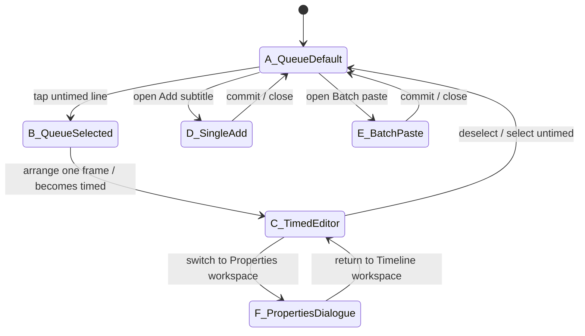

# Portrait Timeline Subtitle — Six-State Design Draft

> Status: design-only proposal, no production code changes
>
> Target: Cloud Touch portrait Timeline workspace, reference viewport 1220 × 2712
>
> Design method: Impeccable / Operate mode — prioritize task clarity, state legibility, touch reachability, and preservation of existing product owners.
>
> Source baseline: current `agent/issue-318-ui-m1` behavior in `TimelineDock`, `DialogueSheet`, `DialogueInspector`, `DialogueBatchPaste`, `DialogueClip`, `DialogueAuthoringDraft`, and `DialogueSelectionStore`.

## 1. Design thesis

The Timeline subtitle area should stop reading as a stack of admin controls and instead behave like one focused authoring surface with a clear task hierarchy:

1. **See what is pending.**
2. **Select the line you want to work on.**
3. **Turn an untimed line into a timed subtitle.**
4. **Edit timed subtitle content and timing without leaving the Timeline mental model.**
5. **Add one line or paste many lines through a shared authoring entry point.**
6. **Keep the existing Properties-side dialogue inspector available as a secondary cross-workspace editing route, not as the primary portrait Timeline experience.**

The design intentionally preserves current business semantics:

- `startMs === endMs` remains the Untimed state.
- `endMs > startMs` remains the Timed state.
- Single-add and batch-paste drafts remain transient UI state and must not mutate Project/History before commit.
- Batch commit remains one History command.
- Dialogue selection remains a single owner and stays mutually exclusive with layer selection.
- Timeline geometry, dragging, resizing, overlap validation and point-time semantics remain unchanged.

## 2. Global visual language

The subtitle surface should inherit the already-improved Panda Stage portrait system instead of creating a new visual world.

### Hierarchy

- Canvas remains the dominant visual object.
- Timeline ruler is the second-level operational surface.
- Subtitle task area becomes one **flat task sheet**, not nested cards.
- Primary action uses the existing soft Panda green.
- Secondary actions use neutral dark surfaces with thin separators.
- Destructive actions are text/icon-led red, never full-width red blocks unless the action is irreversible and isolated.

### Touch / density rules

- Primary touch targets: minimum 48 px visual height.
- Queue row target: 64–72 px.
- No row should require a hidden hover-only affordance.
- Keep one vertical page scroll owner in portrait.
- Local horizontal scroll remains only where Timeline already needs it.

### Typography

- Section eyebrow: 12–13 px / secondary color.
- Primary task heading: 18–20 px / semibold.
- Queue speaker: 14–15 px / semibold.
- Queue text: 14–15 px / regular.
- Metadata: 12–13 px / secondary color.

---

## 3. State map



---

# State A — Queue default

## Job

Let the user understand, at a glance, that there are pending subtitles waiting to be placed on the Timeline.

## Layout

```text
┌─────────────────────────────────────────────────────────────┐
│ 字幕任务                                      ＋ 新建字幕   │
│ 待安排字幕 6 条                                             │
│ 这些台词还没有安排到时间轴。                               │
├─────────────────────────────────────────────────────────────┤
│ Panda        第一行测试对白                       未定时  › │
├─────────────────────────────────────────────────────────────┤
│ Panda        第二行测试对白                       未定时  › │
├─────────────────────────────────────────────────────────────┤
│ Panda        第三行未知角色                       未定时  › │
├─────────────────────────────────────────────────────────────┤
│ Panda        第四行测试对白                       未定时  › │
├─────────────────────────────────────────────────────────────┤
│ Panda        第五行未知角色                       未定时  › │
├─────────────────────────────────────────────────────────────┤
│ Panda        第六行测试对白                       未定时  › │
└─────────────────────────────────────────────────────────────┘
```

## Design decisions

- Replace the separate `+ 批量粘贴` and bottom disclosure emphasis with one **`＋ 新建字幕`** entry point.
- The queue itself is the hero of this state.
- Rows are flat, separated by hairlines, with no large green button blocks.
- Right-side status stays visually quiet until a row is selected.
- If there are no Untimed dialogues, replace the queue with a compact empty state: `暂无待安排字幕` + `新建字幕`.

---

# State B — Queue selected / Untimed detail

## Job

Expose the one important next action for an Untimed subtitle without turning the row into a mini inspector.

## Layout

```text
┌─────────────────────────────────────────────────────────────┐
│ 字幕任务                                      ＋ 新建字幕   │
│ 待安排字幕 6 条                                             │
├─────────────────────────────────────────────────────────────┤
│ Panda        第一行测试对白                       未定时  › │
│                                                             │
│ 当前播放头  00:00.000                                      │
│ [安排一帧]                                      [取消选择]  │
├─────────────────────────────────────────────────────────────┤
│ Panda        第二行测试对白                       未定时  › │
├─────────────────────────────────────────────────────────────┤
│ ...                                                         │
└─────────────────────────────────────────────────────────────┘
```

## Design decisions

- Selected row expands **inline by one compact action strip**; no second card.
- Primary action is `安排一帧` because that is the current real capability.
- Do not invent `自动寻找空位`, `智能排期`, or bulk scheduling.
- If arrange fails due overlap, error appears directly under the selected row and keeps context visible.
- Selection color uses subtle green surface tint + left accent, not a fully filled green row.

---

# State C — Timed subtitle editor

## Job

Make a selected Timed subtitle feel like an editing task tied to the Timeline, rather than a generic form dump.

## Layout

```text
┌─────────────────────────────────────────────────────────────┐
│ 当前字幕                                      已定时  ✓     │
│ Panda                                                       │
├─────────────────────────────────────────────────────────────┤
│ 台词                                                        │
│ ┌─────────────────────────────────────────────────────────┐ │
│ │ 第一行测试对白                                          │ │
│ └─────────────────────────────────────────────────────────┘ │
│                                                             │
│ 时间                                                        │
│ 开始 00:00.417        结束 00:00.833                        │
│ [      417 ms      ]  [      833 ms      ]                 │
│ 持续 00:00.416                            [应用时间]         │
│                                                             │
│ 角色                                                        │
│ [ Panda                                                  ▾ ]│
│                                                             │
│ 音频                                                        │
│ 未绑定音频                                                  │
├─────────────────────────────────────────────────────────────┤
│ 删除字幕                                                    │
└─────────────────────────────────────────────────────────────┘
```

## Design decisions

- Put **copy first, timing second, speaker third, audio last** because the primary Timeline task is subtitle content + timing.
- Keep readable timecode beside raw millisecond fields; expert precision remains available without leading the visual hierarchy.
- `应用时间` is the only filled primary action inside the form.
- Delete becomes a quiet destructive text button at the bottom.
- Subtitle layout warnings appear directly beneath the text field.
- Timeline clip dragging/resizing remains the faster direct-manipulation route; this form is the precision route.

---

# State D — Single Add

## Job

Create one Untimed subtitle quickly without making the user scroll through a permanent form.

## Proposed interaction

`＋ 新建字幕` opens a compact authoring sheet with two tabs/modes:

```text
┌─────────────────────────────────────────────────────────────┐
│ 新建字幕                                             ×      │
│ [单条]   [批量粘贴]                                         │
├─────────────────────────────────────────────────────────────┤
│ 角色                                                        │
│ [ 选择角色                                               ▾ ]│
│                                                             │
│ 台词                                                        │
│ ┌─────────────────────────────────────────────────────────┐ │
│ │ 输入台词                                                │ │
│ └─────────────────────────────────────────────────────────┘ │
│                                                             │
│ 将创建在当前播放头：00:00.000                               │
│                                                             │
│ [取消]                                      [新增字幕]       │
└─────────────────────────────────────────────────────────────┘
```

## Design decisions

- Single-add and Batch-paste become **mutually exclusive presentation modes inside one authoring sheet**.
- Switching mode must preserve each mode’s transient draft during that open session; closing the sheet follows the current draft-clear semantics.
- Explicitly show the current playhead time because the product currently creates Untimed dialogue at point-time.
- Enter may still submit when valid, preserving current keyboard efficiency.

---

# State E — Batch Paste

## Job

Turn a large paste operation into an understandable parse → resolve → commit workflow.

## Layout

```text
┌─────────────────────────────────────────────────────────────┐
│ 新建字幕                                             ×      │
│ [单条]   [批量粘贴]                                         │
├─────────────────────────────────────────────────────────────┤
│ 每行格式：角色名：台词                                      │
│ ┌─────────────────────────────────────────────────────────┐ │
│ │ Panda：第一句                                          │ │
│ │ Panda：第二句                                          │ │
│ │ Unknown：第三句                                        │ │
│ └─────────────────────────────────────────────────────────┘ │
│                                                             │
│ 解析结果   3 行 · 2 有效 · 1 待处理                         │
├─────────────────────────────────────────────────────────────┤
│ 1  ✓ Panda      第一句                                     │
│ 2  ✓ Panda      第二句                                     │
│ 3  ! Unknown    第三句         [映射到角色…              ▾]│
├─────────────────────────────────────────────────────────────┤
│ 这些字幕将创建在当前播放头：00:00.000                       │
│                                                             │
│ [取消]                                  [提交 3 条]          │
└─────────────────────────────────────────────────────────────┘
```

## Design decisions

- Preview is a compact validation table, not a second giant textarea region.
- Summary foregrounds actionable counts: total / resolved / needs attention.
- Unknown / ambiguous speakers receive inline mapping controls.
- Malformed / empty lines get readable error labels in place.
- Commit button remains disabled until every line is resolved.
- Keep batch submission as one History command.
- Avoid nested scrolling in portrait unless the preview itself exceeds a practical cap; prefer page scroll.

---

# State F — Properties dialogue inspector

## Job

Preserve the current cross-workspace route where a selected dialogue takes over the Properties inspector, but visually position it as a **secondary precision inspector**, not the main subtitle authoring surface.

## Layout

```text
┌─────────────────────────────────────────────────────────────┐
│ 字幕属性                                                    │
│ 当前镜头 · Panda · 已定时                                   │
├─────────────────────────────────────────────────────────────┤
│ 台词                                                        │
│ [ 第一行测试对白                                         ] │
│                                                             │
│ 角色        [ Panda                                     ▾ ] │
│                                                             │
│ 开始        00:00.417   [ 417 ms ]                          │
│ 结束        00:00.833   [ 833 ms ]                          │
│                                  [应用时间]                  │
│                                                             │
│ 音频        未绑定音频                                      │
├─────────────────────────────────────────────────────────────┤
│ 删除字幕                                                    │
└─────────────────────────────────────────────────────────────┘
```

## Design decisions

- Use the same field ordering and labels as State C where possible, so Timeline and Properties do not feel like different products.
- Do not duplicate selection state or editing owners.
- Properties remains appropriate for precision editing when the user intentionally leaves Timeline.
- Returning to Timeline should restore the selected dialogue context as current behavior permits.

---

## 4. Shared `新建字幕` authoring model

The largest IA change in this proposal is to replace two competing authoring entry points with one explicit action.

```text
＋ 新建字幕
    ├── 单条
    │    ├── character
    │    └── text
    └── 批量粘贴
         ├── raw paste
         ├── parser result
         ├── manual mapping
         └── commit batch
```

### Why

The current UI can visually expose `添加单条字幕` and `批量粘贴对白` at the same time, producing a long mixed authoring stack. Both operations are conceptually the same user intent — **create subtitles** — with different volume. One entry point creates a more legible information architecture while keeping the underlying draft owners intact.

### Non-goal

This proposal does **not** require merging the underlying single and batch draft data structures. The change is presentation and orchestration first.

---

## 5. State behavior matrix

| State | Selection | Main content | Primary action | Secondary action | Project mutation |
| --- | --- | --- | --- | --- | --- |
| A Queue default | none / no Timed selection | Untimed queue | 新建字幕 | select row | no |
| B Queue selected | Untimed dialogue | selected queue row | 安排一帧 | cancel/select another | arrange only |
| C Timed editor | Timed dialogue | Timeline subtitle editor | 应用时间 | edit text / speaker | update/setTiming |
| D Single Add | authoring draft | one-line authoring | 新增字幕 | cancel / batch mode | create on commit |
| E Batch Paste | authoring draft | parser + preview | 提交 N 条 | mapping / cancel | createMany on commit |
| F Properties Dialogue | dialogue selected | precision inspector | 应用时间 | edit / delete | update/setTiming/remove |

---

## 6. Responsive intent for 1220 × 2712

- Preserve the top navigation and Canvas scale already accepted in portrait.
- Timeline ruler remains directly beneath Canvas.
- Subtitle task sheet starts immediately after Timeline; no large decorative dead space between ruler and queue/editor.
- Queue rows remain single-line where possible; text truncates only after speaker + status remain readable.
- Authoring sheets may use full content width but should not visually become full-screen modals unless real-device testing proves the keyboard/IME requires it.
- No fixed-height queue that introduces a second vertical scrollbar.

---

## 7. Accessibility / interaction requirements

- Every queue row is keyboard focusable and has a visible selected/focus state.
- `安排一帧`, `新建字幕`, authoring mode switches, close, cancel and commit must have explicit labels.
- Errors should be adjacent to the field/row that caused them and use `role="alert"` or status semantics as appropriate.
- Selected Untimed rows must not rely on color alone; add an icon/status and expanded action strip.
- Disabled commit states must have a clear reason in visible copy when unresolved batch lines exist.
- Preserve Escape-to-cancel for Timeline drag/resize gestures.

---

## 8. Implementation boundaries

Likely presentation-level touch points if this design is approved:

- `src/renderer/features/dialogue/DialogueSheet.tsx`
- `src/renderer/features/dialogue/DialogueInspector.tsx`
- `src/renderer/features/dialogue/DialogueBatchPaste.tsx`
- `src/renderer/features/dialogue/dialogueAuthoringDraft.ts` only if an explicit authoring-mode state is needed
- `src/renderer/styles.css`
- portrait Timeline unit coverage

Business owners that should remain unchanged unless a separate product decision is made:

- `DialogueService`
- `DialogueStore`
- `DialogueSelectionStore`
- Timeline geometry / overlap rules
- `DialogueClip` drag-resize semantics

---

## 9. Acceptance checklist for the future implementation issue

- [ ] Queue default is visually legible without any selected row.
- [ ] Selecting an Untimed row exposes `安排一帧` in-place without moving the user to another region.
- [ ] Selecting a Timed clip opens the dedicated Timeline subtitle editor.
- [ ] `新建字幕` is the single authoring entry point.
- [ ] Single and Batch authoring modes are not shown simultaneously.
- [ ] Switching Single/Batch does not unexpectedly destroy in-progress draft content while the authoring sheet remains open.
- [ ] Batch mapping/error states remain fully reachable.
- [ ] Batch commit remains a single History command.
- [ ] Properties dialogue inspector remains available and uses the same terminology/order as Timeline editing.
- [ ] No second Project, selection, Timeline, or History owner is introduced.
- [ ] Portrait keeps one vertical page-scroll owner.
- [ ] Windows Electron + Wuying/Redmi real-device acceptance is performed before shipping.

---

## 10. Recommended implementation slicing

This design should be implemented in small passes rather than one large rewrite:

1. **Queue hierarchy + selected Untimed row** — States A/B.
2. **Timed editor visual hierarchy** — State C.
3. **Unified `新建字幕` shell** — States D/E.
4. **Properties inspector visual alignment** — State F.
5. **Final consistency / touch / real-device acceptance**.

This preserves the current small-step UI iteration strategy and gives each state an independently reviewable acceptance point.
