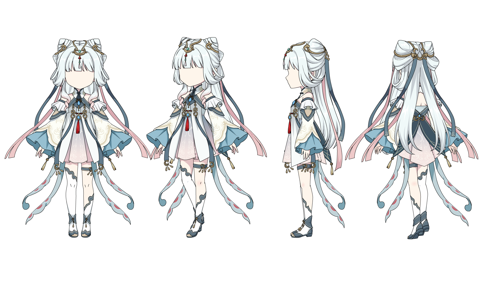

# Issue #743 — Real authored-close minimization

Date: 2026-10-09

Issue: [#743](https://github.com/Cognitive-Architect/panda-stage/issues/743)
Delivery: existing mother PR [#677](https://github.com/Cognitive-Architect/panda-stage/pull/677), kept Draft/Open

## Verdict

**`D_WEAKENED_AUTHENTIC_PAIR_EQUIVALENT`**

A FillStyle1 Shape from the real working male FLA was minimized from an authentic authored-close source. D-A retained the authored closure; D-B replaced the final close marker with the exact explicit closing line derived from Panda's authored-close mapping. Animate's stage PNG hashes matched for M2, D-A, and both D-B captures. Panda returned the same stable `BLOCKED / TARGET_UNSUPPORTED` result for both.

The Animate target contour decomposition changed from 17 HalfEdges in D-A to 7 in D-B even though the target fill remained closed, its FillStyle and placement matched, and full-stage pixels were byte-identical. Panda also reported 22 raw target subsegments for D-A and 23 for D-B, while both produced 23 boundary segments and the same two open graph endpoints. This weakens a close-specific repair claim; it does not establish that the two internal representations are identical.

## C01 — Source census

The full source hashes, Shape IDs, frame/member addresses, exact counts, and capture hashes are in [receipt.json](receipt.json). The table separates whole-XFL-Shape counts from FillStyle1-connected target counts.

| Candidate | FillStyle1 target: Edge / subsegment / close | Whole XFL Shape: Edge / subsegment / close | Animate Shape: Edge / vertex / contour | Panda |
| --- | ---: | ---: | ---: | --- |
| Hanfu | 28 / 99 / 4 | 179 / 273 / 4 | 145 / 136 / 17 | Stable `TARGET_UNSUPPORTED` |
| Qingling | 14 / 61 / 3 | 95 / 176 / 4 | 104 / 99 / 13 | Stable `TARGET_UNSUPPORTED` |
| Male | 9 / 22 / 2 | 88 / 121 / 11 | 66 / 57 / 13 | Stable `TARGET_UNSUPPORTED` |

Male was selected because it has the smallest practical target dependency surface: 9 FillStyle1-connected Edge records, compared with 14 and 28. Each Animate candidate capture opened a copy read-only, closed it without saving, preserved the source timestamp, and restored the pre-existing document; the document count remained 9.

### Animate source captures

The #737 historical and known-good closed-fill controls were retained. Their Animate captures have the same screenshot SHA-256; the shared image is [here](animate/issue737-control.png). The historical Panda control rendered deterministically with 160 raw Edge records, 277 subsegments, and a closed FillStyle1 boundary of 98 segments.

Animate 2023 was `23.0.0.407`, executable SHA-256 `0F869BD383E679611C6F85D887F72FE636B16403A5B98F79DF87F6F563ED3838`, with Authenticode `HashMismatch`. Process and executable provenance stayed stable under the compensating controls recorded in the receipt.

## C02 — Conservative minimization

| Step | Change | Animate target | Panda |
| --- | --- | --- | --- |
| M0 | Frozen real male source; 88 whole-Shape Edge records | Filled target, 17 HalfEdges | Stable `BLOCKED / TARGET_UNSUPPORTED`, 22 target subsegments |
| M1 | Removed 79 non-target Edge records; kept all 9 target Edge records byte-identical | Same 17 HalfEdges and same stage PNG hash | Same stable blocked result |
| M2 | Removed unused FillStyle4; no retained target Edge referenced it | Same 17 HalfEdges and same stage PNG hash | Same stable blocked result |

M1 and M2 archives are strict-valid. M0→M2 retained the target Edge XML hash, two target authored-close markers, and pixel hash `F37C33D2129622855F09C635E642F82D2FBB123CA832301637ACD3DE48465483`. The original source FLA was not written.

## C03 — Authentic D-A / explicit D-B pair

- D-A is byte-identical to M2: `5A501D1F787707A3965BECC31E2E5B8F5DDC519B25369E16EF68E72AF674EB5D`.
- D-B is `2ADC8598EE0B4747E95E48F83BA8FE57617E2B189F922B90943EB72C5BAC50A0`.
- The target remains FillStyle1 with 9 Edge records; authored-close markers change from 2 to 1. Only one XFL member changed, and all other archive member contents remained byte-identical.
- The replaced close was source-mapped to the line from `(18666, 13131)` to `(19207, 12777)` twips. No guessed connector, tolerance, snapping, or epsilon closure was used.
- M2, D-A, and both D-B Animate stage captures share the same PNG SHA-256. D-A and D-B captures were read-only; repeated D-B captures were stable and the original Animate document was restored.
- Animate reports 17 HalfEdges for the D-A target contour and 7 for D-B. Keep this topology difference visible when interpreting pixel equivalence.
- Panda stayed blocked on both: 23 boundary segments, the same open endpoints, and deterministic runs. D-A maps one authored close; D-B maps none because the equivalent explicit line is now a raw segment.

## Scope and validation

The original source FLAs and minimized FLA archives remain outside the repository; this evidence commits hashes, sanitized structured receipts, and Animate captures. No production behavior files changed.

- `pnpm test:integration` — PASS, 38 files / 189 tests.
- Research remains isolated under `docs/evidence/issue-743/**`; Draft CI routes it through the existing CI policy self-tests only. Neighboring Issue evidence paths stay fail-closed.
