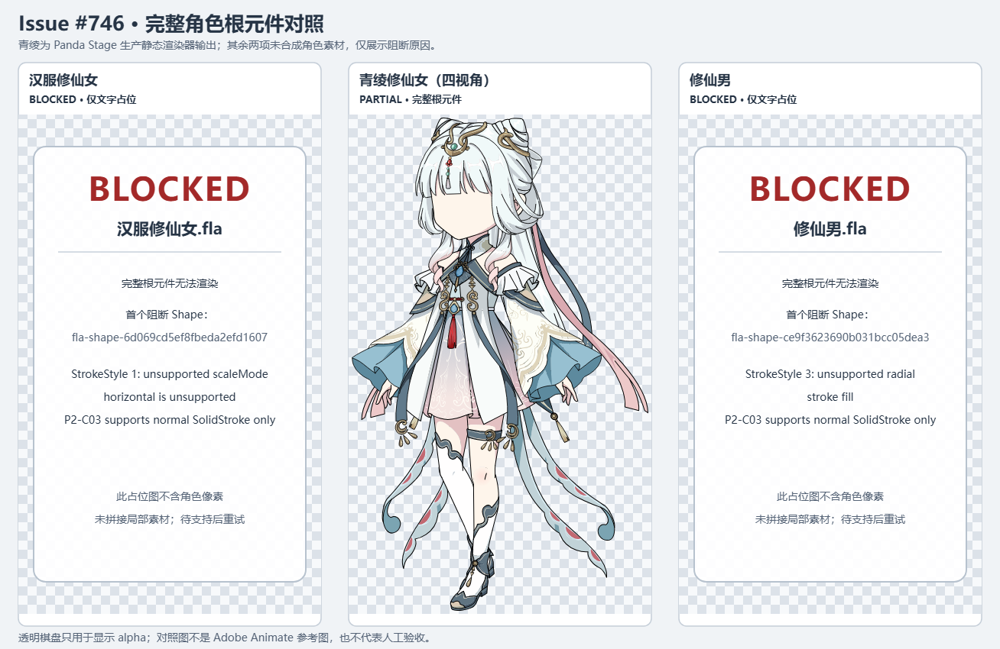

# Issue #746 — full composed character visual evidence

**Handoff verdict: `PARTIAL`.** One complete authored root renders through Panda Stage's existing production FLA renderer. The other two are visibly marked `BLOCKED` because the current renderer rejects source-authored stroke semantics. The two blocked PNGs contain no character pixels and no parts have been collaged. This is preliminary inspection evidence, not a human visual pass.

| Source FLA | Result | Direct image | Finding |
| --- | --- | --- | --- |
| `汉服修仙女.fla` | `BLOCKED` | [hanfu-full-character.png](hanfu-full-character.png) | First blocking shape `fla-shape-6d069cd5ef8fbeda2efd1607`: `StrokeStyle 1` uses unsupported `scaleMode "horizontal"`. |
| `青绫修仙女（四视角）.fla` | `RENDERED` · `REVIEW_PENDING` | [qingling-full-character.png](qingling-full-character.png) | Complete first scene-root Graphic, frame 0. The source does not name its orientation, so no view direction is inferred. |
| `修仙男.fla` | `BLOCKED` | [male-full-character.png](male-full-character.png) | First blocking shape `fla-shape-ce9f3623690b031bcc05dea3`: `StrokeStyle 3` uses an unsupported radial stroke fill. |

The comparison sheet uses a checkerboard only to show transparent pixels. The Qingling PNG is the production root-symbol render; its scene placement matrix is recorded in the receipt but the symbol is shown in its local content frame. Its silhouette includes the hair, head, clothing, arms, hands, legs, and accessories. The face appears blank or mostly hidden by the bangs; this needs human review. A lower-limb asymmetry/misalignment is visible and is labeled `HISTORICAL`, consistent with the existing issue brief. No pixels were retouched or reconstructed.

There is no exact matching Adobe Animate reference for these three roots: `NO_MATCHING_ADOBE_REFERENCE / REVIEW_PENDING`. The installed Animate window was displaying a different, unsaved FLA and was left untouched. Final human visual classification is reserved for the user.

## Provenance and validation

The original FLA hashes, in-memory recovery-candidate normalization, strict preflight, root and nested-instance transforms, frame choices, renderer output hashes, dimensions, known issues, and reference-capture provenance are in [receipt.json](receipt.json). The three original files retained their expected SHA-256 hashes after rendering. Qingling's second production render matched the first PNG hash exactly.

Validation run: `pnpm test:integration` — 38 test files and 189 tests passed; its configured typecheck and renderer/Electron builds also completed successfully. A focused CI-routing contract test and evidence-file checks are recorded with the delivery.

## Missing evidence

- Complete Hanfu and Male root renders remain blocked by the exact unsupported stroke semantics above.
- No matching Adobe Animate reference or user human visual acceptance is available for any of the three sources.
- Qingling's source orientation is unnamed, and the visible face region needs human review.

## Smallest follow-up

Review the Qingling root image and decide whether its visible historical lower-limb misalignment warrants a separate repair ticket.
