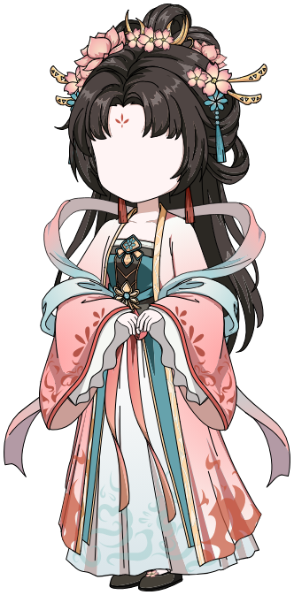

# Issue #747 — Horizontal SolidStroke Scaling

**Verdict: `PASS — HORIZONTAL_STROKE_FIX`. Human visual acceptance: `REVIEW_PENDING`.**

The source-authored Hanfu root now renders as one complete character through Panda Stage's existing production FLA path. The image is the source Graphic's native content frame; the full scene-frame render below also preserves the scene-root placement matrix.

[Open the full scene frame 0 PNG](hanfu-scene-frame-0.png) · [Detailed receipt](receipt.json)

## Source and blocker

- Original: `D:\表情合集\新人物\汉服修仙女.fla`, SHA-256 `6AF14990029D4CED2C4E305721321835180C1BF041178A8799E1D14A1F62E535`. The original remained unchanged. Its recovery-candidate archive was normalized in memory only; strict preflight passed and the normalized archive SHA-256 was `10EDD07E226DB3296A5CAC01B4CDF9654385CE477894A8F7B4D0C90DB9E327F7`.
- Selected root: scene frame 0, `修仙女-cilisucai.com/修仙女-cilisucai.com1`, Graphic frame 0 of 30. Its scene placement is `(a=1.49400329589844, b=0, c=0, d=1.49400329589844, tx=686.5, ty=31.35)`; nested Graphic2 and Graphic3 transforms and the blocker matrix are recorded in the receipt.
- Former blocker: Shape `fla-shape-6d069cd5ef8fbeda2efd1607`, `graphic:修仙女-cilisucai.com/修仙女-cilisucai.com3/layer-0-frame-0/0/5/1/0`, StrokeStyle 1. Its source-authored style is `<SolidStroke scaleMode="horizontal"><fill><SolidColor/></fill></SolidStroke>`.
- Source omits weight, color, alpha, cap, join, miter limit, and pixelHinting. Production defaults remain weight 1, black, alpha 1, round cap/join, miter limit 3, and pixelHinting off.

## Bounded semantics and controls

The supported horizontal mode transforms the stroke path with the composed source matrix and scales its width using the transformed local X basis, `weight × hypot(a, b)`. The same effective width feeds the Graphic stroke bounds. Normal strokes retain their existing SVG transform path.

Adobe Animate 2023 PNG controls changed only the exact source stroke's `scaleMode` on scratch FLA copies. Horizontal and normal output were pixel-identical at baseline. Under X2 and Y2 root transforms, Adobe and Panda report changed pixels in the same source-stroke regions; the pixel counts are close but not identical. This supports the narrow source behavior and does **not** claim Adobe visual equivalence.

| Control | Animate horizontal vs normal | Panda horizontal vs normal |
| --- | --- | --- |
| Baseline | 0 differing pixels | 0 differing pixels |
| X2 | 390 pixels, bbox `(1246,50)–(1298,101)` | 401 pixels, bbox `(1245,50)–(1298,101)` |
| Y2 | 387 pixels, bbox `(966,70)–(992,169)` | 407 pixels, bbox `(966,70)–(992,169)` |

Regression coverage includes the source-default horizontal style, a normal-mode control, rotated-source X2/Y2 transforms, all three accepted #745 Open-Fill Shapes, a historical render control, a closed-fill positive control, and the #746 Qingling full-root control. Each #745 Shape renders deterministically from its original unchanged FLA. The Qingling production PNG remains byte-identical to #746 at SHA-256 `2C24A46F1067E7A7EBF612004EB917F88252256EBF4D69C65331F48A721C1088`.

Unknown scale modes (`vertical`, `none`, and `diagonal`), `pixelHinting=true`, gradient/bitmap strokes, and malformed weight/color remain rejected. The independent Male radial-stroke blocker remains outside this Hanfu fix.

## Render and validation

- Before: `BLOCKED` at the horizontal StrokeStyle. After: `RENDERED`; no later blocker appeared in the selected root.
- Native Graphic PNG: 332×673, SHA-256 `D48AE620AA0C6B1669AC51F3180E9D83E43A9F89C5F4063C4EC3AA001E25BE6B`.
- Scene frame 0 PNG: 1920×1080, SHA-256 `1E9D9E43692D775B2FAE5179410AE3DB877655063153211260531FCFFA7D79FB`.
- Production SVG: SHA-256 `082831D9070DFA313B00C72C4254D8C4C4617EF54D0458D9E19DFDCCAD7C6BE4`. Root composition: 162 Shapes, 2 expanded Graphic instances, no bitmaps; content bounds are fully inside the 4 px padded viewBox.
- `pnpm exec vitest run tests/unit/fla-static-snapshot-c03-stroke.test.ts`: 27 passed.
- Read-only Issue #739 target probe: all three #745 Open-Fill Shapes, the historical oracle, and closed-fill control rendered deterministically; original source hashes remained unchanged.
- `pnpm test:unit`: 343 files, 2,477 tests passed.
- `pnpm test:integration`: 38 files, 189 tests passed; configured typecheck and renderer/Electron builds passed.
- `pnpm typecheck`, `pnpm lint`, and `pnpm build`: passed. Build reports the existing empty legacy CSS imports and large-chunk warning.

No artwork was edited or retouched. The historical face/limb appearance remains for human inspection. `HUMAN_VISUAL_ACCEPTANCE` is reserved for the user; no visual PASS is claimed.
