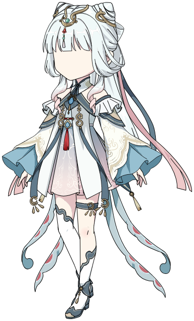
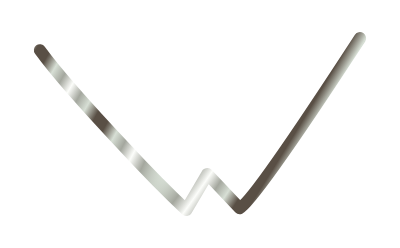
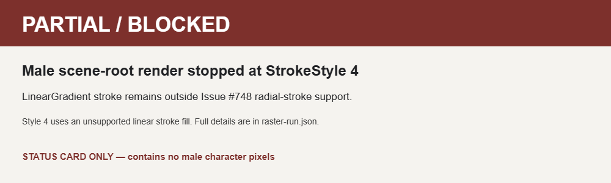

# Issue #748 — radial-gradient stroke evidence

## Result

**PARTIAL — GATE_CLEARED_NEXT_BLOCKER.** The production SVG builder now emits the source-authored radial-gradient paint on the target stroke. The unchanged male scene root still does not produce a complete PNG: composition stops at the same Shape's **StrokeStyle 4**, which uses an unsupported linear-gradient stroke. That family remains outside Issue #748's radial-stroke scope. No complete male-character render is claimed.

The radial gate is demonstrated by `male-radial-stroke-isolated.svg` and its sandbox-rendered PNG. This is a five-segment isolated control copied from the frozen source Shape, including its exact Edge data and transforms; it is not a character render and does not prove whole-root fidelity.

## Frozen source and target

- Original `修仙男.fla` SHA-256: `565C5609A7610EF64ED9F98B09D98DD82D5A45255ADB4D3D410A5A365E0EF4A5`.
- Recovery classifier measured a 54-byte central-directory overstatement. The production in-memory normalizer changed only that field; the original file remained unchanged. Normalized bytes passed strict preflight (SHA-256 `CB891E78AC2882C1DE6F765A4A54634AC1E134A80EAFD1AEB230BA216289A8AB`).
- Scene 1, frame 0, Graphic root `白发修仙男-cilisucai.com/白发修仙男-cilisucai.com1`; root transform `{a:1.042236328125,d:1.042236328125,tx:728.2,ty:36.75}`.
- Target Shape `fla-shape-ce9f3623690b031bcc05dea3`, source address `graphic:白发修仙男-cilisucai.com/白发修仙男-cilisucai.com3/layer-0-frame-0/10/2/0`.
- Shape transform `{a:1.5164794921875,b:0,c:0.0515289306640625,d:1.5164794921875,tx:-1320.75,ty:-1081.5}`; nested symbol transform `{tx:205.35,ty:602.45}`.

## Supported source paint

The target is a normal `SolidStroke` whose fill contains one `RadialGradient`, using `spreadMethod="reflect"`. The stroke uses the source matrix `{a:0.0035400390625,b:0.0022125244140625,c:-0.0178985595703125,d:0.0283050537109375,tx:808.95,ty:622.2}` and four full-opacity stops:

| Ratio | Color | Alpha |
| ---: | --- | ---: |
| 0.152941176470588 | `#594F45` | 1 |
| 0.447058823529412 | `#D7DFD5` | 1 |
| 0.72156862745098 | `#A4A79E` | 1 |
| 1 | `#FCFDFA` | 1 |

The Shape contains 139 Edge records. Exactly one Edge references StrokeStyle 3; its reconstructed stroke has two line and three quadratic segments. Stroke width/cap/join/miter/pixel-hinting attributes are omitted in the source, so the existing renderer defaults apply. The SVG keeps this as a stroke path and uses the authored gradient matrix, stop ratios/colors/alpha, and reflect spread. The official Animate DOM API allows an `IGradientFillStyle` as a solid stroke's fill style and defines radial gradients and their placement matrix: [ISolidStrokeStyle](https://helpx.adobe.com/flash/CPSDevKit/APIDocs/class_d_o_m_1_1_stroke_style_1_1_i_solid_stroke_style.html), [IGradientFillStyle](https://helpx.adobe.com/flash/CPSDevKit/APIDocs/class_d_o_m_1_1_fill_style_1_1_i_gradient_fill_style.html).

## Captures

Both reference roots below render through the current production builder and sandbox Electron renderer. Qingling's PNG matches the previously accepted #746 output hash. These are renderer controls, not Adobe visual references.

### Hanfu full-root control

### Qingling full-root control

The three `control-open-fill-*-shape.png` files preserve the earlier #745 direct-shape controls. They are supplementary single-shape renders, not full-character outputs.

### Male radial-stroke isolated control

### Male root blocker

The blocked card is status evidence only and contains no male-character pixels. The production builder's exact first blocker is recorded in [`raster-run.json`](./raster-run.json).

## Visual acceptance

No matching Adobe screenshot/reference for this exact male root and pose was available. Final visual fidelity remains **REVIEW_PENDING / NO REFERENCE**. This evidence does not claim Adobe equivalence or human visual acceptance.

## Reproduction and receipts

- [`receipt.json`](./receipt.json) — concise frozen-source and gate receipt.
- [`raster-run.json`](./raster-run.json) — full production builder and sandbox Electron capture metadata, source/output hashes, bounds, counts, and blocker message.
- Capture posture: `sandbox=true`, `contextIsolation=true`, `nodeIntegration=false`.
- Source-hash check: unchanged before and after capture. Current unsaved Animate document was not touched.
