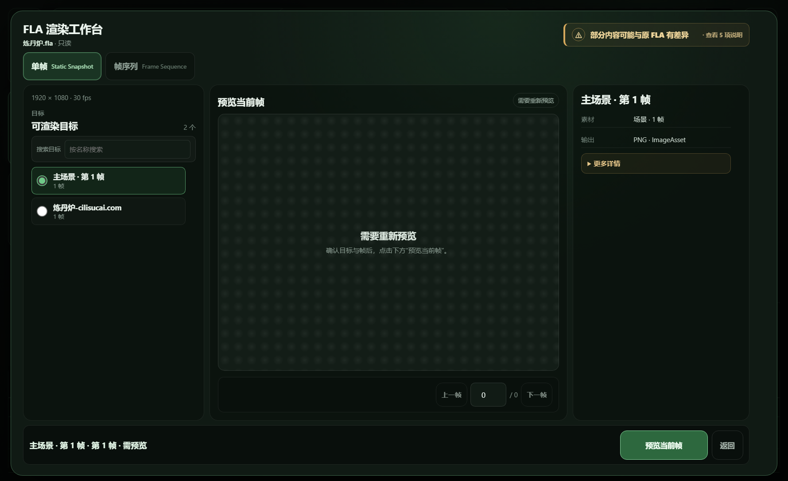
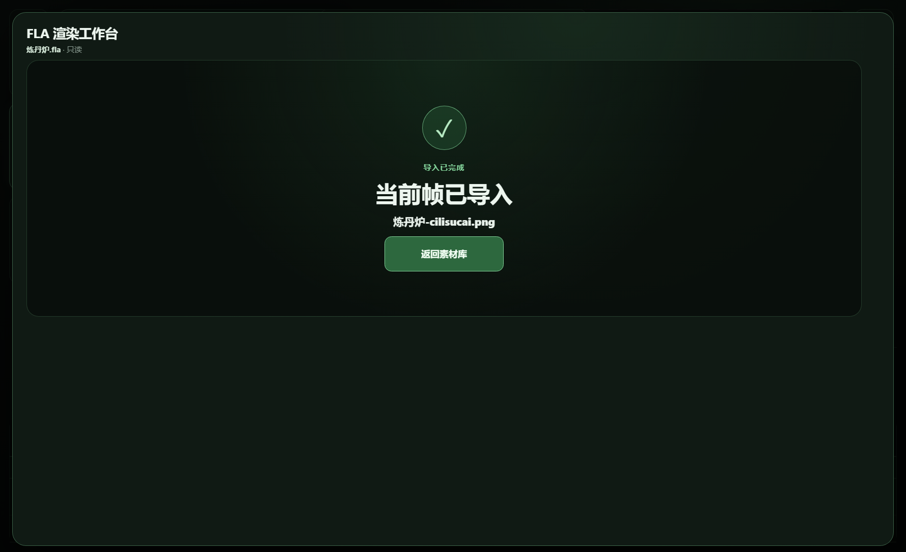
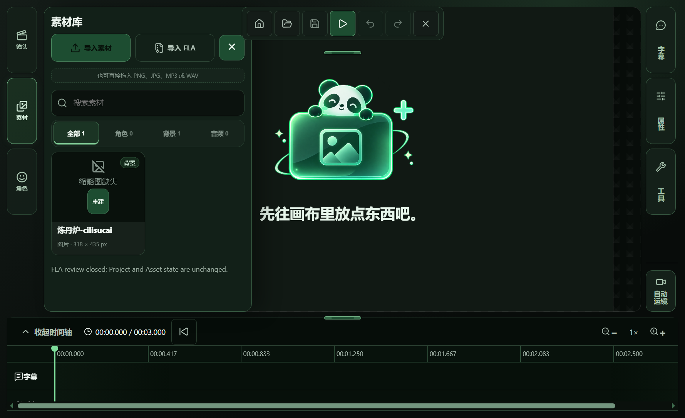
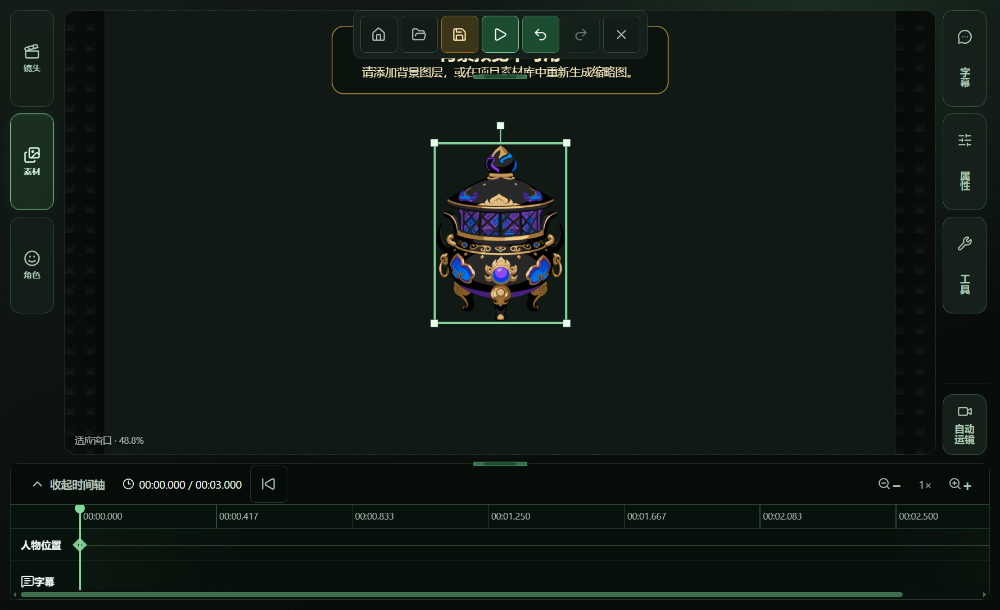

# Issue #751 — V1/T01 acceptance evidence

**Result: PARTIAL.** The complete automated Windows Electron flow now uses the native file chooser with no source-path injection: original FLA → Static Snapshot catalog and preview → explicit import → Asset Library → native mouse drag into a shot → save and reopen. Cancellation left the project and asset count unchanged, and the source FLA hash was unchanged. The repository owner's visual PASS is still pending. A real FLA containing a target that is unsupported by the production preview path has not yet been confirmed, so runtime unsupported-target reporting remains unverified; the bounded disclosure and supported-target isolation are covered by focused tests.

## Latest acceptance run

- Run: `issue751-v1-native-picker-20261010-run7`, Windows Electron production build.
- Source: `D:\表情合集\道具\炼丹炉.fla`, SHA-256 `498537baa9cf900f613987eb9dab99727ee09ddaad4fb06e2d2c4351cb283a68` before and after the run. This is the accepted source from Issue #732.
- The original FLA was selected through the Windows native file chooser. `PANDA_STAGE_FLA_ACCEPTANCE_SOURCE` was not set. The chooser delivered the source to the existing Static Snapshot Workbench.
- Catalog: two targets. The selected `graphic-symbol` target was supported, had one frame, and previewed before the explicit import action.
- Cancellation: the new project still had zero assets and the saved `project.json` hash was unchanged.
- Import: the Static Snapshot transaction created an ordinary PNG image asset and displayed it in the Asset Library.
- Placement: the first OS-level drag began over the card's thumbnail rebuild button and did not create a layer. A second Win32 drag from the card name area to the canvas created one layer. The project was saved and reopened with that same layer ID and image visible.
- Screenshots and the machine-readable run receipt are in [`native-picker-run7/`](./native-picker-run7/).
- The earlier run5 report blamed a Windows automation limitation. That diagnosis was incorrect: its C# `SendInput` `INPUT` structure had the wrong size. With the corrected structure, the native picker accepted Unicode input and the full no-injection flow completed in run7.

### Run7 screenshots

## Runtime unsupported-target probe

- A read-only probe sent all 43 original FLA files under `D:\表情合集` through production Main `chooseAndInspect`, recovery/preflight, and the Static Snapshot catalog API. The test-only path variable selected each source; no project was opened and no commit API was called.
- All 43 parsed successfully and all source hashes stayed unchanged. Their catalogs contained 577 targets total; all 577 were marked preview-supported. Production recovery normalized 38 archives in memory; the remaining five were strictly valid.
- No real unsupported Static Snapshot target was present in this scanned corpus, so runtime unsupported-target reporting remains **UNVERIFIED**. An earlier user-facing import attempt for `飞行中旋转.fla` routed to Raster; that route choice is separate from this direct catalog probe.
- The complete scan receipt is [`catalog-scan-run2/receipt.json`](./catalog-scan-run2/receipt.json). It records each source hash, production ingest trace, target count, and unsupported result. The earlier six-file prop scan remains in [`catalog-scan-run1/receipt.json`](./catalog-scan-run1/receipt.json).

## Focused regression and integration validation

- `pnpm test:integration` — **PASS**, 38 test files and 189 tests, rerun at commit `260289cae3508edb894922691369901cd22dd83b` on 2026-10-10. The command also completed typecheck and production builds. Vite reported existing empty-CSS import and large-chunk warnings.
- Focused FLA regression — **PASS**, 10 test files and 57 tests. This covers Static Snapshot cancellation and commit rollback, raster transaction rollback, sequence review/commit rollback, and asset/sequence history-response paths.
- Focused preview layout tests — **PASS**, 2 files and 8 tests; focused ESLint and `pnpm build` also passed after the preview sizing correction.
- The preview image now fits inside the existing stage. The 318 × 435 px source artwork is fully visible in the production screenshot.
- `HUMAN VISUAL PASS` remains **PENDING_OWNER**. Automated screenshots do not substitute for the repository owner's visual acceptance.
- Real runtime unsupported-target behavior remains **UNVERIFIED**. Unit coverage asserts bounded unsupported copy and that supported targets remain available, but the inspected real FLA catalogs contained only supported targets or routed to Raster.

The structured acceptance receipt is [`receipt.json`](./receipt.json). The native picker run receipt snapshot is [`native-picker-run7/receipt.json`](./native-picker-run7/receipt.json).
