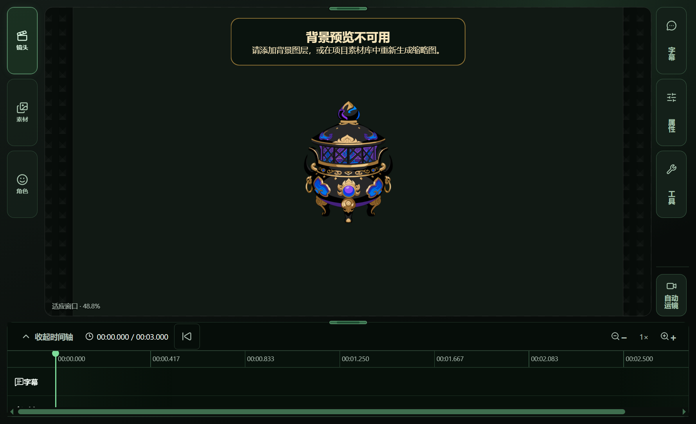

# Issue #751 — V1/T01 acceptance evidence

**Result: PARTIAL.** The Static Snapshot preview/import transaction and the ordinary image asset save/reopen path succeeded with the accepted `炼丹炉.fla` source. The source file hash stayed unchanged. Owner visual acceptance and a real Asset Library-to-canvas drag are still pending; this evidence does not claim `HUMAN VISUAL PASS`.

## Run details

- Windows Electron production build; existing FLA Workbench, Static Snapshot transaction, Asset Library, canvas, and project save/reopen paths were used.
- Source: `炼丹炉.fla`, SHA-256 `498537baa9cf900f613987eb9dab99727ee09ddaad4fb06e2d2c4351cb283a68` before and after the run. This matches the accepted Issue #732 census entry.
- Catalog: two targets. The selected `graphic-symbol` target `炼丹炉-cilisucai.com` was supported and had one frame. Its preview image decoded and displayed before explicit import.
- Cancellation: the new project remained at zero assets and its `project.json` hash did not change.
- Import: the existing Static Snapshot transaction reported completion and added the PNG as an ordinary image asset. The image appeared in the Asset Library.
- Save/reopen: after placement, the saved project contained one asset and one layer referencing it; the reopened project rendered the furnace at the saved position.
- The test harness injected the source path through `PANDA_STAGE_FLA_ACCEPTANCE_SOURCE`; it exercised the in-app FLA Workbench action and import UI but bypassed the native file chooser.
- The successful automated placement dispatched a version-2 `DragEvent` directly to the production canvas viewport. A separate Electron mouse-input attempt emitted `dragstart` but no `dragenter`, `dragover`, or `drop`, and created no layer. Therefore the real card-to-canvas drag remains unverified.
- The Workbench preview screenshot shows the selected artwork inside the preview stage, with part of its lower edge clipped by that view. The imported asset and reopened canvas screenshots show the full furnace. Owner visual review is needed to judge the preview presentation.

The machine-readable receipt is [receipt.json](./receipt.json). The temporary acceptance project and raw runner were kept outside the repository under `D:\PandaStage-Acceptance\issue751-v1-t04`.

## Screenshots

### Catalog

### Loaded preview before explicit import

### Import transaction completion

### Asset Library

### Placed in the current shot

### Saved and reopened project

## Validation

- `pnpm test:integration` — **PASS**, 38 test files and 189 tests passed.
- No production code changed for this evidence update. The integration run includes the repository's configured typecheck/build steps.
- `HUMAN VISUAL PASS` remains pending from the repository owner. Existing raster/sequence behavior and rollback/history acceptance were not separately re-run as part of this focused vertical slice.
