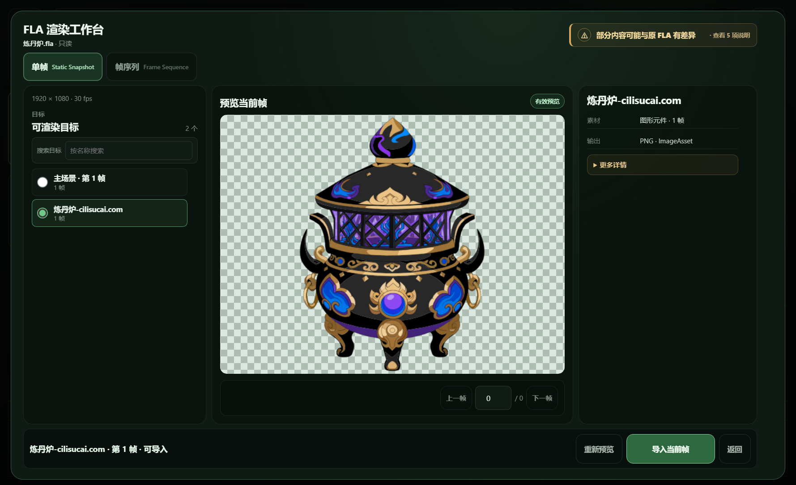
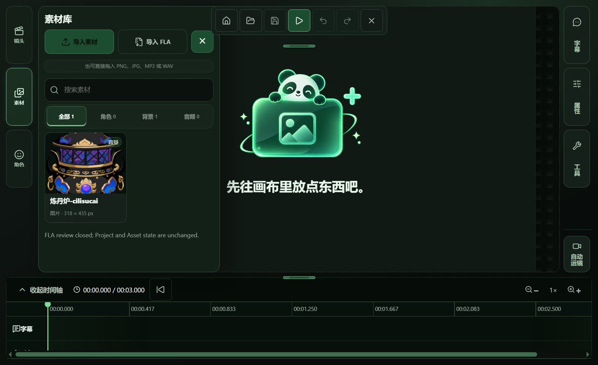
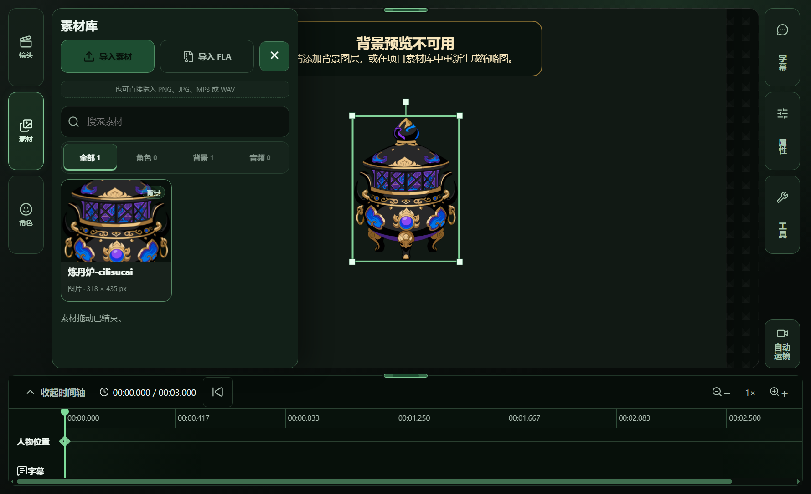

# Issue #751 — V1/T01 acceptance evidence

**Result: PARTIAL.** The accepted real FLA produced a supported Static Snapshot preview, was explicitly imported as an ordinary image asset, appeared in the Asset Library, and was dragged into the current shot with Windows mouse input. The project saved and reopened with the image still visible. `HUMAN VISUAL PASS` remains pending from the repository owner.

## Run details

- Windows Electron production build; the existing FLA Workbench, Static Snapshot transaction, Asset Library, canvas, and project save/reopen paths were used.
- Source: `炼丹炉.fla`, SHA-256 `498537baa9cf900f613987eb9dab99727ee09ddaad4fb06e2d2c4351cb283a68`, matching the accepted Issue #732 census entry. The acceptance runner checked the hash before and after the import flow; the t06 native-drag receipt also records the source hash invariant.
- Catalog: two targets. The selected `graphic-symbol` target `炼丹炉-cilisucai.com` was supported and had one frame. Its preview image decoded before the explicit import action.
- Cancellation: the new project remained at zero assets and its saved `project.json` hash did not change.
- Import: the existing Static Snapshot transaction reported completion and added the PNG as an ordinary image asset. The imported asset appeared in the Asset Library.
- Source selection used the test-only `PANDA_STAGE_FLA_ACCEPTANCE_SOURCE` injection, so the native file chooser itself was bypassed. The in-app Workbench, preview, explicit import, Asset Library, and project UI were exercised; no CLI or manual PNG copy was used to import the prop.
- Native placement used Win32 `SetCursorPos` and `mouse_event` from the Asset Library card to the canvas. The t06 project had zero layers before the drop and one layer afterward. It was saved, closed, reopened, and the furnace decoded and appeared on the canvas.
- The selected artwork's preview screenshot shows its lower edge clipped by the Workbench preview stage. The imported asset and reopened canvas show the full furnace; owner review is needed to judge the preview presentation.
- The older t04 receipt also records a synthetic `DragEvent` placement and a failed Electron `sendInputEvent` attempt. Those are historical attempts; the successful OS-level drag is recorded separately in t06 below.

The machine-readable receipt is [receipt.json](./receipt.json). Temporary acceptance projects and runners remain outside the repository under `D:\PandaStage-Acceptance\issue751-v1-t04` and `D:\PandaStage-Acceptance\issue751-v1-t06`.

## Screenshots

### Catalog

### Loaded preview before explicit import

### Import transaction completion

### Asset Library

### Successful Windows mouse drag into the shot

### Saved and reopened project

The earlier `04-placed-in-shot.png` and `05-reopened-project.png` are retained as supplemental t04 synthetic-event screenshots; the t06 screenshots above show the successful native mouse drag and its reopened result.

## Validation

- `pnpm test:integration` — **PASS**, 38 test files and 189 tests passed on 2026-10-10.
- No production code changed for this evidence update. The integration run includes the repository's configured typecheck/build steps.
- Existing raster/sequence behavior and rollback/history acceptance were not separately re-run as part of this focused vertical slice.
- `HUMAN VISUAL PASS` remains pending from the repository owner.
