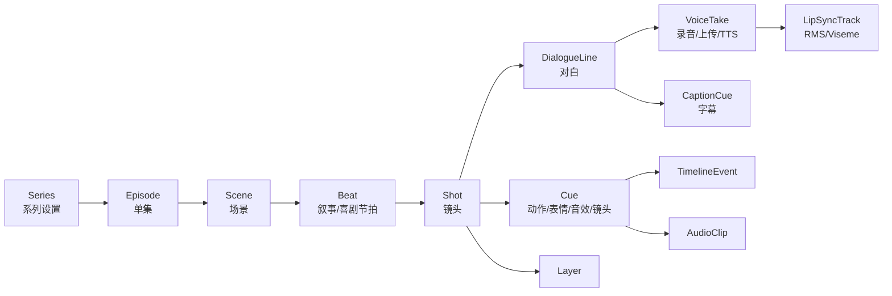

# Panda Stage 沙雕动画工作流后续功能路线

> 文档版本：v0.1
> 调研日期：2026-07-30
> 适用阶段：Day 45 / MVP Gate 之后
> 文档性质：产品方向建议，不替代当前 `ROADMAP.md`、`DAILY_PLAN.md` 与 Day 26～45 Agent Task
> 核心场景：熊猫头、纸片人、简笔画角色驱动的中文对话短动画
> 目标读者：产品决策者、设计者、开发 Agent、测试与真实创作者

---

## 0. 结论先行

Panda Stage 后续不应扩成“小号剪映”，也不应先做重型骨骼、动作捕捉或一键生成不可编辑视频。

最值得建立的产品定位是：

> **Panda Stage 不是把贴纸放上通用时间线，而是把一段中文角色对话直接变成可演、可改、可复用的镜头化动画工程。**

Day 45 之后建议依次建设三条主线：

1. **对白工厂**：结构化剧本、角色声音、逐句音频、口型、字幕与增量改词。
2. **沙雕节奏导演**：对话镜头模板、梗点、停顿、反应、突然放大、抖动、音效与音乐压低。
3. **系列化生产**：角色/场景/表演包复用、剧集模板、批量替换、多画幅版本、导出队列与版权台账。

AI 应放在第四层，作为“生成可检查的结构化草案和命令”的助手，而不是覆盖项目文件的黑盒导演。

目标工作流应收敛为：

```text
成稿剧本
  → 识别角色与台词
  → 绑定角色和声音
  → 生成逐句音频、字幕与嘴型
  → 套用对话镜头和表演模板
  → 调整梗点、停顿与反应
  → 全片预检
  → 导出横版/竖版成片
  → 复制为下一集继续生产
```

北极星不是“功能数量”，而是：

> **准备好角色与剧本后，10 分钟内得到一条可播放、可继续精修的 30 秒双人对话初稿。**

---

## 1. 本文解决什么问题

现有 45 天计划解决的是“能不能稳定完成一条短动画”：

- 项目能否保存、恢复和移动；
- 素材、角色和镜头能否管理；
- 纸片角色能否摆放和做基础动作；
- 对白、字幕、声音和嘴型能否预览；
- 完整项目能否稳定导出 MP4；
- Windows 安装包能否在真实环境工作。

这份后续路线解决的是“第二条、第三条、第三十条动画能不能明显更快”：

- 剧本改一句时，是否还要手动挪动后面所有内容；
- 同一角色是否每集都要重新选声音、表情和嘴图；
- 二人抬杠、独白吐槽、多人轮播是否每次都从空镜头搭起；
- 突然放大、无语停顿、拍桌、震屏和梗音效是否能一键复用；
- 横版和竖版是否必须重新做一遍；
- 云端配音失败后是否还能继续生产；
- 素材是否具备可追溯的商业使用与再分发边界。

本文不承诺具体发布日期，也不直接生成 Day 46 之后的 Agent Task。Day 45 Gate 完成后，仍需根据真实制作耗时重新估算任务切片。

### 1.1 与现有设计蓝图的关系

本路线不是一份新的视觉样式规范。后续功能仍必须遵守现有两份设计合同：

- [`docs/design/DESIGN.md`](../design/DESIGN.md) 是全局视觉设计系统，负责品牌、颜色、字体、间距、布局、组件状态、动效、文案、无障碍、CSS Token 与视觉验收；
- [`docs/design/day26-45-ux-implementation-blueprint.md`](../design/day26-45-ux-implementation-blueprint.md) 是编辑器信息架构与技术实施蓝图，负责组件宿主、状态所有权、滚动、响应式、迁移和测试合同；
- 本文只负责 Day 45 之后的工作流方向、领域模型、依赖顺序、Gate 与优先级。

“对白工厂”“沙雕节奏导演”和“系列化生产”进入开发前，应分别补一份功能级设计说明，至少包含页面/面板结构、关键任务流、默认/空/忙碌/失败/部分成功状态、键盘路径、小窗口行为和验收截图。功能级说明可以是独立 `design.md`，但不能复制或另起一套颜色、字号与组件 Token。

---

## 2. 调研方法与证据边界

### 2.1 仓库证据

本路线基于以下当前事实：

- 本分支签入的 `docs/test-receipts/M3.md` 仍把 M3 判为 FAIL：代码与自动化已通过，但真实 Electron “制作镜头 + 应用预设 + 保存重开”尚未形成正式 PASS 回执，因此本文不能解除 Day 26～45 的现有冻结条件；
- `ROADMAP.md` 已明确 V1 可考虑 RMS 嘴型、Rhubarb、5 分钟项目、时间轴吸附、素材搜索和导出队列；
- `DAILY_PLAN.md` 已把 Day 28～45 用于时间轴、对白、字幕、预览、导出、打包和真实生产验证；
- `src/domain/models/dialogue.ts` 已把角色、Voice Profile、音频、字幕样式、文本和时间绑定为 `Dialogue`；
- `src/domain/models/character.ts` 已有角色表情、张嘴图、默认 Voice Profile 与语速/音高字段；
- `src/domain/models/timeline-event.ts` 已定义 move、scale、opacity、shake、expression、flip 和 visibility；
- `src/domain/actions/ActionPreset.ts` 已建立“高级动作意图编译为 TimelineEvent”的正确方向；
- `src/domain/models/audio.ts` 已有音频片段、偏移和音量；
- Main Process、白名单 IPC、原子保存、FFmpeg sidecar 与预览/导出共享求值器已经构成可复用底座。

同时存在一个必须先解决的架构边界：

- 当前仓库仍同时存在 `src/domain/` 与 `src/shared/domain/` 两套领域入口；
- 后续 Script、Voice、Lip Sync、Beat、Template 等模型必须只扩展 Day 26 收敛后的正式领域层；
- 禁止为了赶功能继续在两套 Schema 中同步加字段。

### 2.2 外部调研

外部样本覆盖：

- 来画的熊猫头动画模板工作流；
- CapCut 的脚本转视频、TTS、自动字幕、模板替换和节奏编辑；
- Vyond Go 的 Script-to-Video、Conversation Layout 与 Quick Edit；
- Animaker 的录音/TTS/上传三路配音、角色口型和字幕；
- Adobe Character Animator 的可编辑 Viseme、Trigger、Replay 与可触发机位；
- Reallusion Cartoon Animator 的音频口型、图片角色化和表演工作流；
- Canva 的模板、Beat Sync 与多平台视频包装；
- Rhubarb Lip Sync、Azure Speech 和 Amazon Polly 的口型元数据能力；
- FFmpeg 的响度、压低背景音乐和静音处理能力。

外部页面只能证明“工具公开提供或声明了某项能力”，不能证明其生成质量、中文效果、区域可用性、价格或稳定性。本文因此把云端和生成式能力设计为可替换、可降级的 Provider，而不是核心项目格式。

### 2.3 仍需补齐的真实证据

正式排期前应完成：

1. 用 Panda Stage 当前版本制作一条真实 30 秒双人动画；
2. 用创作者当前常用工具制作同一条动画；
3. 记录每个步骤的耗时、回退次数和重复操作；
4. 至少观察第二集复用时的真实收益；
5. 访谈或跟随 3～5 位目标创作者；
6. 记录他们真实使用的脚本格式、配音来源、素材目录与交付平台。

---

## 3. 目标创作者与核心任务

### 3.1 工作假设：首要用户

在完成 3～5 位真实创作者访谈前，以下内容只能作为待验证的 Working Persona，而不是已经证实的市场结论：

- 主要制作 30 秒～3 分钟的中文角色对话短动画；
- 常用 2～4 个固定角色；
- 角色主要由透明 PNG、表情图、张嘴图和少量姿势图组成；
- 依赖台词、停顿、表情反应、突然放大和梗音效制造节奏；
- 每周或每天连续更新；
- 不希望学习专业骨骼、曲线编辑和复杂多轨剪辑；
- 可以接受模板，但必须保留逐句和逐镜头修改权。

### 3.2 高频内容形态

建议优先覆盖以下五类：

| 内容形态 | 典型结构 | Panda Stage 应提供的快速入口 |
|---|---|---|
| 双人抬杠 | A 说 → B 反驳 → A 补刀 → B 破防 | 双人正反打模板 |
| 单人口播吐槽 | 开场钩子 → 连续观点 → 结尾反转 | 单人近景 + 关键词强调 |
| 群聊轮播 | 多角色按顺序发言和反应 | 角色轮播布局 |
| 情景短剧 | 场景建立 → 冲突 → 升级 → 包袱 | Beat Sheet + 镜头组 |
| 解说配角色反应 | 旁白推进 → 角色插入反应 | 旁白轨 + 反应 Cue |

### 3.3 待验证的价值假设：“少做重复劳动”

首轮真实制作实验应验证创作者是否愿意为以下重复劳动的减少持续使用 Panda Stage：

- 逐句复制文本到字幕；
- 逐句导出、导入和对齐 TTS 音频；
- 每句都重新指定说话角色；
- 每句都手动切张嘴图；
- 每个镜头都重新摆双人位置；
- 每个包袱都重新拼放大、抖动和音效；
- 改一句台词后手动推移全部后续事件；
- 每集重新设置字幕样式、BGM 音量和导出参数；
- 为横版和竖版重做同一套内容。

---

## 4. 沙雕动画的目标生产流程

### 4.1 阶段 A：剧本准备

用户可以：

- 直接输入 `角色名：台词`；
- 粘贴 Markdown、纯文本或表格；
- 标记场景、旁白、动作提示、停顿和梗点；
- 在导入预览中修正无法识别的角色；
- 把同义角色名映射到已存在角色；
- 在正式修改项目之前看到将新增的镜头、对白和资产引用。

最小文本格式：

```text
# 场景：办公室

熊猫：[无语] 你说这项目今天能上线？
小黄：能。
@pause 500
熊猫：[突然放大] 那你为什么在收拾行李？
@sfx 锣
```

格式只是输入方式，项目内部必须转换成严格 Schema，不能长期依赖字符串解析。

### 4.2 阶段 B：选角与声音

每个角色拥有：

- 默认 Voice Profile；
- 可试听的声音样本；
- 语速、音高、情绪和发音词典；
- 默认闭嘴图、张嘴图或 Mouth Set；
- 默认站位、缩放、朝向和字幕身份色；
- 常用表情与表演包；
- 云端 Provider 不可用时的录音/上传音频回退路径。

### 4.3 阶段 C：逐句声音生产

每句台词可以：

- 使用 TTS；
- 在应用内录音；
- 上传已有音频；
- 复用历史 Voice Take；
- 试听后选择 Take；
- 单独重新生成；
- 锁定已确认 Take；
- 显示费用、网络状态、失败原因和重试范围。

生成音频后，系统自动得到：

- 实际时长；
- 建议前后停顿；
- 字幕时间；
- RMS 嘴型或 Viseme Track；
- 可选词级时间点；
- 需要向后 Ripple 的时长变化。

### 4.4 阶段 D：镜头初排

系统按内容形态套用模板：

- 单人近景；
- 双人同框；
- A/B 正反打；
- 反应特写；
- 插入道具；
- 群聊轮播；
- 旁白 + 角色反应。

模板生成的是普通 Shot、Layer、Dialogue、TimelineEvent 和 Cue。用户应用后可完全编辑，不保存为不可拆解的黑盒。

### 4.5 阶段 E：梗点与表演

用户不必精确拖动多个轨道，而是先在语义锚点上添加：

- 台词开始；
- 某个关键词；
- 台词结束；
- 台词结束后若干毫秒；
- 场景 Beat 开始或结束。

可用表演包括：

- 无语停顿；
- 突然放大；
- 抖动破防；
- 拍桌；
- 摊手；
- 后退；
- 掉头离场；
- 表情切换；
- 画面震动；
- 黑屏白字；
- 梗音效；
- BGM 突停或压低。

系统再把这些语义 Cue 编译为现有时间轴事件与音频片段。

### 4.6 阶段 F：包装与导出

导出前自动检查：

- 是否存在未生成或失败的台词音频；
- 是否存在未知角色或缺失 Mouth Set；
- 字幕是否超出安全区；
- 对白是否意外重叠；
- 音频是否削波或过小；
- BGM 是否盖住对白；
- 角色是否完全在画布外；
- 自动生成内容是否仍处于“待确认”状态；
- 使用的素材是否允许嵌入工程、商业成片或再分发；
- AI 生成/合成内容是否需要显式或隐式标识；
- 克隆或定制声音是否具备可核验的权利与同意记录；
- 当前画幅是否有未处理的布局警告。

---

## 5. 当前底座与后续机会

| 领域 | 当前或 Day 26～45 计划能力 | 后续最有价值的扩展 | 复用点 |
|---|---|---|---|
| Project | 本地项目、原子保存、恢复、迁移 | Series / Episode / Variant | ProjectService、迁移入口 |
| Asset | 图片/音频导入、元数据、缩略图、引用检查 | 标签、收藏、来源与许可、跨项目库 | AssetService、相对路径 |
| Character | 表情、张嘴图、默认声音、缩放和朝向 | Mouth Set、表演包、角色模板、发音词典 | Character、VoiceProfile |
| Shot | CRUD、排序、时长、背景和图层 | 镜头模板、Camera Preset、Beat 归属 | ShotSchema、Layer |
| Dialogue | 角色、声音、音频、字幕、时间、文本 | Voice Take、词级时间、锁定、Ripple | DialogueSchema |
| Timeline | 连续/离散事件、冲突规则、动作预设 | 语义锚点、Macro、局部重算 | TimelineEvent、ActionPreset |
| Preview | AudioContext 时钟、完整项目预览 | 草稿质量模式、Solo/Mute、A/B Take | 共享 Evaluator |
| Lip Sync | MVP 固定频率开合 | RMS → Rhubarb → Provider Viseme 分层 | Dialogue + Mouth Asset |
| Subtitle | 文本、样式、安全区 | 关键词强调、说话人样式、SRT/ASS | SubtitleStyle |
| Audio | 多片段、音量、延迟、混音 | 波形、静音裁剪、Ducking、响度预检 | Web Audio + FFmpeg |
| Export | 1080p MP4、进度、取消、错误 | 队列、画幅 Variant、字幕/音轨附带输出 | ExportService |
| Automation | 数据化 Preset | 可预览的 Script Compiler / Shot Director | Schema Command |

关键判断：

> 当前架构最适合继续发展“高层语义编译为确定性时间轴”，而不是把产品改造成自由关键帧和任意插件优先的 NLE。

---

## 6. 外部工作流给出的产品启示

### 6.1 模板比堆效果更直接

来画公开的熊猫头制作流程是“选择模板 → 编辑文本、角色动作和场景 → 添加配音”。CapCut 官方 Web 模板流程页也展示了 Replace / Batch replace；这只证明该页面公开描述的工作流，不代表所有客户端、模板、地区或账户都具备相同能力。

对 Panda Stage 的启示：

- 模板应围绕“对话结构”而不是视觉皮肤；
- 模板要定义角色槽位、镜头节奏、字幕样式和 Cue；
- 用户应能批量替换角色、场景、声音和文案；
- 模板必须展开成普通可编辑项目对象。

### 6.2 剧本应成为第一入口

Vyond Go 支持 Prompt、文档和 Script-to-Video，并把 Conversation、Talking Head、Narration 作为结构化 Layout；其 Conversation 当前只接受最多两个角色。

对 Panda Stage 的启示：

- 自由文本框之外还需要内容类型、角色数、画幅、时长目标和节奏风格；
- 双人对话可作为第一条最小闭环；
- Panda Stage 后续可以扩展到 3～4 人，但不能让多人能力拖慢二人闭环；
- Script 产物必须能进入完整编辑器，不应只导出扁平视频。

### 6.3 改词必须管理时间影响范围

Vyond Quick Edit 在特定阶段修改脚本会重算视频时长，但进入完整 Studio 后存在不同的时间调整行为。

对 Panda Stage 的启示：

- 不应维护“快速编辑”和“完整编辑”两套相互分叉的时间规则；
- 每次改词都明确显示 `局部伸缩 / 向后推移 / 保持镜头总长` 三种策略；
- 人工锁定的 Beat、镜头边界和 Cue 默认不被自动重写；
- 应显示改动影响范围并支持一次撤销。

### 6.4 配音需要三条平等入口

Animaker 把录音、TTS 和上传音频作为角色配音的三种入口，并将结果绑定到角色进行 Lip Sync。CapCut 的 TTS 依赖云处理，网络、语言和 Voice 可用性都可能导致失败。

对 Panda Stage 的启示：

- TTS 不能成为唯一主路径；
- `record`、`upload`、`tts` 都生成统一的 Voice Take；
- 云端失败时项目仍可编辑、播放其他部分和导出不依赖该台词的草稿；
- Provider、Voice ID 与生成参数必须记录，但密钥不能写入项目。

### 6.5 自动口型必须可手修

Adobe Character Animator 能从音频和 Transcript 生成 Viseme，并允许编辑或复用 Viseme Bar；Rhubarb Lip Sync 可从音频输出 JSON Mouth Cue，并允许提供对白文本提高识别结果。

对 Panda Stage 的启示：

- 把“两张嘴 + RMS 能以低成本提效”作为首轮实验假设，不在实测前当成质量结论；
- 再提供可选的 6～9 Mouth Shape；
- 口型结果必须是可见、可局部修正、可重新生成的派生轨；
- 改词只重算对应 Voice Take 和 Lip Track；
- 中文识别能力必须单独实测，不能从英文资料推断。

### 6.6 表演应封装成可复用 Trigger

Adobe Character Animator 的 Trigger 可控制姿势、道具和循环动作，Scene Camera 可保存可触发机位；Cartoon Animator 同样强调音频口型和可复用的表演控制。

对 Panda Stage 的启示：

- “震惊”“无语”“拍桌”应是可组合的 Performance Macro；
- Macro 可以同时包含表情、动作、镜头、VFX 和音效；
- Macro 实例保留参数和来源，用户可展开查看底层事件；
- 同一 Macro 可锚定到不同台词和关键词。

### 6.7 音乐节拍不能替代喜剧节奏

Canva Beat Sync 面向音乐节拍，并公开说明不能把 Voice Snippet 当作同步源。CapCut Auto Cut 则会参考脚本、语音停顿或音乐节拍，并允许生成后继续修改。

对 Panda Stage 的启示：

- 先做对白停顿、句尾、关键词和反应时长；
- 音乐 Beat 只是可选辅助网格；
- 自动节奏结果必须以草案形式进入时间轴；
- 不要把“按音乐切镜头”误当作“理解中文包袱”。

### 6.8 版权元数据必须早于素材商店

通用模板和素材平台通常区分成片使用、工程转交、独立资产分发、商业使用和署名要求。

对 Panda Stage 的启示：

- 每个 Asset 从一开始就保留来源和许可元数据；
- “允许渲染进成片”不等于“允许把源文件打包给别人”；
- 项目打包、模板分享和未来素材库必须经过 License Preflight；
- 未知来源的熊猫头、音效和字体应被明确标记，而不是默认可商用。

---

## 7. 产品数据模型方向

### 7.1 从 Shot 中堆对象，演进为语义生产链

建议的高层关系：



### 7.2 必须区分“创作意图”和“派生产物”

创作意图：

- 台词文本；
- 说话角色；
- Beat；
- 镜头模板；
- Cue 锚点；
- 用户锁定项；
- Voice Profile；
- 画幅布局意图。

派生产物：

- 尚未选中的 TTS 候选和试听临时件；
- 实际音频时长；
- Mouth Cue；
- 词级时间；
- 字幕分行；
- 编译后的 TimelineEvent；
- 波形缓存；
- 缩略图；
- 自动镜头草案。

这里必须再区分“耐久媒体”和“可删缓存”：

- 录音、上传音频以及用户已经选中的 TTS Voice Take，都是项目内耐久媒体和事实来源；清缓存、断网或 Provider 下线不得使它们无法播放；
- 未选中的可再生候选、流式试听临时件、波形、响度分析、规范化代理、缩略图和导出中间件才是可删缓存；
- Provider 不保证同一请求将来生成完全相同的音频，因此“可重建”不能替代已选 Voice Take 的项目内持久化；
- 派生产物可以删除后重建，创作意图和耐久媒体不能因为清缓存而丢失。

### 7.3 建议新增的核心实体

#### ScriptDocument

```ts
interface ScriptDocument {
  id: string;
  sourceFormat: 'manual' | 'plain-text' | 'markdown' | 'csv';
  rawText: string;
  scenes: ScriptScene[];
  sourceOfTruth: 'raw-text' | 'structured-scenes';
  sourceRevision: number;
  parseRevision: number;
  importedAt: string;
}
```

导入预览阶段以 `rawText + sourceRevision` 为事实来源；用户确认应用后，以版本化的结构化 Scene/Dialogue 集合为项目事实来源，`rawText` 只保留导入证据。首版不做两者之间的隐式双向同步，重新解析必须显示 Diff。

#### DialogueLine

```ts
interface DialogueLine {
  id: string;
  sceneId: string;
  beatId: string | null;
  scriptOrder: number;
  sourceRef?: {
    documentId: string;
    spanId: string;
    start: number;
    end: number;
    sourceRevision: number;
    contentHash: string;
  };
  speakerCharacterId: string;
  text: string;
  textRevision: number;
  pronunciationText?: string;
  voiceProfileId: string | null;
  selectedTakeId: string | null;
  timingMode: 'ripple' | 'fit-shot' | 'locked';
  reviewStatus: 'draft' | 'ready' | 'needs-review';
}
```

`generating`、`failed` 和重试次数属于异步 Job，不属于台词本身。录音/上传路径可以没有 Voice Profile；`selectedTakeId` 只引用已经完整落盘并通过校验的 Take。Scene、Dialogue、Take 的集合归属、级联删除、孤儿处理和交叉引用校验必须在正式 Schema 中明确。

#### VoiceTake

```ts
interface VoiceTake {
  id: string;
  dialogueLineId: string;
  origin: 'recorded' | 'uploaded' | 'tts';
  assetId: string;
  contentHash: string;
  durationMs: number;
  textRevisionAtCreation?: number;
  provider?: string;
  providerVoiceId?: string;
  generationFingerprint?: string;
  wordTimings?: WordTiming[];
  generatedAt?: string;
}
```

`VoiceTake` 只表示成功完成的耐久音频。排队、运行、失败或取消不得创建缺少 `assetId` 的半成品 Take；这些状态进入独立任务：

```ts
interface VoiceGenerationJob {
  id: string;
  dialogueLineId: string;
  sourceTextRevision: number;
  idempotencyKey: string;
  providerRequestId?: string;
  status: 'queued' | 'running' | 'succeeded' | 'failed' | 'cancelled';
  resultTakeId?: string;
}
```

#### SemanticCue

```ts
interface SemanticCue {
  id: string;
  type: 'action' | 'expression' | 'camera' | 'sfx' | 'caption-emphasis';
  target:
    | { kind: 'layer'; layerId: string }
    | { kind: 'shot'; shotId: string }
    | { kind: 'audio-bus'; busId: string }
    | { kind: 'caption'; dialogueLineId: string };
  anchor:
    | { kind: 'dialogue-start'; dialogueLineId: string; offsetMs: number }
    | { kind: 'dialogue-end'; dialogueLineId: string; offsetMs: number }
    | {
        kind: 'text-span';
        dialogueLineId: string;
        spanId: string;
        sourceRevision: number;
        contentHash: string;
        offsetMs: number;
      }
    | { kind: 'beat'; beatId: string; edge: 'start' | 'end'; offsetMs: number };
  presetId: string;
  parameters: Record<string, number | string | boolean>;
  locked: boolean;
  status: 'active' | 'orphaned' | 'needs-review';
  owner:
    | { kind: 'manual' }
    | { kind: 'macro'; macroInstanceId: string; compileRevision: number };
  editMode: 'managed' | 'overridden' | 'detached';
}
```

中文分词和供应商 token 边界不稳定，因此 Cue 不依赖裸 `wordIndex`。文本修改后先依据稳定 `spanId + sourceRevision + contentHash` 尝试重锚；目标文字被删除或无法唯一定位时进入 `orphaned / needs-review`，不得静默移到相邻词。正式 Schema 应按 Cue Type 使用判别联合，让 Camera→Layer、SFX→Caption 等无效组合无法表示。Macro 编译出的事件必须记录 Owner；人工修改后进入 `overridden` 或 `detached`，重新编译不能覆盖它。

#### AssetProvenance

```ts
interface AssetProvenance {
  source: 'self-made' | 'imported' | 'generated' | 'provider';
  provider?: string;
  sourceUrl?: string;
  licenseId?: string;
  licenseTextHash?: string;
  evidenceRef?: string;
  rights: {
    renderInOutput: boolean | null;
    commercialUse: boolean | null;
    embedInProject: boolean | null;
    redistributeSource: boolean | null;
    modify: boolean | null;
  };
  territories?: string[];
  validFrom?: string;
  validUntil?: string;
  attribution?: string;
  lastVerifiedAt?: string;
}
```

许可不是一个互斥枚举。成片使用、商业使用、工程嵌入、源文件再分发、改编、署名、地域和期限必须分别记录；未知值保持 `null`，不能被解释为允许。许可证明只通过安全的 Opaque `evidenceRef` 引用，并记录许可文本版本或 Hash。

生成式音频、图片或视频另带 Asset/Take/Segment 级 `GenerationRecord`，至少包含 Provider、模型/版本、生成时间、输入摘要 Hash、适用 Policy 版本和显式/隐式标识要求。标识结论不能只存在于最终 Project 顶层。

如果未来接入声音克隆，另设 `VoiceConsentRecord`，至少记录：

- 被克隆或授权人的身份引用；
- 授权范围；
- 商业使用范围；
- 允许的平台与地区；
- 授权起止时间；
- 撤回状态；
- 证明文件的安全引用；
- 记录创建人与审计时间。

同意证明不得作为普通项目附件明文打包。项目只保存安全存储返回的 Opaque ID、授权范围摘要和当前有效/撤回状态。

这些接口仅用于表达产品边界。正式实现必须通过版本化 Zod Schema、迁移和交叉引用校验落地。

---

## 8. 第一优先级：对白工厂

### 8.1 结构化剧本编辑器

#### 要解决的问题

用户现在需要先手动创建镜头，再逐句新增 Dialogue。对于 20 句对话，这会产生大量重复操作。

#### 最小能力

- 纯文本/Markdown 粘贴；
- 识别 `角色：台词`；
- 场景分隔；
- 旁白；
- 表情、动作、停顿和音效标记；
- 角色映射预览；
- 解析错误逐行显示；
- 应用前 Diff；
- 应用后单次撤销。

#### 验收

- 30 句、4 角色文本可稳定解析；
- 未知角色不会被静默创建；
- 同一输入重复解析得到相同结果；
- 应用前不修改项目；
- 导入失败不产生半成品对象；
- 用户可从解析结果跳回原始行。

### 8.2 Voice Provider Adapter

#### 要解决的问题

如果直接把某家云 TTS 字段写入 Dialogue，后续换供应商、离线或导入真人录音会破坏项目模型。

#### 最小能力

```ts
interface VoiceProviderCapabilities {
  supportsSsml: boolean;
  supportsWordTimings: boolean;
  supportsVisemes: boolean;
  supportsEmotion: boolean;
  supportsStreamingPreview: boolean;
  supportsCancellation: boolean;
  supportsIdempotencyKey: boolean;
  supportedLocales: string[];
  maxInputCharacters: number | null;
  outputFormats: string[];
  timestampGranularity: 'none' | 'word' | 'phoneme' | 'viseme';
  ssmlDialect?: string;
  dataRegions?: string[];
  retentionPolicyUrl?: string;
  costEstimateMode: 'exact' | 'estimate' | 'unavailable';
}
```

- `record`、`upload`、`tts` 统一产出 Voice Take；
- Provider 列表与能力探测；
- 本地安全存储密钥；
- 试听不写入正式项目；
- 生成前显示预计费用或“供应商未提供估算”；
- 单句取消、重试和回退；
- Provider Voice ID 不可用时保持已有音频可播放；
- 生成缓存按输入指纹命中。

12～20 句的首个真实实验已经需要最小批处理合同：

- Batch 只是多个可独立恢复的 Job，不创建一个“全成或全败”的巨型请求；
- 队列遵守 Provider 并发、速率限制和 `Retry-After`，退避带上限；
- 每个 Job 都有 `idempotencyKey`、`providerRequestId`、来源 Revision、状态和费用；
- 页面显示完成、运行、失败、取消和待重试数量，允许部分成功后继续；
- 用户可以设置总费用上限；达到上限时停止派发新请求，不删除已完成 Take；
- 旧 Job 返回时用来源 Revision 和指纹执行 Compare-and-Set，过期结果只能保存为候选，不能覆盖新文本对应的已选 Take。

#### 指纹至少包含

- Provider、模型、Adapter 与生成器版本；
- Voice ID；
- Locale、规范化后的文本或 SSML；
- 语速、音高、情绪；
- 发音词典版本；
- 输出音频格式、Sample Rate、Channel 和 Codec；
- 非破坏性后处理链及其版本。

### 8.3 逐句改词与 Ripple Policy

用户修改一句台词后，系统必须先计算影响：

| 策略 | 行为 | 适用场景 |
|---|---|---|
| 向后推移 | 后续未锁定内容整体平移 | 初稿快速生产 |
| 适配镜头 | 维持镜头边界，调整句间停顿或语速建议 | 已确定镜头长度 |
| 完全锁定 | 不移动任何内容，提示音频是否越界 | 精修阶段 |

时间基准必须唯一：

- Voice Take、Word Timing 和 Mouth Cue 使用 Take-relative 整数毫秒；
- Dialogue、TimelineEvent、SemanticCue 的落点使用 Shot-local 整数毫秒；
- Episode absolute time 只由镜头顺序和 Shot Duration 派生，不作为第二套可编辑时间；
- 音频 Trim 或处理改变“有效时长”时显式生成新 Revision，不能偷偷改写原始 Take 时长。

首版 Ripple 默认只在当前 Shot 内移动未锁定的 Dialogue/Cue。若新时长越过 Shot 边界，系统必须预览“延长当前 Shot 并推移后续 Shot”或“保持 Shot 并处理冲突”，不得自动跨镜头。遇到锁定对象或锁定 Shot Boundary 时停止并报告精确冲突；`fit-shot` 只允许在项目设定的有界语速范围内给出建议，默认建议区间为 `0.9×～1.1×`，超出时要求用户改词、重生成或显式确认，不能拉伸录音/上传音频蒙混过关。

硬约束：

- 已锁定 Beat、Shot Boundary 和 Cue 不被静默移动；
- 自动移动前显示受影响对象数和时间变化；
- Ripple 作为一个原子 `ProjectCommand` 提交；
- 失败时全部回滚；
- 撤销后逐对象时间和 Shot Duration 必须精确恢复；
- 重新生成一句音频不能让其他已确认 Voice Take 变脏。

### 8.4 发音词典

中文 TTS 的高频问题包括：

- 多音字；
- 人名、地名；
- 英文缩写；
- 网络用语；
- 故意口吃或拉长音；
- 数字和单位读法。

建议支持：

- 项目级和角色级词典；
- 显示文本与发音文本分离；
- 试听局部短语；
- 词典变更只使受影响台词变脏；
- 导出时字幕仍使用显示文本。

---

## 9. 第二优先级：口型、字幕与对话同步

### 9.1 分层口型策略

| 层级 | 输入 | 输出 | 优点 | 限制 |
|---|---|---|---|---|
| L0 固定频率 | Dialogue 时间段 | 开/闭嘴 | 最简单，MVP 已计划 | 与声音强弱无关 |
| L1 RMS 门控 | 音频振幅 | 开/闭嘴 Cue | 本地、快、适合两张嘴 | 不是音素 |
| L2 Rhubarb | 音频 + 可选文本 | 6～9 Mouth Cue | 本地 CLI、JSON 输出 | 中文需实测，素材量上升 |
| L3 Provider Viseme | TTS 元数据 | Provider Viseme | 与合成音频天然对齐 | 云依赖、映射和语言差异 |

默认路线：

1. 先把 L1 做成可靠默认；
2. L2 作为可选本地 Sidecar；
3. L3 只在 Provider 明确支持时启用；
4. 所有层级最终映射到同一个 `LipSyncTrack`。

统一 `LipSyncTrack` 至少记录：

- 来源 Voice Take ID 与音频 Content Hash；
- Algorithm、Version、Config Fingerprint；
- Take-relative 的整数毫秒起止；
- 与 Provider 无关的 Canonical Mouth Shape；
- 可选 Confidence；
- 自动、人工覆盖与锁定区间。

Mouth Cue 必须稳定排序、无负数、无非法 Shape，并且不能越过非破坏处理后的有效音频时长。局部重算只替换未锁定且仍由算法管理的区间；与锁定区间重叠时报告冲突，不拼接出倒序或零长 Cue。异步分析结果同样使用 Voice Take Hash 和算法指纹做 Compare-and-Set。

### 9.2 Mouth Set

角色不应只有一个 `mouthOpenAssetId`，后续需要：

- Mouth Shape ID；
- 对应 Asset；
- 中心锚点与偏移；
- 缺失 Shape 的回退；
- 预览校准；
- 两张嘴、六张嘴、九张嘴三个模板；
- 角色缩放或翻转后保持嘴图对齐。

Mouth Set 必须声明渲染模式：

- `full-expression-swap`：每个 Mouth Shape 对应一张完整角色图；
- `mouth-overlay`：嘴图叠加在角色表情上。

`mouth-overlay` 需要为每个 Expression 保存 Anchor、Offset、Scale 和 Flip 规则；只有角色级单一偏移不足以保证不同表情稳定对齐。

### 9.3 可编辑口型轨

用户可以：

- 查看 Mouth Cue；
- 拖动边界；
- 替换 Mouth Shape；
- 局部重新分析；
- 锁定一段；
- 恢复自动结果；
- 比较“自动结果”和“当前结果”。

口型轨默认折叠，不应让新手一开始面对几十个 Viseme。

### 9.4 字幕与剧本同源

如果台词文本由用户输入，默认字幕不应先经过一次语音识别再回来。

建议：

- 字幕文本默认来自 Dialogue；
- 音频词级时间只帮助分段和强调；
- 用户可编辑字幕显示文本，但系统提示其与台词已分叉；
- 支持逐句、逐词和重点词强调；
- 支持说话人身份样式；
- 导出 SRT；
- 后续再考虑 ASS 或双语字幕；
- 导出前提供全片字幕审阅表。

对于上传的无文本音频，可单独提供“转写为草稿”，并要求用户确认后才成为 Dialogue 文本。

---

## 10. 第三优先级：沙雕节奏导演

### 10.1 Conversation Shot Template

第一批模板建议只做：

1. 单人中景；
2. 单人近景；
3. 双人同框；
4. A/B 正反打；
5. 反应特写；
6. 群聊轮播；
7. 黑屏白字；
8. 旁白 + 插入反应。

模板定义：

- 角色槽位；
- 角色默认站位、比例和朝向；
- 背景槽位；
- Camera Preset；
- 可选 Dialogue 分配规则；
- 默认字幕安全区；
- 默认入场/出场；
- 可用的画幅 Variant。

模板不应内嵌来源不明的正式角色素材。

### 10.2 Camera Preset

现有项目以 Layer 变换为主。后续应新增独立 Camera Model，而不是移动所有图层模拟镜头。

最小 Camera Preset：

- 全景；
- 双人中景；
- 左角色近景；
- 右角色近景；
- 道具特写；
- 突然推近；
- 轻微手持抖动；
- 恢复默认机位。

Camera Cue 同样锚定到 Dialogue 或 Beat。

### 10.3 Comedy Beat

Beat 是比 Shot 更高层的节奏单位：

```ts
type ComedyBeatKind =
  | 'setup'
  | 'challenge'
  | 'misunderstanding'
  | 'escalation'
  | 'pause'
  | 'reaction'
  | 'punchline'
  | 'callback';
```

Beat 可携带：

- 目标时长；
- 推荐停顿；
- 推荐镜头；
- 推荐 Performance Macro；
- 是否禁止被 Ripple 压缩；
- 是否为导出前必须人工确认的 Punchline。

系统不需要“理解幽默”，只需让用户能明确放置和复用节奏结构。

### 10.4 Performance Macro

示例：`破防`

```text
台词结束 + 100ms
  → 表情切换：震惊
  → 角色 scale 1.0 → 1.18 → 1.0
  → shake 450ms
  → Camera 推近
  → 播放“破防”音效
  → BGM 暂停 300ms
```

Macro 设计原则：

- 组合现有 Event、Audio 和 Camera Cue；
- 参数化时长、幅度和音效；
- 可预览；
- 可撤销；
- 可展开；
- 保存来源版本；
- Macro 更新不自动改写旧实例；
- 用户可将当前组合另存为个人 Macro。

第一批 Performance Pack：

- 无语；
- 震惊；
- 破防；
- 得意；
- 拍桌；
- 摊手；
- 后退；
- 掉头走；
- 突然出现；
- 黑屏吐槽；
- 结尾定格。

### 10.5 Shot Director

自动导演只能生成建议：

- 根据当前说话角色切换近景；
- 句尾插入听者反应；
- Punchline 前保留停顿；
- 连续近景过多时插入双人同框；
- 对长句建议拆镜头；
- 对未出现在当前镜头的说话角色提出修复。

每条建议必须支持：

- 接受；
- 忽略；
- 替换模板；
- 锁定；
- 查看将新增/移动/删除的对象；
- 一次撤销。

---

## 11. 第四优先级：音效、BGM 与成片包装

### 11.1 音效收藏与语义标签

音效库应按创作目的组织：

- 反转；
- 震惊；
- 无语；
- 破防；
- 转场；
- 拍桌；
- 脚步；
- 手机提示；
- 环境；
- 结尾。

支持：

- 收藏；
- 最近使用；
- 试听；
- 关键词；
- 来源与许可；
- 默认音量；
- 锚定到 Dialogue、Word 或 Beat；
- 一键替换同类音效。

### 11.2 BGM Ducking

现有 `AudioClip` 的 offset/volume 不足以承载对白、BGM、SFX 与非破坏处理。进入 Ducking 前先定义最小规范化混音合同：

- 每个 Clip 声明 `role`（dialogue / bgm / sfx / ambience）与目标 Bus；
- Source 保留原始媒体，另存 Trim、Fade、Gain Automation 和有版本的 Processing Chain；
- 处理后有效时长与原始媒体时长分开；
- 项目内部使用明确的 Mix Sample Rate、Channel Layout 和时间基准；首版沿用当前导出证据中的 48 kHz，最终声道布局由导出 Preset 决定；
- 所有响度、True Peak 和削波阈值进入导出 Preset，不散落在 UI 或 FFmpeg 命令字符串里。

首版不做复杂混音台，提供：

- 对白存在时自动压低 BGM；
- Attack、Release 和压低量三档；
- 手动例外；
- Punchline 前后短暂停；
- 预先计算统一的 Ducking Gain Envelope，Web Audio 预览与 FFmpeg 导出消费同一包络；
- 导出前响度和削波检查。

FFmpeg 已提供 `sidechaincompress`、`loudnorm`、`silencedetect` 与 `silenceremove` 等基础能力，但 Web Audio 与 FFmpeg 即使使用同名参数也不天然等价。正式启用前必须用固定音频 Fixture 验证 Ducking 起止偏差不超过 20 ms、包络增益偏差不超过 0.5 dB，并验证导出 Preset 定义的 Integrated LUFS、True Peak、Sample Rate 和 Channel Layout。若实现无法达到该容差，就以预计算包络为唯一结果，不分别运行两套自动压低算法。

### 11.3 Voice Take 清理

建议提供非破坏性处理：

- 去除头尾静音；
- 淡入淡出；
- 音量统一；
- 轻度降噪只作为可选 Provider；
- 保留原音；
- 所有处理保存为参数；
- 导出缓存可重建。

---

## 12. 第五优先级：系列化生产

### 12.1 Series Kit

系列级设置包括：

- 固定角色；
- 固定 Voice Profile；
- 默认 Mouth Set；
- 场景模板；
- 字幕主题；
- 片头、片尾和水印；
- BGM；
- 常用 SFX；
- Performance Pack；
- 横版/竖版布局；
- 默认导出配置；
- 许可与署名模板。

项目仍必须可单独移动和打开。Series Kit 引用需要选择：

- 复制进项目；
- 只读链接；
- 创建可更新快照。

首版建议只支持“复制进项目 + 记录来源”，避免项目依赖外部库后失去可移植性。

### 12.2 Episode Template

用户可以：

- 把当前项目另存为剧集模板；
- 标记可替换角色、背景、文案和音效槽位；
- 从上一集复制；
- 只复制选定镜头；
- 清空对白但保留镜头与 Cue；
- 批量替换角色；
- 批量替换 Voice Profile；
- 查看模板资产是否可再分发。

### 12.3 增量重算

应建立依赖图，但不能用一条“文本变化 → 所有下游都脏”的链条替代具体语义：

```text
Dialogue.textRevision / pronunciation / VoiceProfile
  → 新的 TTS Generation Candidate

Selected VoiceTake.contentHash / processing revision
  → effective duration / word timing / LipSyncTrack

Dialogue.textRevision + timing source + SubtitleStyle
  → CaptionCue / text-span anchor review

effective duration + Ripple Policy
  → unlocked Shot-local timing
  → derived Episode duration
```

最小失效矩阵：

| 变更 | 需要重算或复核 | 必须保留 |
|---|---|---|
| Dialogue 显示文本 | 字幕文本、文本锚点；TTS 可新建候选 | 录音/上传 Take、已选旧 TTS Take、基于未变化音频的 Lip Track |
| 发音文本 / Voice Profile | 新 TTS 候选 | 现有所有耐久 Take |
| Selected Voice Take | 有效时长、Word Timing、Lip Track、Ducking Envelope、允许 Ripple 的时间 | 其他 Take 与人工锁定 Cue |
| Mouth Set | Canonical Shape→素材的视觉映射 | 音频分析与 Canonical Mouth Cue |
| SubtitleStyle | 分行、排版与安全区 | 音频、口型、镜头时间 |
| 角色位置/表情素材 | 画面渲染缓存 | Voice Take、口型分析与字幕 |
| Mix 参数 | Gain Envelope、混音预览和导出音频缓存 | Dialogue、Voice Take、Lip Track |
| 导出格式/分辨率 | 新 Export Job 的渲染/编码产物 | 项目编辑状态；已经创建的不可变 Snapshot |

每个派生产物记录上游 ID 与 Revision/Hash、Generator 与 Version、Config Fingerprint、生成时间以及 `auto / overridden / locked` 所有权。`stale` 应由指纹比较计算，不持久化一个容易漂移的布尔真相。异步 TTS、口型或波形任务结束时必须对 Source Revision/Fingerprint 做 Compare-and-Set；旧任务结果可以保留为候选或诊断证据，但不得覆盖新文本或新 Take 的当前结果。

不可接受：

- 改一句话重新生成整集 TTS；
- 改字幕样式使音频缓存失效；
- 改角色位置使口型重新分析；
- 改导出分辨率使项目编辑状态变脏；
- Provider 暂时不可用导致旧 Voice Take 无法播放。

### 12.4 多画幅 Layout Variant

长期需要：

- 16:9；
- 9:16；
- 1:1。

它们共享：

- Script；
- Dialogue；
- Voice Take；
- Lip Sync；
- Beat；
- 大部分 Cue；
- Shot 顺序和时间。

各画幅单独保存：

- Camera Framing；
- 角色站位覆盖；
- 字幕安全区；
- 允许隐藏的装饰元素；
- 必须人工确认的布局警告。

不建议首版自动“神奇重排”。先提供模板 Variant 和清晰预检。

### 12.5 导出队列

支持：

- 多画幅队列；
- 带字幕/无字幕版本；
- 草稿水印版；
- 纯视频与 SRT；
- 失败后从安全阶段重试；
- 每个 Job 使用不可变项目 Snapshot；
- 导出时继续编辑不会改变正在运行的结果；
- 结果清楚标注来源 Revision。

---

## 13. 第六优先级：受约束智能化

### 13.1 AI 可以做什么

- 把自然语言剧本解析成 Script Scene、Dialogue 与标记；
- 建议角色映射；
- 建议 Beat 类型；
- 建议镜头模板；
- 建议 Performance Macro；
- 建议字幕关键词；
- 根据用户命令生成 Schema 化变更；
- 检查明显缺失的对白音频、角色或镜头；
- 为一条命令生成可预览的 Diff。

示例：

```text
把“小黄：我没有慌”这一句前面加 300ms 停顿，
切到小黄近景，说到“慌”时突然放大并播锣声。
```

模型只能输出：

- 目标对象 ID；
- 允许的 Command Type；
- Schema 校验后的参数；
- 影响范围；
- 解释与置信度。

### 13.2 AI 不可以做什么

- 直接重写 `project.json`；
- 生成或执行任意代码；
- 绕过引用校验；
- 覆盖已锁定内容；
- 静默调用付费 Provider；
- 把未审核文本标记为最终成稿；
- 把云端失败变成项目无法打开；
- 在未说明版权边界时自动打包外部素材。

### 13.3 AI 交互合同

每次自动化必须具备：

1. 输入摘要；
2. 预计费用与网络需求；
3. 可取消状态；
4. 结构化结果；
5. 应用前 Diff；
6. 人工锁定保护；
7. 一次撤销；
8. 局部重试；
9. 来源与生成记录；
10. 不可用时的手工路径。

---

## 14. 建议优先级矩阵

评分说明：

- 工作流价值：是否直接减少每集重复劳动；
- 架构契合：能否复用当前 Project、Dialogue、Event、IPC 与 FFmpeg；
- 实施风险：外部依赖、数据迁移、算法或 UX 风险；
- 优先级以真实生产价值为主，不等于开发难度排序。
- `P0a` 对应 M7 的“对白工厂”主链；`P0b` 对应 M8 的“沙雕节奏导演”，两者不能假装在同一生产里程碑一次完成。

| 功能方向 | 工作流价值 | 架构契合 | 风险 | 建议 |
|---|---:|---:|---:|---|
| 结构化剧本导入 | 5 | 5 | 2 | P0a |
| 逐句 Voice Take | 5 | 5 | 3 | P0a |
| Ripple / Lock 时间策略 | 5 | 4 | 4 | P0a |
| 剧本同源字幕 | 5 | 5 | 2 | P0a |
| RMS 嘴型 | 4 | 5 | 2 | P0a，效果待实测 |
| 最小来源/许可/Generation Record 与导出标识预检 | 5 | 4 | 3 | P0a |
| 项目内逐词发音覆盖 | 4 | 4 | 2 | P0a |
| 双人对话镜头模板 | 5 | 4 | 3 | P0b |
| Comedy Beat / Semantic Cue | 5 | 4 | 4 | P0b |
| Performance Macro | 5 | 5 | 3 | P0b |
| BGM Ducking 与音量预检 | 4 | 4 | 3 | P0b |
| Series / Episode Template | 5 | 4 | 3 | P1 |
| 完整 Asset Provenance 台账/许可打包 | 4 | 4 | 2 | P1，M9 |
| Voice Consent | 4 | 3 | 4 | 声音克隆能力同期建设，不等待 M10 |
| Rhubarb Mouth Set | 3 | 4 | 3 | P1 |
| 角色/项目级完整发音词典 | 4 | 4 | 3 | P1 |
| 多画幅 Layout Variant | 4 | 3 | 4 | P1 |
| 导出队列 | 3 | 5 | 3 | P1 |
| 自动镜头建议 | 3 | 4 | 4 | P2 |
| Provider Viseme | 3 | 3 | 4 | P2 |
| 上传音频自动转写 | 3 | 3 | 4 | P2 |
| 自然语言编辑命令 | 3 | 4 | 4 | P2 |
| 图片轻量 Rig | 2 | 2 | 5 | P3 |
| Webcam Mocap | 1 | 2 | 5 | P3 |
| 多人实时协作 | 1 | 1 | 5 | 暂缓 |
| 素材市场 | 1 | 1 | 5 | 暂缓 |
| 3D / 骨骼 / IK | 1 | 1 | 5 | 不进入近期路线 |

---

## 15. Day 45 之后的建议里程碑

每个里程碑开工前都要补功能级 `design.md` 与技术决策记录；沿用全局 [`DESIGN.md`](../design/DESIGN.md) 的视觉 Token，同时把主任务流、全状态矩阵、数据所有权、失效规则、失败恢复和可重复 Gate 写清楚。

### M7：Dialogue Factory

目标：

> 从准备好的角色与剧本出发，10 分钟内得到 30 秒双人对话可播放初稿。

范围：

- ScriptDocument 与导入预览；
- 角色映射；
- Voice Take；
- 录音/上传/TTS 三路入口；
- Provider Adapter、批处理 Job 与耐久 Take / 可删缓存分层；
- Ripple / Fit / Lock；
- 剧本同源字幕；
- RMS 嘴型；
- 项目内逐词发音覆盖；
- 最小 Asset Provenance、Generation Record 与导出标识预检；
- Dialogue 全片审阅。

开工前置设计 Gate：

- 明确 Script 与结构化 Dialogue 的单一事实来源、集合归属、级联删除和引用校验；
- 明确 Voice Take、Generation Job、耐久媒体和可删缓存的边界；
- 签入时间基准、Ripple/Lock 冲突语义和增量失效矩阵；
- 签入异步 Job 的幂等、取消、限流、部分成功、费用上限与 Compare-and-Set 合同；
- 签入口型轨边界，以及最小来源、生成记录和导出标识合同。

Gate D：

- 20 句双人剧本不手工逐句新建 Dialogue；
- 批量 TTS 在限流、部分失败和重试后不重复计费或创建重复 Take；
- 单句重新生成不影响无关 Voice Take；
- 旧异步任务晚到不会覆盖新文本或新 Take；
- 单句时长变化只移动允许 Ripple 的内容；
- 保存重开、清除可删缓存和断网后，已选录音/上传/TTS Take 均可继续播放；
- 修改逐词发音只使对应 TTS 候选变脏；
- Mouth Cue 有序、非负且不越过处理后音频时长；
- 字幕默认与 Dialogue 同源，分叉时可定位；
- 生成式资产的来源/标识要求在导出 Preflight 可验证；
- 30 秒初稿制作时间不超过 10 分钟；
- 预览/导出继续共享同一数据合同。

### M8：Comedy Director

目标：

> 不进入复杂关键帧编辑，也能完成一条有停顿、反应、强调和音效节奏的成片。

范围：

- Conversation Shot Template；
- 独立 Camera Preset；
- Comedy Beat；
- Semantic Cue；
- Performance Macro；
- Shot Director 建议；
- SFX 收藏；
- BGM Ducking；
- 全片节奏预览。

Gate E：

- 至少 8 种镜头/表演模板；
- 在签入的固定高频动作语料中，至少 80% 无需手工组合多个事件；
- Macro 生成结果可展开、可修改、可撤销；
- Punchline Cue 使用稳定文本 Span 锚定；原词删除后进入待处理而不是漂移；
- 人工覆盖或 Detached 的 Macro 事件不会被重新编译覆盖；
- 自动建议不会覆盖锁定镜头；
- 预览与导出的 Camera、SFX 一致；
- Ducking 共享同一 Gain Envelope，起止偏差 ≤20 ms、增益偏差 ≤0.5 dB。

### M9：Series Factory

目标：

> 第二集生产时间比第一集缩短至少 50%。

范围：

- Series Kit；
- Episode Template；
- Slot 与批量替换；
- 增量依赖图；
- 完整 Asset Provenance 与许可台账；
- 16:9 / 9:16 Layout Variant；
- 导出队列；
- 项目打包许可清单；
- 项目版本快照。

Gate F：

- 从上一集复制后可安全替换剧本和角色；
- 第二集不重复设置 Voice、Mouth、字幕和导出参数；
- 修改一条 Dialogue 不使整集派生产物变脏；
- 两种画幅共享台词和声音但保存独立构图覆盖；
- 不可再分发资产不会被静默打包；
- Export Job 使用不可变 Snapshot；队列运行时继续编辑不会改变结果；
- 失败重试不重复已完成阶段，取消后临时文件清理且可立即再导出；
- 正交许可矩阵能区分成片使用、商业、工程嵌入、改编与源文件再分发；
- 第二集实测耗时至少减少 50%。

### M10：Constrained Assistant

目标：

> 自动化帮助用户完成草案，但任何结果都可检查、可拒绝、可局部应用。

范围：

- Script Parser 增强；
- Beat 建议；
- Shot / Macro 建议；
- 自然语言 Command；
- Diff Preview；
- 成本、取消、重试；
- 人工锁定保护；
- 生成来源台账。

Gate G：

- 模型输出不能直接写文件；
- 100% 应用命令先通过 Schema 与引用校验；
- 每条命令携带 Command ID 与 Base Revision；同一确认命令 At-most-once，重复应用为 No-op；
- Base Revision 过期时重新生成 Diff，不在新项目状态上盲目重放；
- 无效目标 ID 不产生部分写入；
- 所有自动改动可单次撤销；
- 离线状态仍可完成不依赖 AI 的完整生产流程。

---

## 16. 横切工程原则

### 16.1 单一领域模型

- 先完成 Day 26 的领域入口收敛；
- 所有新模型只进入正式共享领域层；
- Renderer 不拥有隐藏项目状态；
- 派生缓存与正式 Project Schema 分离；
- 每次 Schema 升级附迁移、降级说明和 Fixture。

### 16.2 增量失效而非全量重建

每个派生产物记录：

- 输入指纹；
- 上游对象 ID 与 Revision/Hash；
- 生成器、Adapter 与版本；
- 配置指纹；
- 生成时间；
- `auto / overridden / locked` 所有权；
- 异步提交时用于 Compare-and-Set 的来源 Revision。

“是否过期”由当前输入与以上指纹比较得出，不把可漂移的 `stale: boolean` 当作持久化事实。

### 16.3 本地优先，云端可选

- 项目可在断网状态打开、编辑和播放已有内容；
- 云服务不持有项目唯一副本；
- 上传内容前明确提示；
- Provider 凭据进入 OS 安全存储；
- Provider 失败不污染 Project；
- 支持用户删除生成缓存和服务记录。

### 16.4 预览与导出继续同源

- Camera、Mouth、Cue、Subtitle 和 Audio Effect 都必须进入共享求值合同；
- 禁止在主窗口用 CSS 假动画、导出窗口用另一套实现；
- Preview Quality 可降低渲染成本，但不能改变时间与状态结果；
- 导出使用不可变 Snapshot；
- 自动化只生成数据，不直接操作 Konva 节点。

### 16.5 自动化必须可逆

- Apply 前 Diff；
- 单次事务；
- 一次撤销；
- 锁定保护；
- 局部失败全回滚；
- 不以“系统认为更好”为理由静默覆盖人工结果。

### 16.6 版权与来源是一等数据

- 图片、音频、字体、模板、Voice 与生成素材均记录来源；
- 区分成片使用、项目嵌入和源资产再分发；
- 导出成片与分享工程使用不同 Preflight；
- 未知许可不会阻止本地草稿，但会在商业导出和工程分享前明确提醒；
- 不把来源不明的网络梗图作为内置资源发布。

### 16.7 AI 标识与声音同意不能留到收尾

中国《人工智能生成合成内容标识办法》已自 2025-09-01 起施行，并把文本、图片、音频、视频和虚拟场景纳入生成合成内容范围；办法同时区分显式标识和文件元数据中的隐式标识。`GB 45438-2025` 也已作为现行强制性国家标准实施。

Panda Stage 的具体法律义务取决于产品部署方式、Provider、用户角色和发布场景，正式上线前必须由法务复核。产品架构现在就应预留：

- `generatedByAi`、Provider、模型、生成时间和输入摘要；
- 可见标识模板；
- 文件元数据标识写入与验证；
- 导出前的用户声明；
- 平台转码可能移除元数据时的可见标识提醒；
- 不提供恶意删除、伪造或隐匿标识的工具；
- 声音克隆前的权利与同意确认；
- 同意撤回后的禁用、审计和历史成片边界。

M7 一旦接入生成式 TTS，就必须同时落地最小 `GenerationRecord`、适用 Policy 版本、显式/隐式标识要求和导出后验证；不能把它们推迟到 M9/M10。完整许可台账可在 M9 扩展，但来源记录不能事后补猜。声音克隆若更晚进入，则在同一个能力里同步启用 Voice Consent，不允许先上线再补同意模型。

ElevenLabs 的公开声音克隆流程同样要求用户确认其拥有克隆声音的权利与同意。这不是对所有 Provider 法律状态的概括，但足以说明 Voice Consent 应成为 Provider Adapter 的横切合同，而不是某家服务的临时复选框。

---

## 17. 成功指标

### 17.1 核心效率指标

| 指标 | M7 目标 | M9 目标 |
|---|---:|---:|
| 30 秒双人初稿时间 | ≤10 分钟 | ≤5 分钟 |
| 每句台词平均手工操作 | ≤4 次 | ≤2 次 |
| 改一条台词的人工修复时间 | ≤60 秒 | ≤30 秒 |
| 第二集相对第一集制作耗时 | 记录基线 | 至少减少 50% |
| 模板复用覆盖的镜头比例 | ≥60% | ≥80% |
| 无需打开底层 Timeline 的初稿比例 | ≥80% | ≥90% |

### 17.2 质量护栏

- 30～180 秒预览无明显音画漂移；
- 导出字幕与剧本文本默认一致；
- Voice Take 失败不导致项目数据损坏；
- 单句重生成不修改无关人工锁定对象；
- Mouth Cue 始终在音频时长范围内；
- BGM Ducking 在预览和导出中时间一致；
- 画幅 Variant 不修改共享 Dialogue 时间；
- 导出前所有未知许可资产可定位；
- 自动化改动 100% 可撤销。

### 17.3 产品健康指标

- 首次完成率；
- 从导入剧本到第一次完整预览的时间；
- 每集 Voice Take 重试数；
- 每集手工移动事件数；
- Macro 使用率与展开修改率；
- 导出前 Preflight 问题数；
- 第二集复用率；
- 因云端不可用中断的项目比例；
- 用户回到外部剪辑工具完成的步骤与原因。

指标默认只保存在本地诊断记录中。若未来采集遥测，必须明确征得用户同意。

### 17.4 测量协议

Gate D～G 必须可重复，不用“操作起来感觉很快”代替证据：

- 签入固定 16～20 句脚本、角色/背景/音频 Fixture、高频动作语料和期望输出；
- 记录机器配置、应用 Commit、Provider/模型/区域、网络条件和缓存冷热状态；
- 每项至少执行 3 次，报告中位数与最差一次；
- 初稿时间使用 Wall-clock，包含 Provider 等待；同时单列 Active Editing Time、Provider Wait 和 Export Wait；
- M9 的 `≤5 分钟` 是固定样例的绝对阈值，“第二集至少快 50%”是同一创作者、同一系列、同等时长与质量的配对比较；
- Gate D 同时覆盖保存重开、清缓存、断网、取消和旧任务晚到；
- Gate E 的 80% 只对签入的固定动作语料计算，并记录模板展开后的人工修改量；
- Gate F 覆盖队列 Snapshot、并行编辑、失败重试、取消清理和许可矩阵；
- Gate G 覆盖相同 Command ID 重放、过期 Base Revision 和局部失败回滚。

---

## 18. 不做清单

在 M7～M9 完成真实生产 Gate 前，不建议投入：

- 完整 NLE 多轨剪辑器；
- Bezier 曲线与专业 Graph Editor；
- 全功能 2D 骨骼、IK、Mesh Deform；
- Webcam 全身动捕；
- 3D 角色与场景；
- 实时多人协作；
- 云项目作为唯一存储；
- 素材商城；
- 插件市场；
- 一键生成不可编辑完整视频；
- 无限数量的视觉模板；
- 需要账号才能完成的基础编辑；
- 自动抓取来源不明的网络梗图和音效；
- 直接发布到平台且无导出前人工确认。

判断标准：

> 如果一项功能不能明显缩短“成稿剧本 → 可发布角色对话动画”的时间，或不能提高可恢复性、可复用性和确定性，就不进入近期路线。

---

## 19. 建议的首个真实实验

Day 45 后不要立即生产化十个模块，先做一个跨 M7/M8 的垂直原型。它只验证整条价值链与数据合同，不能被当作“一次提交同时完成 Dialogue Factory 和 Comedy Director”。

### 实验题目

“30 秒双人抬杠，10 分钟出初稿”

### 固定输入

- 2 个已配置角色；
- 每个角色 3 个表情；
- 每个角色闭嘴/张嘴两张图；
- 1 张背景；
- 12～16 句成稿台词；
- 2 个 Voice Profile；
- 3 个梗音效；
- 1 条 BGM。

### A 段：M7 / P0a 生产切片

- 粘贴 `角色：台词`；
- 自动识别角色；
- 以可恢复 Job 队列批量 TTS 或上传现有音频；
- 自动按实际音频长度排句；
- 自动生成字幕；
- RMS 嘴型；
- 导出 1080p MP4。

批量任务必须在这个实验里验证并发/限流、`Retry-After`、幂等、取消、部分成功恢复、费用上限和旧任务晚到；不能用逐句串行的 Demo 掩盖核心风险。

### B 段：M8 / P0b 薄原型

- 只做 1 个固定双人正反打模板；
- 只做 3 个固定梗点 Performance Macro；
- 只做 1 个共享 Gain Envelope 的 BGM Ducking Preset；
- 允许用受控 Fixture 和不可配置参数验证价值，不宣称已完成通用模板、Macro 编辑器或完整音频工作台。

### 实验成功条件

- A 段从空 Episode 到首次完整预览 ≤10 分钟；
- 不需要逐句手动创建 Dialogue；
- 不需要逐句复制字幕；
- 不需要逐句手工切嘴；
- B 段不需要为固定正反打手工移动角色；
- 改第 6 句后只重算第 6 句及允许 Ripple 的后续时间；
- 清除可删缓存与断网后，已选 Take 仍可播放；
- 批处理部分失败后可继续，不重复成功 Job；
- 最终导出通过现有一致性与清理 Gate；
- 真实创作者愿意用同一流程继续做第二集。

如果实验失败，应先修复流程和数据模型，不要用更多 AI 或更多模板掩盖问题。

---

## 20. 调研来源

以下链接用于确认公开工作流和能力，访问与核对日期为 2026-07-30。

### 沙雕动画与模板工作流

- [来画：怎么从 0 开始制作熊猫头 MG 动画视频](https://content.laihua.com/tutorial/975.html)
- [CapCut：模板替换与批量替换](https://www.capcut.com/resource/capcut-template-videos)
- [Canva：Video Resizer 与多平台画幅](https://www.canva.com/features/video-resizer/)

### 剧本、TTS 与快速修改

- [Vyond Go：Text-to-Video 与 Script-to-Video](https://help.vyond.com/hc/en-us/articles/17215758029460-Using-Vyond-Go-Text-to-video)
- [Vyond：Quick Edit](https://help.vyond.com/hc/en-us/articles/17215774391828-Quick-Edit)
- [CapCut：Text-to-Speech 帮助](https://www.capcut.com/help/text-to-speech-feature)
- [CapCut：AI Story / Script-to-Video](https://www.capcut.com/tools/ai-story-generator)
- [Animaker：录音、TTS、上传音频与角色 Lip Sync](https://support.animaker.com/en/articles/3595043-how-do-i-use-voiceover-lip-sync-in-animaker)

### 字幕与节奏

- [CapCut：自动字幕](https://www.capcut.com/help/how-to-recognise-subtitles)
- [Animaker：自动、手动与文件导入字幕](https://support.animaker.com/en/articles/6910858-how-do-i-add-subtitles-to-a-video)
- [CapCut：Auto Cut](https://www.capcut.com/help/auto-cut-in-capcut)
- [Canva：Beat Sync](https://www.canva.com/features/beat-sync/)

### 口型、表演与镜头

- [Adobe Character Animator：音频与 Transcript Lip Sync](https://helpx.adobe.com/uk/adobe-character-animator/desktop/behaviors/learn-more-about-behaviors/body-directly-controlled.html)
- [Adobe Character Animator：Trigger 与 Swap Set](https://helpx.adobe.com/adobe-character-animator/desktop/creating-and-controlling-puppets/triggering-and-controlling-puppets.html)
- [Adobe Character Animator：Scene Camera](https://helpx.adobe.com/adobe-character-animator/desktop/recording-and-playback/scene-cameras.html)
- [Reallusion Cartoon Animator：产品能力概览](https://www.reallusion.com/cartoon-animator/default.html)
- [Rhubarb Lip Sync：CLI、Mouth Shape 与 JSON 输出](https://github.com/DanielSWolf/rhubarb-lip-sync)
- [Azure Speech：Viseme 事件](https://learn.microsoft.com/en-us/azure/ai-services/speech-service/how-to-speech-synthesis-viseme)
- [Amazon Polly：Speech Mark 与 Viseme](https://docs.aws.amazon.com/polly/latest/dg/sp-mks-example1.html)

### 音频处理

- [FFmpeg Filters：loudnorm、sidechaincompress、silencedetect、silenceremove](https://ffmpeg.org/ffmpeg-filters.html)
- [MDN：OfflineAudioContext](https://developer.mozilla.org/en-US/docs/Web/API/OfflineAudioContext)

### 素材许可与再分发边界

- [Canva Content License Agreement](https://www.canva.com/policies/content-license-agreement/)
- [Vyond Terms of Service](https://www.vyond.com/terms/)
- [Vyond：商业权利转移说明](https://help.vyond.com/hc/en-us/articles/17221671231764-When-do-I-transfer-commercial-rights-to-a-video)
- [Reallusion Content EULA](https://www.reallusion.com/Content/EULA/EULA.htm)

### AI 标识与声音同意

- [国家互联网信息办公室：《人工智能生成合成内容标识办法》](https://www.cac.gov.cn/2025-03/14/c_1743654684782215.htm)
- [国家标准：GB 45438-2025《网络安全技术 人工智能生成合成内容标识方法》](https://openstd.samr.gov.cn/bzgk/std/newGbInfo?hcno=F32EA2A561F1886CD8D606513512D547)
- [ElevenLabs：Instant Voice Cloning 与权利/同意确认](https://elevenlabs.io/docs/eleven-creative/voices/voice-cloning/instant-voice-cloning)

---

## 21. 最终建议

如果只能选一个后续方向，应选：

> **先做 P0a：结构化剧本 + 逐句 Voice Take + 自动字幕/嘴型 + 可控 Ripple；再用 P0b 的双人镜头模板和表演节奏把它变成成片。**

这条分两步交付的主链能第一次把 Panda Stage 从“动画编辑器”变成“动画生产工具”，又避免一个里程碑同时生产化对白、镜头、Macro 和混音四套系统。

随后再加入 Comedy Beat、Performance Macro、Series Kit 和多画幅输出，才有机会让用户第二集比第一集快 50% 以上。

AI、动捕、骨骼和素材市场都可以晚一点。先让一段中文对话稳定、快速、有梗地演出来。
