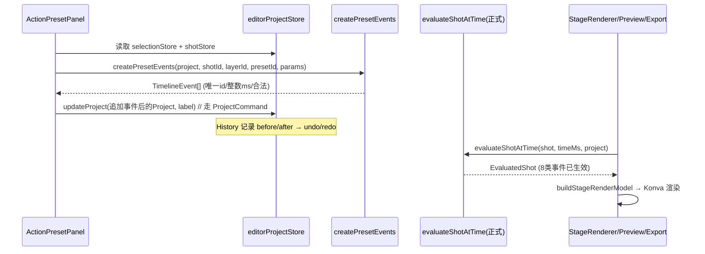

# Panda Stage · Day 25 架构审计与方案设计（动作预设）

> 审计人：高见远（架构师）　分支：`feat/day-25-action-presets`　基线：origin/main @ 5ad6911（Day 24 已合并）
> 范围：**只做架构审计 + 方案设计，不写业务代码、不改源文件**。本文件交付工程师（task #2）实现。

---

## 0. 设计决策速览

| # | 决策点 | 结论 |
|---|---|---|
| 1 | 事件存在哪 | `Shot.timelineEvents: TimelineEvent[]` **已存在于 v5 正式 schema**，无需新增字段、无需升版本。 |
| 2 | 是否需要 schema/migration 变更 | **不升版本**（仍 v5）。但必须**补 `timelineEvents` 迁移回填**，否则 v1–v4 旧文件缺该字段会打不开（违反工程合同 #4「旧项目可开」）。 |
| 3 | 双链分叉对齐（RISK-EVENT-001） | 在 `src/domain` **新增正式 evaluator** `evaluateShotAtTime(shot, timeMs, project)`，让 StageRenderer / Preview / Export **全部改引用正式 `src/domain` 的 evaluator 与 `Project`/`EvaluatedShot` 类型**。旧 `shared/domain` evaluator 保留但**退出生产链路**。所见=预览=导出共用一条 evaluator；**不混用 `durationMs`/`endMs`**（probe 改为正式 `endMs` 形状）。 |
| 4 | 纯函数事件工厂 | `src/domain/actions/ActionPreset.ts`（数据驱动定义）+ `src/domain/actions/createPresetEvents.ts`（纯函数）。 |
| 5 | validator | `src/domain/validators/timelineEventValidator.ts`。越界 = **显式拒绝（带原因）**，禁止静默截断。 |
| 6 | History 接入 | **复用现有 `ProjectCommand` + `editorProjectStore.updateProject`**，无需新 command 子类。预设产出「追加事件后的新 Project」推入即可 undo/redo。 |
| 7 | UI 面板 | `src/features/actions/ActionPresetPanel.tsx` + `PresetParameterForm.tsx`，读取 `selectionStore` / `shotStore` / `editorProjectStore`。未选/背景/锁定/失效 expression → 禁用或拒绝。 |

---

## 1. 事实核对结论（已读代码）

> 标注：✅ 已确认（直接读源码）｜🔶 推测（基于读到的代码推断，需工程师实现时复核）

### 1.1 事件存储现状
- ✅ `src/domain/models/shot.ts`：`ShotBaseShape` 已含 `timelineEvents: z.array(TimelineEventSchema)`，被 `ShotSchema` / `ShotV2Schema` / `ShotV3Schema` / `ShotV4Schema` 共用。即**正式 `Shot` 早已持有 `timelineEvents`**。
- ✅ `src/domain/models/timeline-event.ts`：正式 7 类 union（`move`/`scale`/`opacity`/`shake`/`expression`/`flip`/`visibility`），全部用 `startMs`/`endMs`，并 `superRefine` 校验 `endMs >= startMs`。
- ✅ `src/domain/services/ShotService.ts`：已将 `timelineEvents` 视为一等公民——`create` 置 `[]`、`duplicate` 重映射事件 id 与 `layerId`、`setDuration` 用 `maximumContentEndMs(shot)`（含 `event.endMs`）阻止把时长缩到内容之外。
- ✅ `src/domain/services/LayerService.ts`：`deleteLayer` 会同步从 `shot.timelineEvents` 中剔除该 layer 的事件；`projectIds` 已把 `event.id` 纳入唯一 id 池。
- ✅ `src/domain/validators/projectReferences.ts`：已校验事件 `layerId` 存在、`endMs <= shot.durationMs`；且 `expression` 事件要求目标 layer 的 `source.kind === 'character'` 且 `expressionId` 属于该角色（失效引用直接报 issue）。

### 1.2 evaluator 现状（核心分叉点）
- ✅ 正式 `src/domain` **没有时间轴 evaluator**。`src/domain/selectors/stageRenderModel.ts` 的 `buildEditorStageRenderModel(project, shot)` 是**静态**渲染模型（直接用 layer 的 `x/y/scale/opacity/...`，**不消费 `timelineEvents`**）。
- ✅ 旧 `src/shared/domain/evaluate-shot-at-time.ts`：`evaluateShotAtTime(shot, requestedTimeMs)` 仅处理旧 `MoveEvent`（`durationMs`），产出 `EvaluatedShot`(`EvaluatedLayer`)。**这是当前唯一的时间轴求值器，但只支持 move。**
- ✅ 旧 `src/shared/domain/schema.ts`：`Project`/`Shot`/`MoveEvent` 仍用 `durationMs`，`TimelineEventSchema = MoveEventSchema`（仅 move）。

### 1.3 渲染/预览/导出消费现状（双链）
- ✅ `src/renderer/stage/StageRenderer.tsx`：从 `../../shared/domain` 导入 `Project`/`EvaluatedShot`，调用 `buildStageRenderModel(project, evaluatedShot, assetUrls)`。
- ✅ `src/shared/stage/render-model.ts`：从 `../domain`（= `shared/domain`）导入 `EvaluatedLayer`/`EvaluatedShot`/`Project`；用 `EvaluatedLayer` 的 `x/y/scaleX/scaleY/flipX/rotationDeg/opacity/visible/zIndex/assetId` 生成 `StageLayerRenderInstruction`。**`assetId` 决定渲染哪张图**（表情切换靠它）。
- ✅ `src/renderer/stage/CanvasStage.tsx`：从 `../../shared/domain` 导入 `Project`/`EvaluatedShot`。
- ✅ `src/renderer/stage/StagePreview.tsx`：`evaluateShotAtTime(PROBE_SHOT, timeMs)` —— 用旧 evaluator + 硬编码 `PROBE_SHOT`（旧 schema，`durationMs` move 事件）。
- ✅ `src/export-renderer/ExportRendererApp.tsx`：`evaluateShotAtTime(shot, timeMs)` —— 同样旧 evaluator + `PROBE_PROJECT`/`PROBE_SHOT`。`window.pandaStageHidden` 负责逐帧截图。
- 🔶 `src/main.tsx → App.tsx`：当前 `App.tsx` **只挂载** `StagePreview`（预览探针）+ `ProjectRecoveryPanel` + 导出探针 UI。**并未挂载 `src/renderer/features/*`（canvas/properties/shots/editor 等编辑 UI）**。即本 worktree 的 `App.tsx` 是「预览/导出探针外壳」，真实编辑外壳未在此挂载 —— 见 §5 风险 R1。

### 1.4 schema 版本
- ✅ `src/domain/constants.ts`：`PROJECT_SCHEMA_VERSION = 5`。`Shot`/`Project` 的正式 schema 当前即 v5，`timelineEvents` 已是 v5 字段。
- ✅ `src/domain/migrations/*`：支持 v0/v1/v2/v3/v4 → v5 单向迁移；`migrateProject` 入口；`detectSchemaVersion` 接受 0–4 与 5。

### 1.5 History / Store 接入
- ✅ `src/history/HistoryStore.ts` + `src/history/commands/ProjectCommand.ts`：`ProjectCommand(before, after, applyProject)`，immutable before/after `Project` 快照；`undo/redo` 调 `applyProject`。`EditorProjectStore.updateProject(project, label, options?)` 会构造 `ProjectCommand` 并 `history.execute` —— **这是所有可撤销变更的统一定点**。
- ✅ `src/renderer/stores/{selectionStore,shotStore,layerStore}.ts`：`selectionStore.getSelectedLayerId()` 给当前选中 layer（背景层会置 null）；`shotStore.getCurrentShotId()` 给当前镜头；各 store 均通过 `editorProjectStore.updateProject(next, label)` 落地变更（与我们要做的预设应用同模式）。

---

## 2. 是否需要 schema / migration 变更

### 结论
**不需要升版本号**（维持 v5）。`Shot.timelineEvents` 已是 v5 持久字段，当前 v5 文件序列化后天然含该数组，新增事件不改变已存 v5 文件的形状。

### 但必须补「迁移回填」（contract #4 加固，非版本变更）
- **问题（已确认）**：`ShotBaseShape` 要求 `timelineEvents`，而 `project.ts` 的迁移路径里：
  - `addBackgroundIdentity`（V1/V2 路径）返回 `{...shot, layers, backgroundLayerId}`，若旧 shot 无 `timelineEvents`，展开后**不会补该字段**，最终被严格 `ProjectDataSchema` 校验拒绝。
  - V3/V4 映射分支同理依赖源已含该字段。
  - 结果：**任何在 `timelineEvents` 引入之前产出的 v0–v3 旧文件（缺该字段）将无法打开** —— 违反工程合同 #4「保留旧项目可开」。这是 Day 21–24 引入该字段时漏补迁移回填的潜在回归。
- **最小修复方案（不升版本）**：
  - `src/domain/models/project.ts` 的 `addBackgroundIdentity`：每个迁移 shot 显式补 `timelineEvents: []`。
  - 同一文件 V3、V4 映射分支：补 `timelineEvents: shot.timelineEvents ?? []`（防御式，向前兼容）。
  - 旧 `ProjectV4Schema`/`V3Schema` 等**无需改**（它们要求源含 `timelineEvents` 才会 parse 成功；回填只在 legacy 路径需要）。
- **迁移函数要点**：
  - 输入：legacy（v0–v3）project JSON（shot 可能无 `timelineEvents`）。
  - 输出：v5 `Project`，每个 shot 的 `timelineEvents` 至少为 `[]`，其余字段按现有迁移逻辑（layers 加 `locked/flipX`、`backgroundLayerId` 推断等）。
- **必须新增迁移测试**：`tests/domain/migrations/project-migration.test.ts`，构造一个**不含 `timelineEvents` 的 v1/v2 fixture**，断言 `migrateProject` 成功且结果每个 shot 含 `timelineEvents: []`。

> 若团队断言「生产环境不存在任何早于 `timelineEvents` 引入的 v0–v3 文件」，该回填可降级为「仅加测试」，但为稳妥与合同合规，**建议实现回填**。

---

## 3. 双链对齐方案（RISK-EVENT-001，最小且契约合规）

### 3.1 原则
- **一条 evaluator 通吃编辑/预览/导出**：在正式 `src/domain` 新增时间轴 evaluator，渲染链三处（StageRenderer、Preview、Export）全部改指它。这样「编辑所见 = 预览 = 导出」天然一致。
- **绝不混用 `durationMs` 与 `endMs`**：旧 `shared/domain` 的 `evaluateShotAtTime`（move-only, `durationMs`）**不再被生产链路调用**；probe fixture 改写为正式 `endMs` 形状。旧 `shared/domain` 文件保留（供历史测试/legacy 探针），但**退出生产渲染路径**。
- **`EvaluatedLayer`/`EvaluatedShot` 形状保持不变**：正式 evaluator 产出与旧版**完全相同字段**（`id, assetId, anchor, x, y, scaleX, scaleY, flipX, rotationDeg, opacity, visible, zIndex` / `shotId, timeMs, backgroundLayerId, layers`），故 `shared/stage/render-model.ts` 无需改逻辑，只改 import 来源。

### 3.2 新增 / 修改文件与职责

| 动作 | 文件（绝对路径，基于 `D:\panda-stage\.worktrees\day25`） | 职责 |
|---|---|---|
| 新增 | `src/domain/evaluate-shot-at-time.ts` | 正式 evaluator：`evaluateShotAtTime(shot, requestedTimeMs, project): EvaluatedShot`（处理 7 类事件；`project` 用于 expression→assetId 解析；`requestedTimeMs` clamp 到 `[0, shot.durationMs]`）。导出 `EvaluatedLayer`、`EvaluatedShot` 类型。 |
| 改 | `src/domain/index.ts` | 新增 `export { evaluateShotAtTime } from './evaluate-shot-at-time'; export type { EvaluatedLayer, EvaluatedShot } from './evaluate-shot-at-time';` |
| 改 | `src/shared/stage/render-model.ts` | `import type { EvaluatedLayer, EvaluatedShot, Project } from '../../domain';`（改来源，逻辑不变） |
| 改 | `src/renderer/stage/StageRenderer.tsx` | `import type { EvaluatedShot, Project } from '../../domain';` |
| 改 | `src/renderer/stage/CanvasStage.tsx` | `import type { EvaluatedShot, Project } from '../../domain';` |
| 改 | `src/renderer/stage/StagePreview.tsx` | `import { evaluateShotAtTime } from '../../domain';`；调用 `evaluateShotAtTime(PROBE_SHOT, renderedTimeMs, PROBE_PROJECT)` |
| 改 | `src/export-renderer/ExportRendererApp.tsx` | `import { evaluateShotAtTime } from '../domain';`；调用 `evaluateShotAtTime(shot, requestedTimeMs, project)` |
| 改 | `src/shared/probe/probe-project.ts` | `import { ProjectSchema, type Project, type Shot } from '../domain';`（改正式 schema）；把 timeline event 由 `durationMs` 改写为 `startMs/endMs`（如 `durationMs:3000` → `startMs:0, endMs:3000`）；其余字段不变。 |

### 3.3 正式 evaluator 的 7 类处理（要点）
- `move`：插值 `x,y`，`ease` 与旧逻辑一致（linear / ease-in-out）。
- `scale`：对 `scaleX, scaleY` 同样插值（基值取 layer 当前 `scaleX/scaleY` 或从 `from`→`to`，按预设定义；Day 25「放大强调」用 `from=layer.scale, to=放大后`）。
- `opacity`：插值 `0–1`（基值取 layer 当前 `opacity`）。
- `shake`：在 layer 当前 `x,y` 上叠加 `amplitudeX*sin(2π·frequencyHz·t)`、`amplitudeY*...` 偏移。
- `expression`：**仅 character layer 适用**。基 expression = `layer.source.expressionId`；若处在某 `expression` 事件 `[startMs,endMs]` 内，用事件 `expressionId` 覆盖；据此查 `project.characters` 解析 `assetId`，替换 `EvaluatedLayer.assetId`（复用 `resolveLayerImageAsset` 思路，或内联查表）。
- `flip` / `visibility`：置 `flipX` / `visible`（Day 25 预设不产生，但 evaluator 完整支持，向前兼容）。
- 每个 layer 的事件按 `startMs` 升序求值；时间超出事件区间则沿用区间端点值（与旧 move 行为一致，过去的时间用终点值，未来用起点值）。

### 3.4 调用时序（示意）

---

## 4. 任务清单（给工程师，按依赖排序）

> 全部路径基于 `D:\panda-stage\.worktrees\day25`。实现要点含关键约束。
> 通用铁律：只生成 `TimelineEvent`，不直接操作 DOM/Konva；整数毫秒；唯一 id；越界显式拒绝（禁静默截断）；未选/锁定/失效引用禁用或拒绝；走 History 可撤销。

### T01 — 迁移回填（合同 #4 加固，不升版本）
- **文件**：`src/domain/models/project.ts`（改 `addBackgroundIdentity` + V3/V4 映射）；`tests/domain/migrations/project-migration.test.ts`（新）
- **职责**：旧 shot 缺 `timelineEvents` 时补 `[]`；新增「不含 `timelineEvents` 的 v1/v2 fixture 经 `migrateProject` 成功且结果含 `timelineEvents: []`」测试。
- **依赖**：无。
- **要点**：仅回填 `timelineEvents: []`；不动其它字段；版本仍 5；测试必须覆盖「缺字段也能打开」。

### T02 — 正式时间轴 evaluator（双链对齐核心）
- **文件**：`src/domain/evaluate-shot-at-time.ts`（新）；`src/domain/index.ts`（改，导出）；`tests/domain/evaluate-shot-at-time.test.ts`（新）
- **职责**：实现 `evaluateShotAtTime(shot, requestedTimeMs, project): EvaluatedShot`，覆盖 move/scale/opacity/shake/expression（flip/visibility 一并支持）。复用 `resolveLayerImageAsset`（`src/domain/selectors/canvasLayers.ts`）解析 character→asset。
- **依赖**：无（T01 可并行）。
- **要点**：`EvaluatedLayer/EvaluatedShot` 字段形状与旧版**完全一致**；`requestedTimeMs` clamp 到 `[0,shot.durationMs]`；expression 事件仅 character layer 生效；使用 `startMs/endMs`；纯函数、可测。

### T03 — 渲染/预览/导出改指正式 evaluator（收敛双链）
- **文件**：`src/shared/stage/render-model.ts`、`src/renderer/stage/StageRenderer.tsx`、`src/renderer/stage/CanvasStage.tsx`、`src/renderer/stage/StagePreview.tsx`、`src/export-renderer/ExportRendererApp.tsx`、`src/shared/probe/probe-project.ts`（均改 import 来源；probe 改写为 `endMs`）
- **职责**：上述 6 文件把 `Project`/`EvaluatedShot`/`evaluateShotAtTime` 的来源从 `shared/domain` 改为正式 `src/domain`；`PROBE_SHOT`/`PROBE_PROJECT` 改用正式 `ProjectSchema` 并以 `endMs` 描述事件。
- **依赖**：T02（evaluator 必须就位）。
- **要点**：渲染模型**逻辑不变**只换 import；probe 事件 `durationMs→{startMs,endMs}`（如 3000ms 事件 `startMs:0,endMs:3000`）；确保 `StagePreview`/`ExportRendererApp` 调用带上 `project` 参数。完成后「编辑=预览=导出」共用一条 evaluator。

### T04 — 动作预设数据驱动定义
- **文件**：`src/domain/actions/ActionPreset.ts`（新）；`tests/domain/actions/ActionPreset.test.ts`（新）
- **职责**：8 类预设的纯数据定义（id、label、eventType、默认参数、参数 schema、锁定/角色约束、是否要求 character 等）。不做插件抽象。
- **依赖**：无。
- **要点**：映射——
  1 左入场→`move`（起点画布外左侧，终点 layer 当前位）
  2 右入场→`move`（右侧外）
  3 移动到→`move`（目标逻辑坐标，clamp 到 `[0,PROJECT_WIDTH/HEIGHT]`）
  4 放大强调→`scale`（`from=layer.scale, to=放大系数`）
  5 抖动→`shake`（`amplitudeX/Y, frequencyHz`）
  6 表情切换→`expression`（`expressionId` 必须属于该 layer 的 character）
  7 淡入→`opacity`（`from=0, to=layer.opacity`）
  8 淡出→`opacity`（`from=layer.opacity, to=0`）
  默认动作时长建议 500–1000ms（整数），起止用当前镜头时间与 layer 当前位置。

### T05 — 纯函数事件工厂
- **文件**：`src/domain/actions/createPresetEvents.ts`（新）；`tests/domain/actions/createPresetEvents.test.ts`（新）
- **职责**：`createPresetEvents(project, shotId, layerId, presetId, params, options?): TimelineEvent[]`。输入 layer 当前 shot 时长/位置/参数 → 输出合法事件。
- **依赖**：T04（读取预设定义）。
- **要点**：`options.createId ?? crypto.randomUUID` 保证 id **唯一**；所有时间**整数毫秒**；逻辑坐标（用 `PROJECT_WIDTH/HEIGHT`、左/右入场起点在画布外如 `x=-layer宽` 或 `x=PROJECT_WIDTH+layer宽`）；`opacity` 限 `0–1`；`expression` 事件校验 `expressionId ∈ 该 character.expressions`（否则抛错，由 validator 拦截）；同 layer/同属性区间重叠至少**检测**并声明 `DEBT-CONFLICT-B25-001`（不静默）。输出事件须经 `TimelineEventSchema` 解析通过。

### T06 — validator（显式拒绝越界/失效引用）
- **文件**：`src/domain/validators/timelineEventValidator.ts`（新）；`tests/domain/validators/timelineEventValidator.test.ts`（新）
- **职责**：`validatePresetApplication(project, shotId, layerId, candidateEvents): { ok: boolean; errors: string[] }`。检查：事件 `endMs ≤ shot.durationMs`（越界→明确原因，拒绝，禁静默截断）；`layerId` 存在且非 background；`expression` 事件 expressionId 属于该 character；`opacity` 在 `0–1`；id 唯一。
- **依赖**：T05。
- **要点**：越界采用「**拒绝 + 可理解原因**」策略（工单红线 4）；错误信息为中文，供 UI 反馈（UX-002）。

### T07 — History 接入（复用 ProjectCommand，不新建子类）
- **文件**：`src/domain/actions/applyPresetEvents.ts`（新，纯函数：把事件追加进 shot 的 `timelineEvents` 并返回新 `Project`）+ `src/features/actions/actionPresetStore.ts`（新，桥接 store）；`tests/integration/action-preset-history.test.ts`（新）
- **职责**：`actionPresetStore.apply(presetId, params)`：取 `editorProjectStore` 当前 project + `shotStore.getCurrentShotId()` + `selectionStore.getSelectedLayerId()` → `createPresetEvents` → `validatePresetApplication` → 追加事件构造新 `Project`（经 `ProjectSchema.parse` 校验）→ `editorProjectStore.updateProject(next, '应用动作预设：<label>')`。
- **依赖**：T05、T06、T04。
- **要点**：**复用现有 `ProjectCommand`/`EditorProjectStore.updateProject`**，无需新 command 类；`before/after` 全自动记录 → `undo/redo` 免费生效；`applyProject` 通过 `EditorProjectStore` 现有机制落地。集成测试覆盖：应用→undo→redo→`ProjectSchema.parse` 往返序列化后事件不丢（E2E-001 / 持久化）。

### T08 — UI 面板（禁用/反馈/拒绝）
- **文件**：`src/features/actions/ActionPresetPanel.tsx`（新）、`src/features/actions/PresetParameterForm.tsx`（新）；`tests/features/actions/ActionPresetPanel.test.tsx`（新）；挂载点（见 §5 R1）
- **职责**：渲染 8 个预设按钮 + 参数表单；读取 `selectionStore`/`shotStore`/`editorProjectStore` 决定可用态与默认值；点击 → `actionPresetStore.apply`。
- **依赖**：T04、T05、T06、T07。
- **要点**：
  - 未选图层 / 选中背景层 → 整个面板禁用（NEG-001）。
  - layer `locked` → 应用被拒（NEG-002）。
  - `expression` 预设：若 layer 非 character 或所选 `expressionId` 失效 → 禁用/拒绝（NEG-004）。
  - 越界/非法参数 → 表单内**可理解错误反馈**，不静默（UX-002）；参数旁给出「预计效果」提示（UX-001）。
  - 只收集参数、派发命令，**绝不**直接碰 DOM/Konva（ARCH 闸门）。

### T09 — M3 回执与收卷
- **文件**：`docs/test-receipts/M3.md`（新，按 DAY-25-AGENT-TASK 模块5 格式）；失败时 `docs/decisions/M3-FAILURE-REPORT.md`
- **职责**：记录 8 类预设映射、边界证据、刀刃表 16 项状态、自动化闸门（typecheck/lint/test/build）、HIGH-001（无代码完成静态镜头+动作）结论。
- **依赖**：T01–T08 全部。
- **要点**：结论只能 PASS/FAIL；未验证项按 FAIL；含真实制作镜头 + 保存重开证据。

---

## 5. 待确认 / 风险

- **R1（重要）编辑外壳挂载点不明**：本 worktree 的 `App.tsx`（`main.tsx` 入口）**只挂载 StagePreview + ProjectRecoveryPanel + 导出探针**，并未挂载 `src/renderer/features/*`（canvas/properties/shots/editor）。`ActionPresetPanel` 按设计应随编辑侧栏（`LayerTransformPanel`/`LayerOrderControls` 同上下文）挂载，读取 `selectionStore`/`shotStore`/`editorProjectStore`。**工程师须先确认 Day 25 的真实编辑外壳在哪里挂载**——若 `App.tsx` 在本 worktree 确为探针外壳，则需先（或同步）把编辑外壳接入 `App.tsx`，否则 M3「用户不改代码完成镜头」无法在 UI 上操作。建议：面板挂载方式完全对齐 `src/renderer/features/properties/*`，不另起炉灶。
- **R2 导出耗时 / 低配性能（不在架构范围）**：逐帧 `evaluateShotAtTime` 在导出链路对每帧全量求值，事件多/镜头长时 CPU 成本上升。属实现期性能议题，不在本次设计约束内，仅提示工程师留意（可后日做缓存/区间裁剪）。
- **R3 同属性区间重叠（DEBT-CONFLICT-B25-001）**：工单允许本日「至少检测明显冲突并声明债务」。本设计在 T05/T06 做**检测+报错**（同一 layer 同一属性在重叠时间区间内只允许一个事件，否则拒绝），完整多事件叠加语义留给 Day 27。需在 M3 回执显式登记该债务。
- **R4 旧 `shared/domain` evaluator 弃用**：T03 后旧 `evaluateShotAtTime`（move-only, `durationMs`）不再被生产链路引用，但文件保留。建议加 `// @deprecated` 注释并说明将在后续日清理；不要在本日删除以免破坏既有历史测试（如有）。
- **R5 迁移回填的必要性确认**：T01 的回填前提是「存在早于 `timelineEvents` 引入的 v0–v3 文件」。若团队确认不存在此类文件，T01 可降级为「仅加测试」，但仍建议实现回填以稳妥。
- **R6 表达式事件与角色默认表情**：`expression` 事件切换 `assetId` 依赖 `layer.source.kind==='character'` 且 `expressionId` 有效。若角色后续被编辑（增删表情），事件引用失效由 `projectReferences` + `validatePresetApplication` 在导入/应用时拦截；运行期 evaluator 遇到失效 expressionId 应回退到 layer 基 expression（不抛错），保证渲染不崩。

---

## 附：关键文件事实索引（供工程师快速定位）
- 事件 union + `startMs/endMs`：`src/domain/models/timeline-event.ts`
- Shot 已含 `timelineEvents`：`src/domain/models/shot.ts`（`ShotBaseShape`）
- 旧 move-only evaluator（待弃用生产链路）：`src/shared/domain/evaluate-shot-at-time.ts`
- 渲染消费 `EvaluatedLayer.assetId`：`src/shared/stage/render-model.ts` + `layer-render-contract.ts`
- History 统一定点：`src/history/commands/ProjectCommand.ts` + `src/renderer/stores/EditorProjectStore.ts`
- 选中/镜头上下文：`src/renderer/stores/selectionStore.ts`、`shotStore.ts`、`layerStore.ts`
- expression→asset 解析可复用：`src/domain/selectors/canvasLayers.ts`（`resolveLayerImageAsset`）、`src/domain/services/CharacterService.ts`（`resolveAppearance`）
